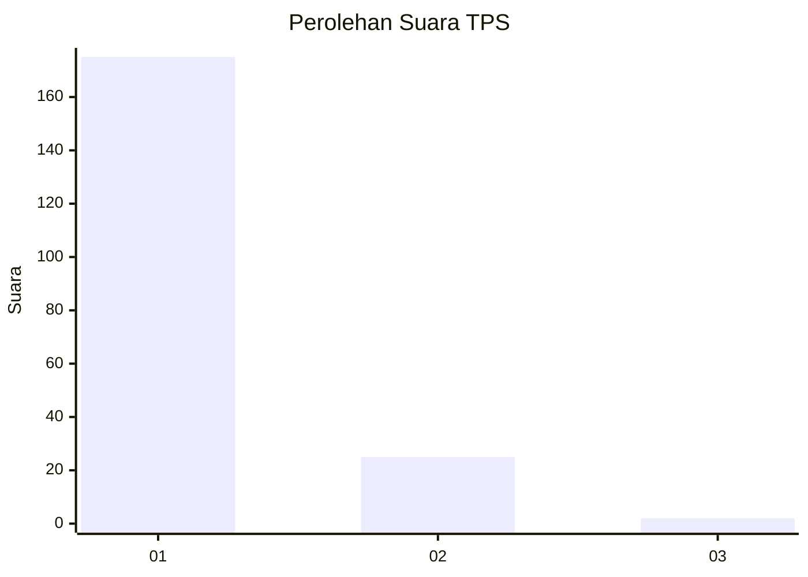
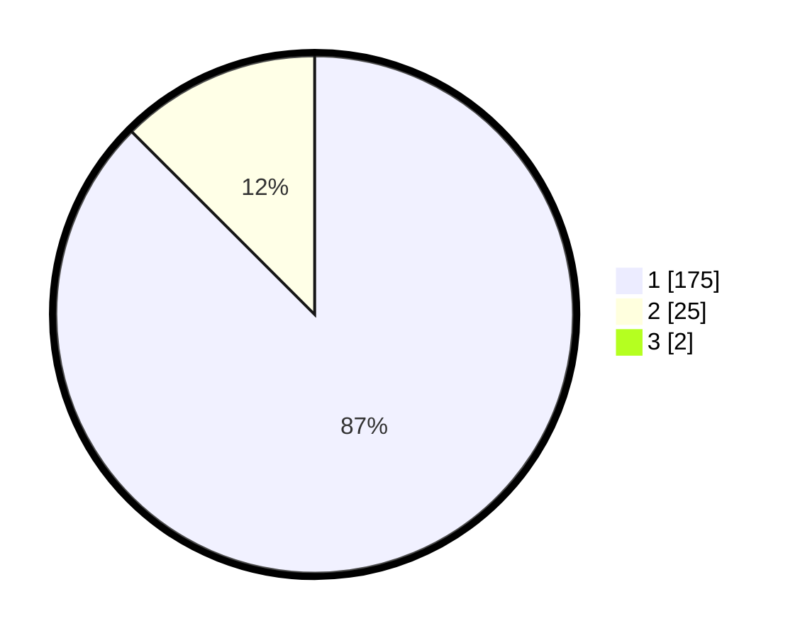

# Hasil

## Grafik

## Tabel

| No. | Nama Paslon    | Suara | Suara (raw) | Persentase |
|:--- |:-------------- | -----:| -----------:| ----------:|
| 1   | ANIES MUHAIMIN | 175   | [175][p-1]  | 86,63      |
| 2   | PRABOWO GIBRAN | 25    | [25][p-2]   | 12,38      |
| 3   | GANJAR MAHFUD  | 2     | [2][p-3]    | 0,99       |

[p-1]: https://github.com/gigit-pemilu/pemilu-2024-11-aceh/blob/main/pilpres/hitung-suara/sub/11-aceh/sub/03-aceh-timur/sub/19-sungai-raya/sub/2004-buket-seulamat/sub/003-tps/sub/paslon-1.txt
[p-2]: https://github.com/gigit-pemilu/pemilu-2024-11-aceh/blob/main/pilpres/hitung-suara/sub/11-aceh/sub/03-aceh-timur/sub/19-sungai-raya/sub/2004-buket-seulamat/sub/003-tps/sub/paslon-2.txt
[p-3]: https://github.com/gigit-pemilu/pemilu-2024-11-aceh/blob/main/pilpres/hitung-suara/sub/11-aceh/sub/03-aceh-timur/sub/19-sungai-raya/sub/2004-buket-seulamat/sub/003-tps/sub/paslon-3.txt

## Foto C Plano

https://sirekap-obj-formc.kpu.go.id/1eea/pemilu/ppwp/11/03/19/20/04/1103192004003-20240215-063040--63554e4e-9dc2-49b5-98b2-2e5567486ec2.jpg

https://sirekap-obj-formc.kpu.go.id/1eea/pemilu/ppwp/11/03/19/20/04/1103192004003-20240215-063240--e250e488-a8a8-4c55-8e3d-0658286853d6.jpg

https://sirekap-obj-formc.kpu.go.id/1eea/pemilu/ppwp/11/03/19/20/04/1103192004003-20240215-064636--a19666e3-8022-4fe6-8db2-82305fc78db3.jpg

## Metadata

| Key        | Value               |
| ---------- | ------------------- |
| Time Stamp | 2024-02-24 22:31:28 |

