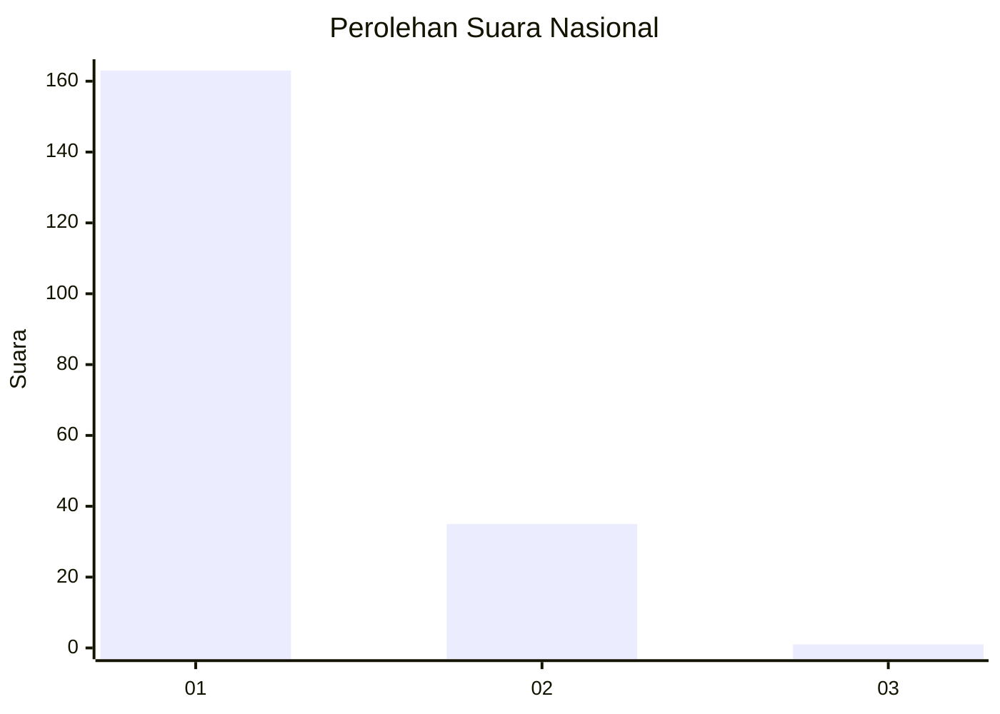
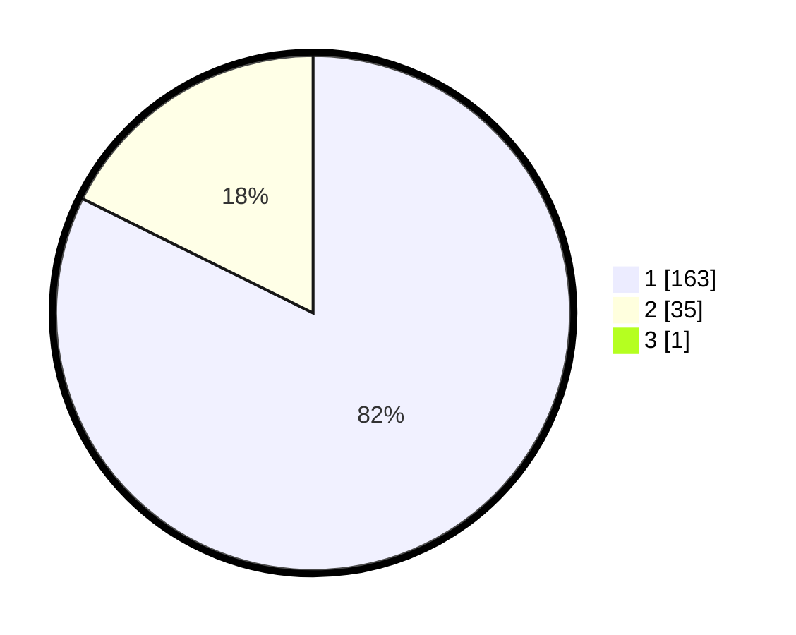

# Hasil

## Grafik

## Tabel

| No. | Nama Paslon    | Suara | Suara (raw) | Persentase |
|:--- |:-------------- | -----:| -----------:| ----------:|
| 1   | ANIES MUHAIMIN | 163   | [163][p-1]  | 81,91      |
| 2   | PRABOWO GIBRAN | 35    | [35][p-2]   | 17,59      |
| 3   | GANJAR MAHFUD  | 1     | [1][p-3]    | 0,50       |

[p-1]: https://github.com/gigit-pemilu/pemilu-2024/blob/main/pilpres/hitung-suara/sub/11-aceh/sub/03-aceh-timur/sub/19-sungai-raya/sub/2004-buket-seulamat/sub/005-tps/sub/paslon-1.txt
[p-2]: https://github.com/gigit-pemilu/pemilu-2024/blob/main/pilpres/hitung-suara/sub/11-aceh/sub/03-aceh-timur/sub/19-sungai-raya/sub/2004-buket-seulamat/sub/005-tps/sub/paslon-2.txt
[p-3]: https://github.com/gigit-pemilu/pemilu-2024/blob/main/pilpres/hitung-suara/sub/11-aceh/sub/03-aceh-timur/sub/19-sungai-raya/sub/2004-buket-seulamat/sub/005-tps/sub/paslon-3.txt

## Foto C Plano

https://sirekap-obj-formc.kpu.go.id/0405/pemilu/ppwp/11/03/19/20/04/1103192004005-20240215-035007--f0e6300b-c867-4e88-bc7d-cf1ae4810af8.jpg

https://sirekap-obj-formc.kpu.go.id/0405/pemilu/ppwp/11/03/19/20/04/1103192004005-20240215-035244--6eb2b504-e363-4819-8506-e1769bb9690b.jpg

https://sirekap-obj-formc.kpu.go.id/0405/pemilu/ppwp/11/03/19/20/04/1103192004005-20240215-035513--e811b45c-3edf-439b-8015-cd113c150f12.jpg

## Metadata

| Key        | Value               |
| ---------- | ------------------- |
| Time Stamp | 2024-02-24 22:31:28 |

