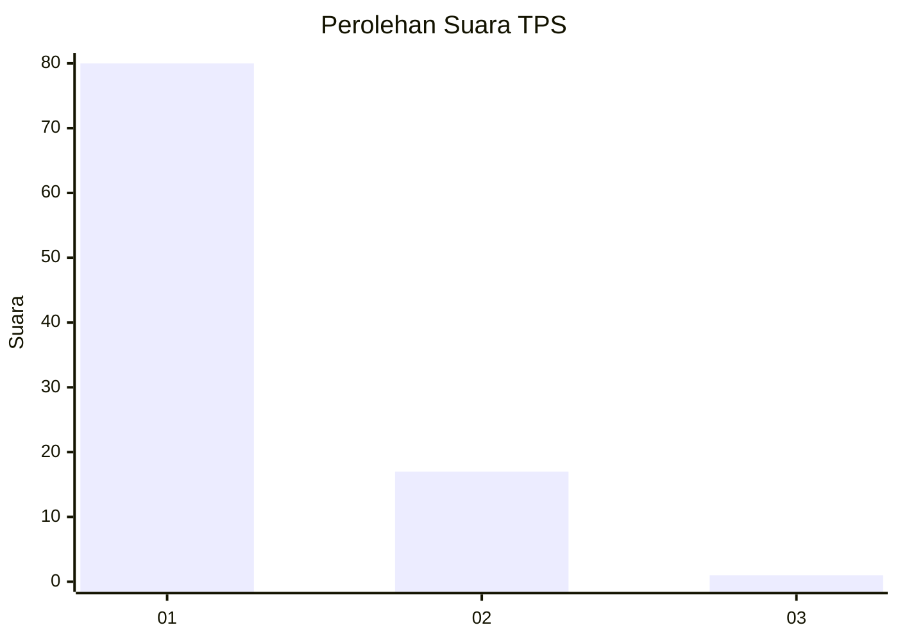
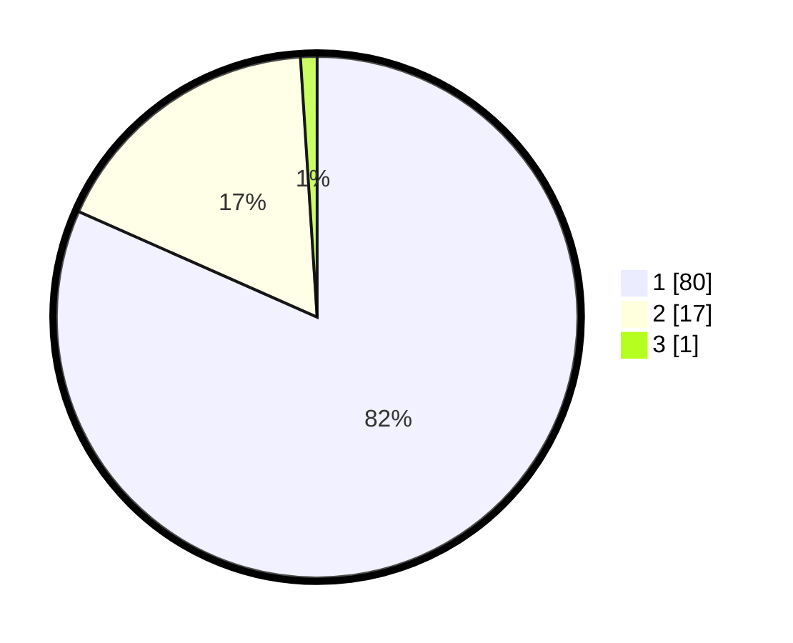

# Hasil

## Grafik

## Tabel

| No. | Nama Paslon    | Suara | Suara (raw) | Persentase |
|:--- |:-------------- | -----:| -----------:| ----------:|
| 1   | ANIES MUHAIMIN | 80    | [80][p-1]   | 81,63      |
| 2   | PRABOWO GIBRAN | 17    | [17][p-2]   | 17,35      |
| 3   | GANJAR MAHFUD  | 1     | [1][p-3]    | 1,02       |

[p-1]: https://github.com/gigit-pemilu/pemilu-2024-11-aceh/blob/main/pilpres/hitung-suara/sub/11-aceh/sub/03-aceh-timur/sub/19-sungai-raya/sub/2007-paya-keutapang/sub/002-tps/sub/paslon-1.txt
[p-2]: https://github.com/gigit-pemilu/pemilu-2024-11-aceh/blob/main/pilpres/hitung-suara/sub/11-aceh/sub/03-aceh-timur/sub/19-sungai-raya/sub/2007-paya-keutapang/sub/002-tps/sub/paslon-2.txt
[p-3]: https://github.com/gigit-pemilu/pemilu-2024-11-aceh/blob/main/pilpres/hitung-suara/sub/11-aceh/sub/03-aceh-timur/sub/19-sungai-raya/sub/2007-paya-keutapang/sub/002-tps/sub/paslon-3.txt

## Foto C Plano

https://sirekap-obj-formc.kpu.go.id/6337/pemilu/ppwp/11/03/19/20/07/1103192007002-20240215-000035--a6cd923b-3d07-4f9b-a6ca-a75b0fe33beb.jpg

https://sirekap-obj-formc.kpu.go.id/6337/pemilu/ppwp/11/03/19/20/07/1103192007002-20240215-001104--9b8d92a9-77a3-4238-af4e-e9aa3b23d817.jpg

https://sirekap-obj-formc.kpu.go.id/6337/pemilu/ppwp/11/03/19/20/07/1103192007002-20240215-001501--4913e373-aac6-463b-9812-4a8c34719d2f.jpg

## Metadata

| Key        | Value               |
| ---------- | ------------------- |
| Time Stamp | 2024-02-24 22:31:28 |

