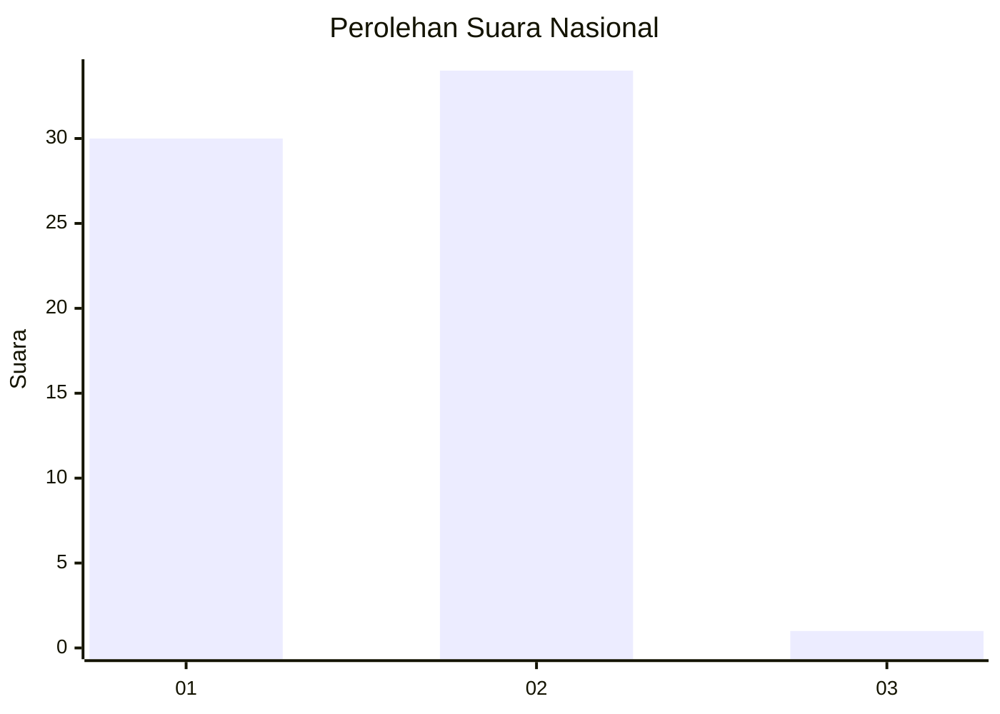
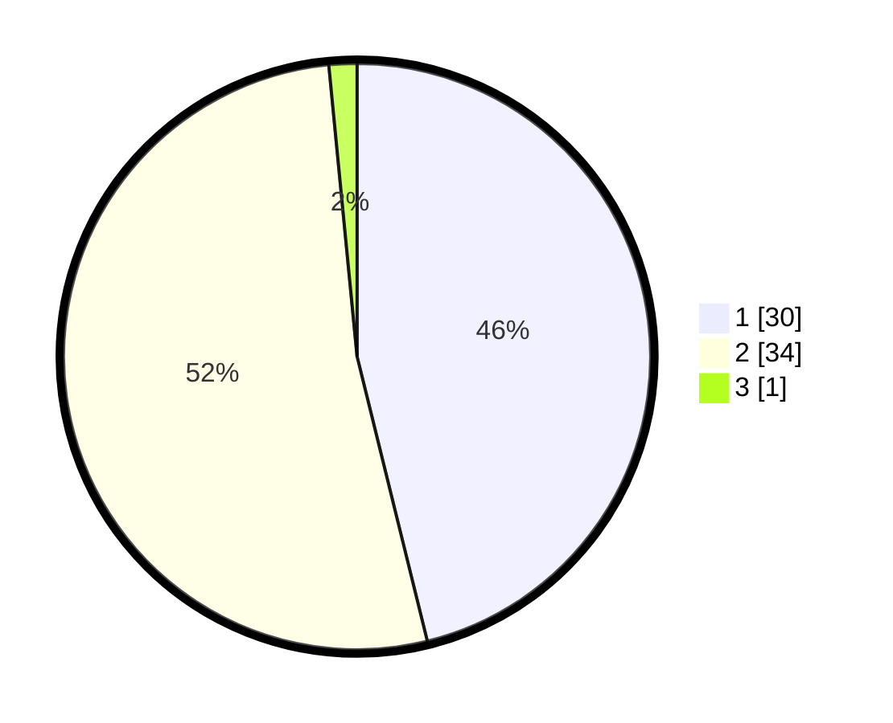

# Hasil

## Grafik

## Tabel

| No. | Nama Paslon    | Suara | Suara (raw) | Persentase |
|:--- |:-------------- | -----:| -----------:| ----------:|
| 1   | ANIES MUHAIMIN | 30    | [30][p-1]   | 46,15      |
| 2   | PRABOWO GIBRAN | 34    | [34][p-2]   | 52,31      |
| 3   | GANJAR MAHFUD  | 1     | [1][p-3]    | 1,54       |

[p-1]: https://github.com/gigit-pemilu/pemilu-2024/blob/main/pilpres/hitung-suara/sub/11-aceh/sub/03-aceh-timur/sub/19-sungai-raya/sub/2008-gajah-mentah/sub/002-tps/sub/paslon-1.txt
[p-2]: https://github.com/gigit-pemilu/pemilu-2024/blob/main/pilpres/hitung-suara/sub/11-aceh/sub/03-aceh-timur/sub/19-sungai-raya/sub/2008-gajah-mentah/sub/002-tps/sub/paslon-2.txt
[p-3]: https://github.com/gigit-pemilu/pemilu-2024/blob/main/pilpres/hitung-suara/sub/11-aceh/sub/03-aceh-timur/sub/19-sungai-raya/sub/2008-gajah-mentah/sub/002-tps/sub/paslon-3.txt

## Foto C Plano

https://sirekap-obj-formc.kpu.go.id/09db/pemilu/ppwp/11/03/19/20/08/1103192008002-20240216-011908--bcc7de1d-1310-4f3b-b02e-b24ddd7f3eed.jpg

https://sirekap-obj-formc.kpu.go.id/09db/pemilu/ppwp/11/03/19/20/08/1103192008002-20240216-011916--3023f0b9-d83f-40fe-a92f-22c792f4f012.jpg

https://sirekap-obj-formc.kpu.go.id/09db/pemilu/ppwp/11/03/19/20/08/1103192008002-20240216-011910--79f88c03-62e2-4e55-8c35-d138855b2765.jpg

## Metadata

| Key        | Value               |
| ---------- | ------------------- |
| Time Stamp | 2024-02-16 17:30:00 |

## DATA PEMILIH TETAP

Jumlah pemilih dalam DPT: **78**.
 * L: **46**.
 * P: **32**.

## DATA PENGGUNA HAK PILIH

Jumlah pengguna hak pilih dalam DPT: **70**.
 * L: **46**.
 * P: **24**.

Jumlah pengguna hak pilih dalam DPTb: **0**.
 * L: **0**.
 * P: **0**.

Jumlah pengguna hak pilih dalam DPK: **0**.
 * L: **0**.
 * P: **0**.

Jumlah pengguna hak pilih: **70**.
 * L: **46**.
 * P: **24**.

## JUMLAH SUARA SAH DAN TIDAK SAH

JUMLAH SELURUH SUARA SAH: **65**.

JUMLAH SUARA TIDAK SAH: **5**.

JUMLAH SELURUH SUARA SAH DAN SUARA TIDAK SAH: **70**.

