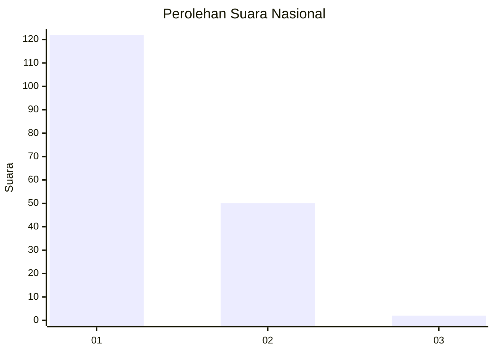
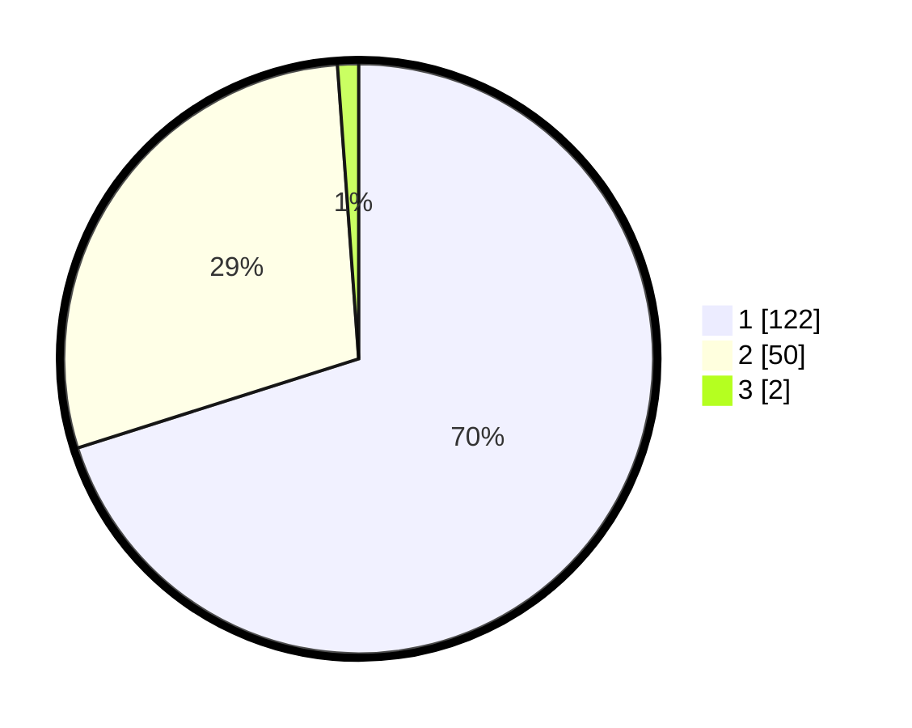

# Hasil

## Grafik

## Tabel

| No. | Nama Paslon    | Suara | Suara (raw) | Persentase |
|:--- |:-------------- | -----:| -----------:| ----------:|
| 1   | ANIES MUHAIMIN | 122   | [122][p-1]  | 70,11      |
| 2   | PRABOWO GIBRAN | 50    | [50][p-2]   | 28,74      |
| 3   | GANJAR MAHFUD  | 2     | [2][p-3]    | 1,15       |

[p-1]: https://github.com/gigit-pemilu/pemilu-2024/blob/main/pilpres/hitung-suara/sub/11-aceh/sub/03-aceh-timur/sub/20-simpang-jernih/sub/2001-simpang-jernih/sub/001-tps/sub/paslon-1.txt
[p-2]: https://github.com/gigit-pemilu/pemilu-2024/blob/main/pilpres/hitung-suara/sub/11-aceh/sub/03-aceh-timur/sub/20-simpang-jernih/sub/2001-simpang-jernih/sub/001-tps/sub/paslon-2.txt
[p-3]: https://github.com/gigit-pemilu/pemilu-2024/blob/main/pilpres/hitung-suara/sub/11-aceh/sub/03-aceh-timur/sub/20-simpang-jernih/sub/2001-simpang-jernih/sub/001-tps/sub/paslon-3.txt

## Foto C Plano

https://sirekap-obj-formc.kpu.go.id/a3d8/pemilu/ppwp/11/03/20/20/01/1103202001001-20240220-054504--b03f48ef-6064-46bc-b748-2304b65bdf4f.jpg

https://sirekap-obj-formc.kpu.go.id/a3d8/pemilu/ppwp/11/03/20/20/01/1103202001001-20240220-054506--539d7741-ee25-47c8-b43a-ffb8a7ee26ca.jpg

https://sirekap-obj-formc.kpu.go.id/a3d8/pemilu/ppwp/11/03/20/20/01/1103202001001-20240220-054505--30dbee5a-641d-4290-b7a8-3b16eeef1d22.jpg

## Metadata

| Key        | Value               |
| ---------- | ------------------- |
| Time Stamp | 2024-02-22 12:00:00 |

## DATA PEMILIH TETAP

Jumlah pemilih dalam DPT: **228**.
 * L: **107**.
 * P: **121**.

## DATA PENGGUNA HAK PILIH

Jumlah pengguna hak pilih dalam DPT: **161**.
 * L: **77**.
 * P: **84**.

Jumlah pengguna hak pilih dalam DPTb: **2**.
 * L: **2**.
 * P: **0**.

Jumlah pengguna hak pilih dalam DPK: **13**.
 * L: **7**.
 * P: **6**.

Jumlah pengguna hak pilih: **176**.
 * L: **86**.
 * P: **90**.

## JUMLAH SUARA SAH DAN TIDAK SAH

JUMLAH SELURUH SUARA SAH: **174**.

JUMLAH SUARA TIDAK SAH: **2**.

JUMLAH SELURUH SUARA SAH DAN SUARA TIDAK SAH: **176**.

