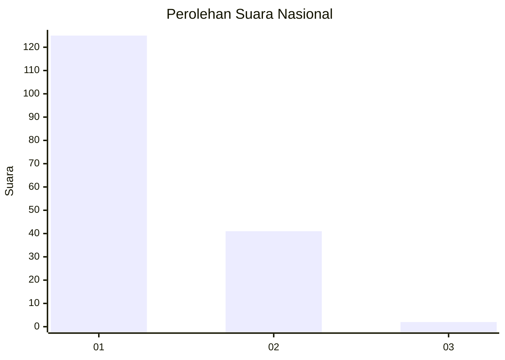
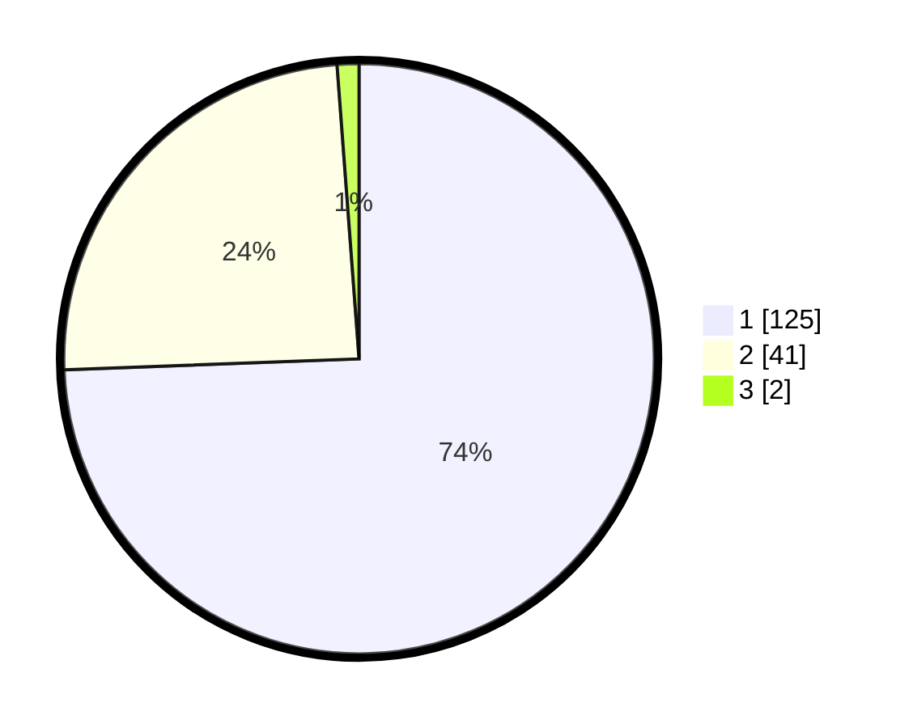

# Hasil

## Grafik

## Tabel

| No. | Nama Paslon    | Suara | Suara (raw) | Persentase |
|:--- |:-------------- | -----:| -----------:| ----------:|
| 1   | ANIES MUHAIMIN | 125   | [125][p-1]  | 74,40      |
| 2   | PRABOWO GIBRAN | 41    | [41][p-2]   | 24,40      |
| 3   | GANJAR MAHFUD  | 2     | [2][p-3]    | 1,19       |

[p-1]: https://github.com/gigit-pemilu/pemilu-2024/blob/main/pilpres/hitung-suara/sub/11-aceh/sub/03-aceh-timur/sub/20-simpang-jernih/sub/2001-simpang-jernih/sub/002-tps/sub/paslon-1.txt
[p-2]: https://github.com/gigit-pemilu/pemilu-2024/blob/main/pilpres/hitung-suara/sub/11-aceh/sub/03-aceh-timur/sub/20-simpang-jernih/sub/2001-simpang-jernih/sub/002-tps/sub/paslon-2.txt
[p-3]: https://github.com/gigit-pemilu/pemilu-2024/blob/main/pilpres/hitung-suara/sub/11-aceh/sub/03-aceh-timur/sub/20-simpang-jernih/sub/2001-simpang-jernih/sub/002-tps/sub/paslon-3.txt

## Foto C Plano

https://sirekap-obj-formc.kpu.go.id/4d47/pemilu/ppwp/11/03/20/20/01/1103202001002-20240219-224720--dce5d4bf-3c7b-4e8e-8db2-d7b749d1cc1f.jpg

https://sirekap-obj-formc.kpu.go.id/4d47/pemilu/ppwp/11/03/20/20/01/1103202001002-20240219-224722--0e418931-3189-4851-a102-2731b819f121.jpg

https://sirekap-obj-formc.kpu.go.id/4d47/pemilu/ppwp/11/03/20/20/01/1103202001002-20240219-224721--6a7a355c-57a9-4346-b67d-680927575842.jpg

## Metadata

| Key        | Value               |
| ---------- | ------------------- |
| Time Stamp | 2024-02-21 15:00:00 |

## DATA PEMILIH TETAP

Jumlah pemilih dalam DPT: **232**.
 * L: **121**.
 * P: **111**.

## DATA PENGGUNA HAK PILIH

Jumlah pengguna hak pilih dalam DPT: **161**.
 * L: **81**.
 * P: **80**.

Jumlah pengguna hak pilih dalam DPTb: **1**.
 * L: **0**.
 * P: **1**.

Jumlah pengguna hak pilih dalam DPK: **6**.
 * L: **3**.
 * P: **3**.

Jumlah pengguna hak pilih: **168**.
 * L: **84**.
 * P: **84**.

## JUMLAH SUARA SAH DAN TIDAK SAH

JUMLAH SELURUH SUARA SAH: **168**.

JUMLAH SUARA TIDAK SAH: **0**.

JUMLAH SELURUH SUARA SAH DAN SUARA TIDAK SAH: **168**.

