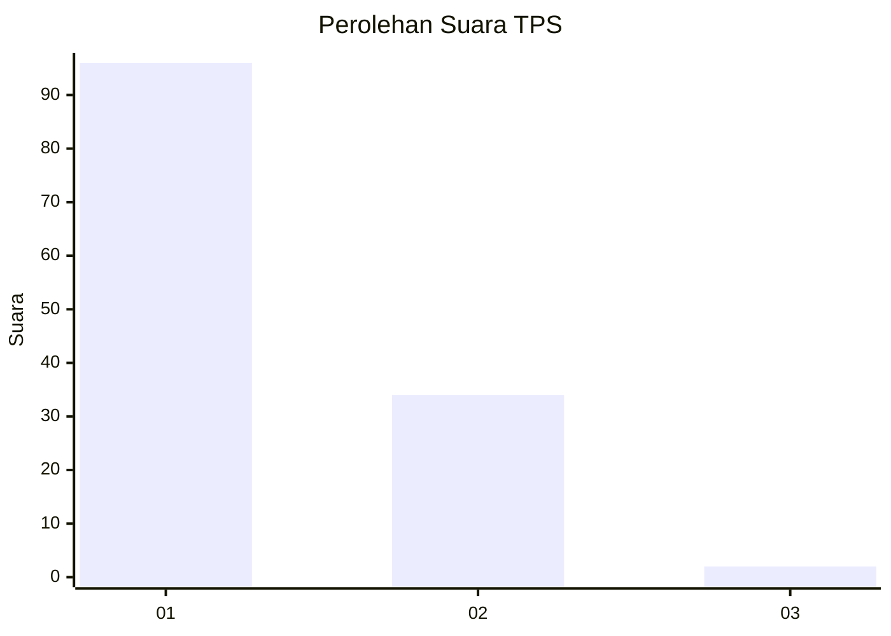
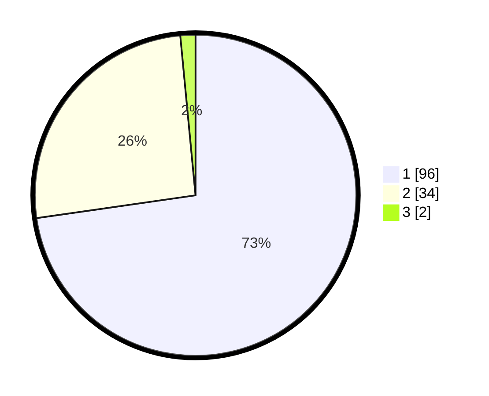

# Hasil

## Grafik

## Tabel

| No. | Nama Paslon    | Suara | Suara (raw) | Persentase |
|:--- |:-------------- | -----:| -----------:| ----------:|
| 1   | ANIES MUHAIMIN | 96    | [96][p-1]   | 72,73      |
| 2   | PRABOWO GIBRAN | 34    | [34][p-2]   | 25,76      |
| 3   | GANJAR MAHFUD  | 2     | [2][p-3]    | 1,52       |

[p-1]: https://github.com/gigit-pemilu/pemilu-2024-11-aceh/blob/main/pilpres/hitung-suara/sub/11-aceh/sub/03-aceh-timur/sub/20-simpang-jernih/sub/2002-batu-sumbang/sub/001-tps/sub/paslon-1.txt
[p-2]: https://github.com/gigit-pemilu/pemilu-2024-11-aceh/blob/main/pilpres/hitung-suara/sub/11-aceh/sub/03-aceh-timur/sub/20-simpang-jernih/sub/2002-batu-sumbang/sub/001-tps/sub/paslon-2.txt
[p-3]: https://github.com/gigit-pemilu/pemilu-2024-11-aceh/blob/main/pilpres/hitung-suara/sub/11-aceh/sub/03-aceh-timur/sub/20-simpang-jernih/sub/2002-batu-sumbang/sub/001-tps/sub/paslon-3.txt

## Foto C Plano

https://sirekap-obj-formc.kpu.go.id/5fb8/pemilu/ppwp/11/03/20/20/02/1103202002001-20240216-144310--98104bac-0efc-4c26-b97d-7249067ec6a1.jpg

https://sirekap-obj-formc.kpu.go.id/5fb8/pemilu/ppwp/11/03/20/20/02/1103202002001-20240216-144312--f33272b6-7757-4399-9b5c-c0f3095ee1fe.jpg

https://sirekap-obj-formc.kpu.go.id/5fb8/pemilu/ppwp/11/03/20/20/02/1103202002001-20240216-144311--75ee7f0a-d5bc-442f-83a3-cce3b7fac2ef.jpg

## Metadata

| Key        | Value               |
| ---------- | ------------------- |
| Time Stamp | 2024-02-16 17:30:00 |

## DATA PEMILIH TETAP

Jumlah pemilih dalam DPT: **164**.
 * L: **83**.
 * P: **81**.

## DATA PENGGUNA HAK PILIH

Jumlah pengguna hak pilih dalam DPT: **131**.
 * L: **60**.
 * P: **71**.

Jumlah pengguna hak pilih dalam DPTb: **0**.
 * L: **0**.
 * P: **0**.

Jumlah pengguna hak pilih dalam DPK: **1**.
 * L: **1**.
 * P: **0**.

Jumlah pengguna hak pilih: **132**.
 * L: **61**.
 * P: **71**.

## JUMLAH SUARA SAH DAN TIDAK SAH

JUMLAH SELURUH SUARA SAH: **132**.

JUMLAH SUARA TIDAK SAH: **0**.

JUMLAH SELURUH SUARA SAH DAN SUARA TIDAK SAH: **132**.

