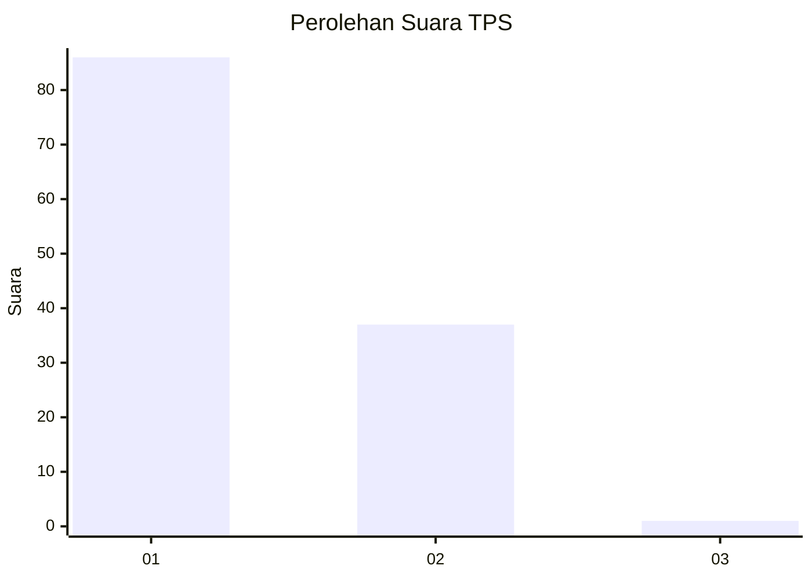
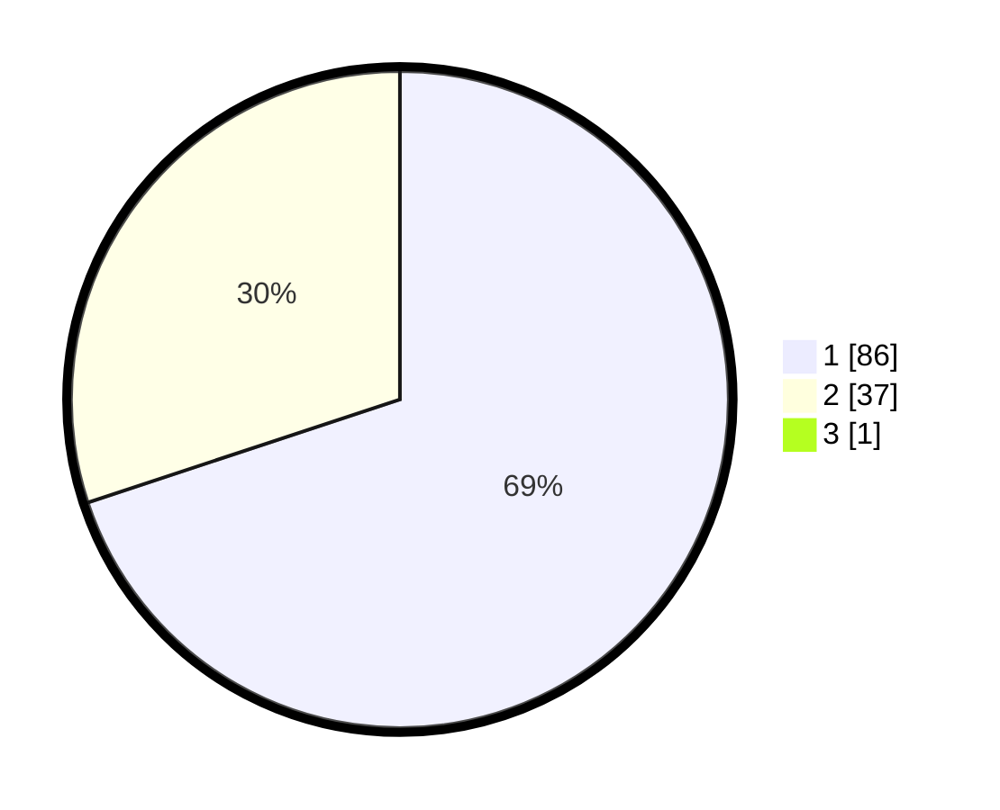

# Hasil

## Grafik

## Tabel

| No. | Nama Paslon    | Suara | Suara (raw) | Persentase |
|:--- |:-------------- | -----:| -----------:| ----------:|
| 1   | ANIES MUHAIMIN | 86    | [86][p-1]   | 69,35      |
| 2   | PRABOWO GIBRAN | 37    | [37][p-2]   | 29,84      |
| 3   | GANJAR MAHFUD  | 1     | [1][p-3]    | 0,81       |

[p-1]: https://github.com/gigit-pemilu/pemilu-2024-11-aceh/blob/main/pilpres/hitung-suara/sub/11-aceh/sub/03-aceh-timur/sub/20-simpang-jernih/sub/2004-rantau-panjang/sub/001-tps/sub/paslon-1.txt
[p-2]: https://github.com/gigit-pemilu/pemilu-2024-11-aceh/blob/main/pilpres/hitung-suara/sub/11-aceh/sub/03-aceh-timur/sub/20-simpang-jernih/sub/2004-rantau-panjang/sub/001-tps/sub/paslon-2.txt
[p-3]: https://github.com/gigit-pemilu/pemilu-2024-11-aceh/blob/main/pilpres/hitung-suara/sub/11-aceh/sub/03-aceh-timur/sub/20-simpang-jernih/sub/2004-rantau-panjang/sub/001-tps/sub/paslon-3.txt

## Foto C Plano

https://sirekap-obj-formc.kpu.go.id/5415/pemilu/ppwp/11/03/20/20/04/1103202004001-20240218-150225--7092cf42-a114-426f-a841-782042158127.jpg

https://sirekap-obj-formc.kpu.go.id/5415/pemilu/ppwp/11/03/20/20/04/1103202004001-20240215-235205--79a58c38-cac1-4c51-b39a-6a024a875984.jpg

https://sirekap-obj-formc.kpu.go.id/5415/pemilu/ppwp/11/03/20/20/04/1103202004001-20240216-000134--5fa84906-a6aa-4619-bafe-ccc39e43eff3.jpg

## Metadata

| Key        | Value               |
| ---------- | ------------------- |
| Time Stamp | 2024-02-19 06:16:00 |

## DATA PEMILIH TETAP

Jumlah pemilih dalam DPT: **189**.
 * L: **90**.
 * P: **99**.

## DATA PENGGUNA HAK PILIH

Jumlah pengguna hak pilih dalam DPT: **128**.
 * L: **55**.
 * P: **73**.

Jumlah pengguna hak pilih dalam DPTb: **0**.
 * L: **0**.
 * P: **0**.

Jumlah pengguna hak pilih dalam DPK: **4**.
 * L: **2**.
 * P: **2**.

Jumlah pengguna hak pilih: **132**.
 * L: **57**.
 * P: **75**.

## JUMLAH SUARA SAH DAN TIDAK SAH

JUMLAH SELURUH SUARA SAH: **124**.

JUMLAH SUARA TIDAK SAH: **8**.

JUMLAH SELURUH SUARA SAH DAN SUARA TIDAK SAH: **132**.

