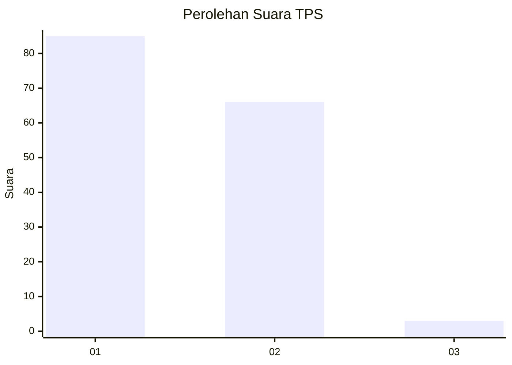
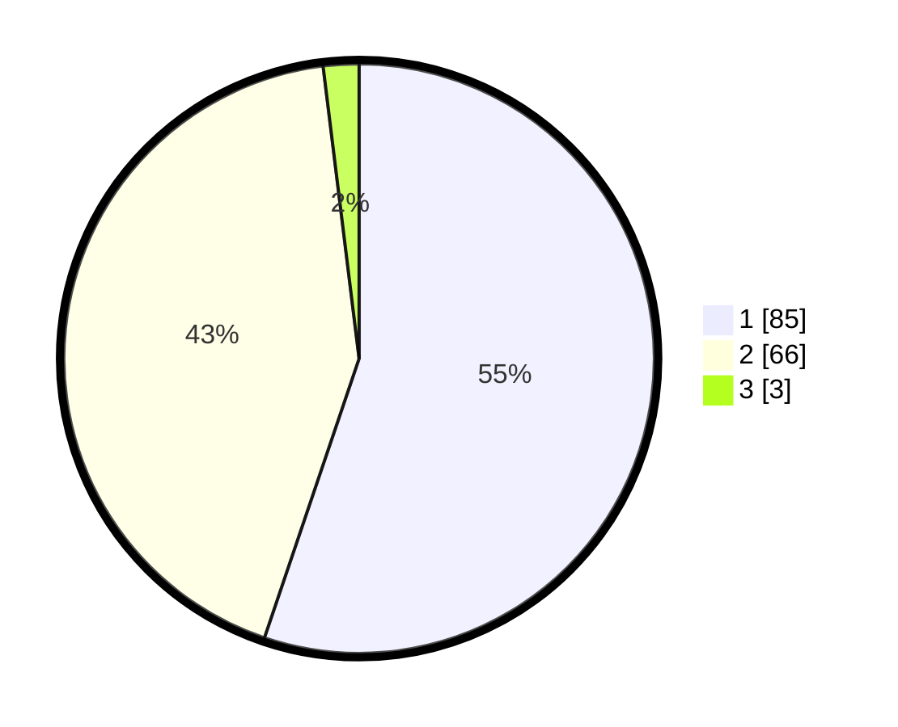

# Hasil

## Grafik

## Tabel

| No. | Nama Paslon    | Suara | Suara (raw) | Persentase |
|:--- |:-------------- | -----:| -----------:| ----------:|
| 1   | ANIES MUHAIMIN | 85    | [85][p-1]   | 55,19      |
| 2   | PRABOWO GIBRAN | 66    | [66][p-2]   | 42,86      |
| 3   | GANJAR MAHFUD  | 3     | [3][p-3]    | 1,95       |

[p-1]: https://github.com/gigit-pemilu/pemilu-2024-11-aceh/blob/main/pilpres/hitung-suara/sub/11-aceh/sub/03-aceh-timur/sub/20-simpang-jernih/sub/2004-rantau-panjang/sub/002-tps/sub/paslon-1.txt
[p-2]: https://github.com/gigit-pemilu/pemilu-2024-11-aceh/blob/main/pilpres/hitung-suara/sub/11-aceh/sub/03-aceh-timur/sub/20-simpang-jernih/sub/2004-rantau-panjang/sub/002-tps/sub/paslon-2.txt
[p-3]: https://github.com/gigit-pemilu/pemilu-2024-11-aceh/blob/main/pilpres/hitung-suara/sub/11-aceh/sub/03-aceh-timur/sub/20-simpang-jernih/sub/2004-rantau-panjang/sub/002-tps/sub/paslon-3.txt

## Foto C Plano

https://sirekap-obj-formc.kpu.go.id/64ed/pemilu/ppwp/11/03/20/20/04/1103202004002-20240219-154143--279ac7d1-db8f-408f-801f-90a4474ca0dd.jpg

https://sirekap-obj-formc.kpu.go.id/64ed/pemilu/ppwp/11/03/20/20/04/1103202004002-20240219-154307--f3dfcfd2-499c-479d-8598-29bc88e90494.jpg

https://sirekap-obj-formc.kpu.go.id/64ed/pemilu/ppwp/11/03/20/20/04/1103202004002-20240219-154400--0b187a0a-37fd-4c4a-8c73-a0cbb1c467eb.jpg

## Metadata

| Key        | Value               |
| ---------- | ------------------- |
| Time Stamp | 2024-02-21 18:00:00 |

## DATA PEMILIH TETAP

Jumlah pemilih dalam DPT: **214**.
 * L: **120**.
 * P: **94**.

## DATA PENGGUNA HAK PILIH

Jumlah pengguna hak pilih dalam DPT: **161**.
 * L: **89**.
 * P: **72**.

Jumlah pengguna hak pilih dalam DPTb: **0**.
 * L: **0**.
 * P: **0**.

Jumlah pengguna hak pilih dalam DPK: **0**.
 * L: **0**.
 * P: **0**.

Jumlah pengguna hak pilih: **161**.
 * L: **89**.
 * P: **72**.

## JUMLAH SUARA SAH DAN TIDAK SAH

JUMLAH SELURUH SUARA SAH: **154**.

JUMLAH SUARA TIDAK SAH: **7**.

JUMLAH SELURUH SUARA SAH DAN SUARA TIDAK SAH: **161**.

