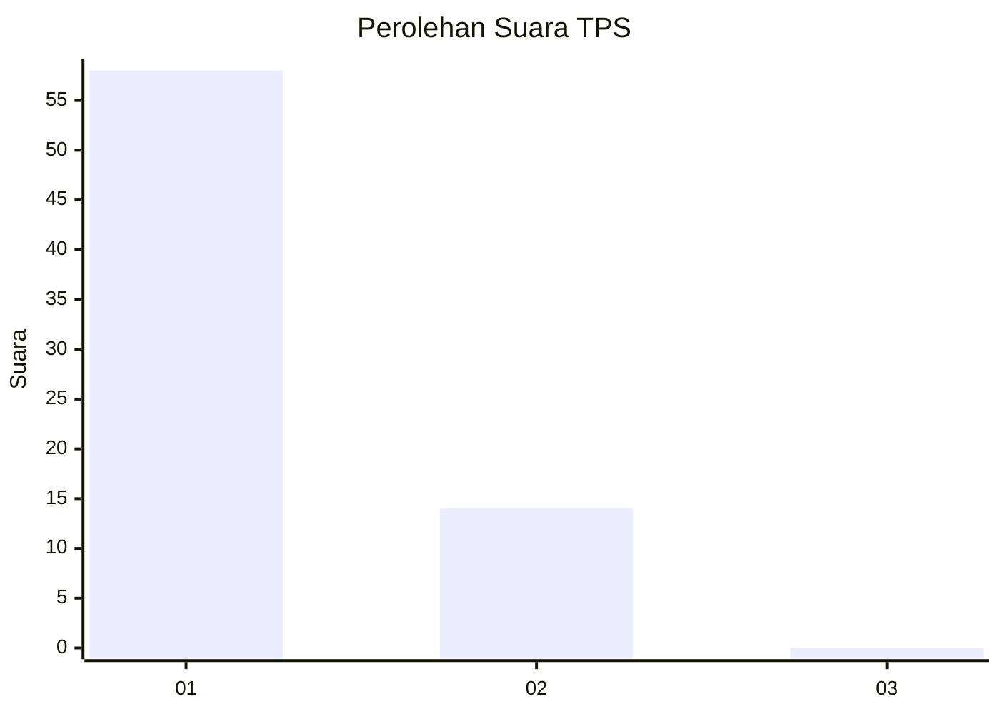
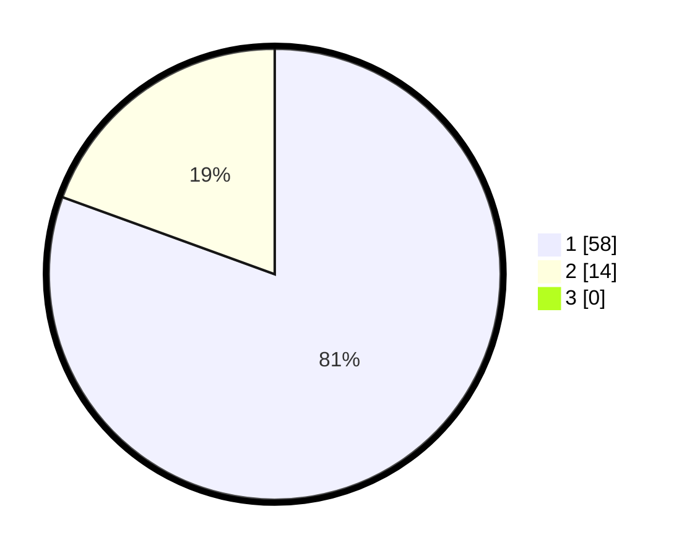

# Hasil

## Grafik

## Tabel

| No. | Nama Paslon    | Suara | Suara (raw) | Persentase |
|:--- |:-------------- | -----:| -----------:| ----------:|
| 1   | ANIES MUHAIMIN | 58    | [58][p-1]   | 80,56      |
| 2   | PRABOWO GIBRAN | 14    | [14][p-2]   | 19,44      |
| 3   | GANJAR MAHFUD  | 0     | [0][p-3]    | 0,00       |

[p-1]: https://github.com/gigit-pemilu/pemilu-2024-11-aceh/blob/main/pilpres/hitung-suara/sub/11-aceh/sub/03-aceh-timur/sub/20-simpang-jernih/sub/2007-tampur-boor/sub/001-tps/sub/paslon-1.txt
[p-2]: https://github.com/gigit-pemilu/pemilu-2024-11-aceh/blob/main/pilpres/hitung-suara/sub/11-aceh/sub/03-aceh-timur/sub/20-simpang-jernih/sub/2007-tampur-boor/sub/001-tps/sub/paslon-2.txt
[p-3]: https://github.com/gigit-pemilu/pemilu-2024-11-aceh/blob/main/pilpres/hitung-suara/sub/11-aceh/sub/03-aceh-timur/sub/20-simpang-jernih/sub/2007-tampur-boor/sub/001-tps/sub/paslon-3.txt

## Foto C Plano

https://sirekap-obj-formc.kpu.go.id/f81c/pemilu/ppwp/11/03/20/20/07/1103202007001-20240220-005932--efd3d8f4-290a-499d-acf8-9a2efc32fbaa.jpg

https://sirekap-obj-formc.kpu.go.id/f81c/pemilu/ppwp/11/03/20/20/07/1103202007001-20240220-005934--91c296c2-943e-4ad4-a3da-903a71d4fa50.jpg

https://sirekap-obj-formc.kpu.go.id/f81c/pemilu/ppwp/11/03/20/20/07/1103202007001-20240220-005933--d41195c4-de24-492c-9aa7-29b6330341be.jpg

## Metadata

| Key        | Value               |
| ---------- | ------------------- |
| Time Stamp | 2024-02-21 10:00:00 |

## DATA PEMILIH TETAP

Jumlah pemilih dalam DPT: **98**.
 * L: **42**.
 * P: **56**.

## DATA PENGGUNA HAK PILIH

Jumlah pengguna hak pilih dalam DPT: **71**.
 * L: **33**.
 * P: **38**.

Jumlah pengguna hak pilih dalam DPTb: **1**.
 * L: **1**.
 * P: **0**.

Jumlah pengguna hak pilih dalam DPK: **1**.
 * L: **1**.
 * P: **0**.

Jumlah pengguna hak pilih: **73**.
 * L: **35**.
 * P: **38**.

## JUMLAH SUARA SAH DAN TIDAK SAH

JUMLAH SELURUH SUARA SAH: **72**.

JUMLAH SUARA TIDAK SAH: **1**.

JUMLAH SELURUH SUARA SAH DAN SUARA TIDAK SAH: **73**.

