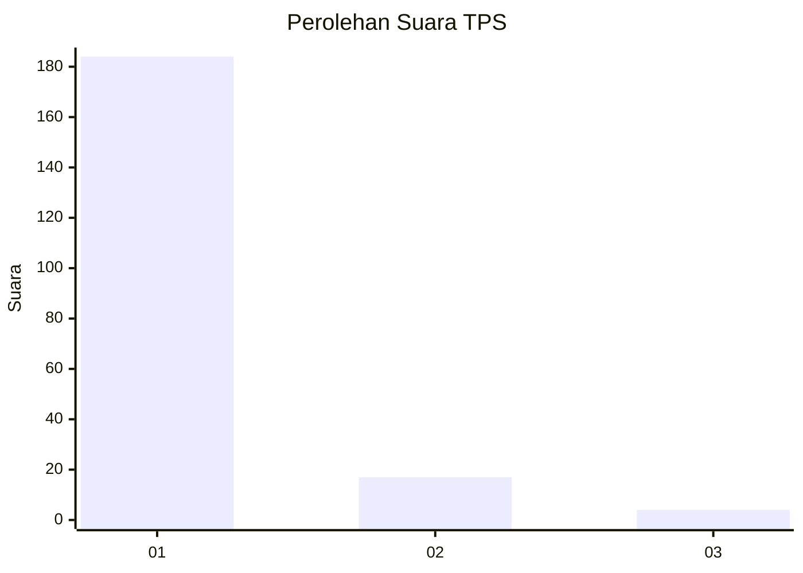
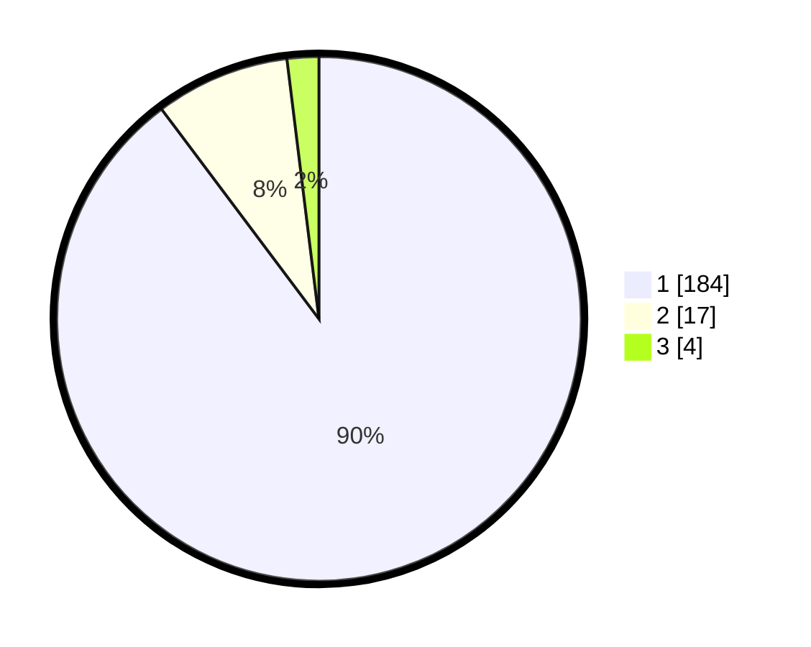

# Hasil

## Grafik

## Tabel

| No. | Nama Paslon    | Suara | Suara (raw) | Persentase |
|:--- |:-------------- | -----:| -----------:| ----------:|
| 1   | ANIES MUHAIMIN | 184   | [184][p-1]  | 89,76      |
| 2   | PRABOWO GIBRAN | 17    | [17][p-2]   | 8,29       |
| 3   | GANJAR MAHFUD  | 4     | [4][p-3]    | 1,95       |

[p-1]: https://github.com/gigit-pemilu/pemilu-2024-11-aceh/blob/main/pilpres/hitung-suara/sub/11-aceh/sub/03-aceh-timur/sub/21-darul-ihsan/sub/2004-keude-dua/sub/001-tps/sub/paslon-1.txt
[p-2]: https://github.com/gigit-pemilu/pemilu-2024-11-aceh/blob/main/pilpres/hitung-suara/sub/11-aceh/sub/03-aceh-timur/sub/21-darul-ihsan/sub/2004-keude-dua/sub/001-tps/sub/paslon-2.txt
[p-3]: https://github.com/gigit-pemilu/pemilu-2024-11-aceh/blob/main/pilpres/hitung-suara/sub/11-aceh/sub/03-aceh-timur/sub/21-darul-ihsan/sub/2004-keude-dua/sub/001-tps/sub/paslon-3.txt

## Foto C Plano

https://sirekap-obj-formc.kpu.go.id/21c0/pemilu/ppwp/11/03/21/20/04/1103212004001-20240215-035715--ff916588-c02c-4c39-ab44-170836f8c1eb.jpg

https://sirekap-obj-formc.kpu.go.id/21c0/pemilu/ppwp/11/03/21/20/04/1103212004001-20240215-040211--d7724288-f678-4ff9-914d-6db3781286e8.jpg

https://sirekap-obj-formc.kpu.go.id/21c0/pemilu/ppwp/11/03/21/20/04/1103212004001-20240215-040558--127a434e-6bb2-462f-81b2-66364b3cd8c7.jpg

## Metadata

| Key        | Value               |
| ---------- | ------------------- |
| Time Stamp | 2024-02-24 22:31:28 |

## DATA PEMILIH TETAP

Jumlah pemilih dalam DPT: **280**.
 * L: **132**.
 * P: **148**.

## DATA PENGGUNA HAK PILIH

Jumlah pengguna hak pilih dalam DPT: **204**.
 * L: **92**.
 * P: **112**.

Jumlah pengguna hak pilih dalam DPTb: **0**.
 * L: **0**.
 * P: **0**.

Jumlah pengguna hak pilih dalam DPK: **4**.
 * L: **2**.
 * P: **2**.

Jumlah pengguna hak pilih: **208**.
 * L: **94**.
 * P: **114**.

## JUMLAH SUARA SAH DAN TIDAK SAH

JUMLAH SELURUH SUARA SAH: **205**.

JUMLAH SUARA TIDAK SAH: **3**.

JUMLAH SELURUH SUARA SAH DAN SUARA TIDAK SAH: **208**.

