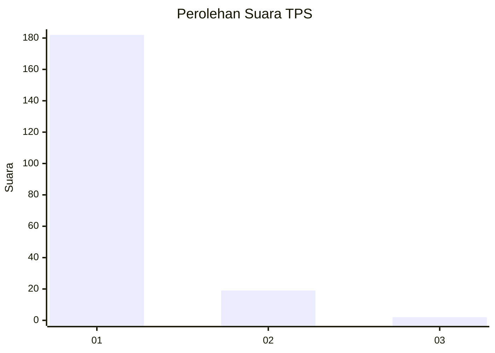
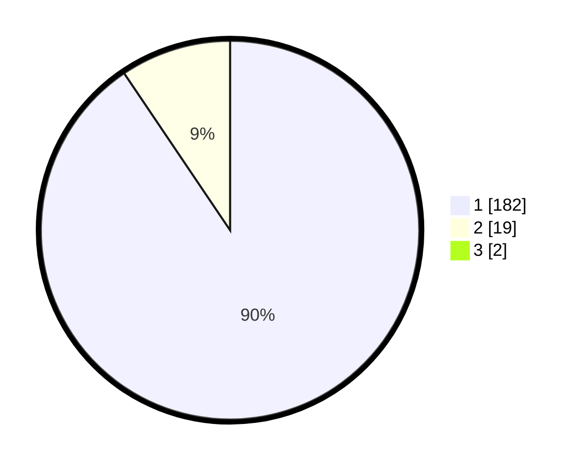

# Hasil

## Grafik

## Tabel

| No. | Nama Paslon    | Suara | Suara (raw) | Persentase |
|:--- |:-------------- | -----:| -----------:| ----------:|
| 1   | ANIES MUHAIMIN | 182   | [182][p-1]  | 89,66      |
| 2   | PRABOWO GIBRAN | 19    | [19][p-2]   | 9,36       |
| 3   | GANJAR MAHFUD  | 2     | [2][p-3]    | 0,99       |

[p-1]: https://github.com/gigit-pemilu/pemilu-2024-11-aceh/blob/main/pilpres/hitung-suara/sub/11-aceh/sub/03-aceh-timur/sub/21-darul-ihsan/sub/2010-pulo-blang/sub/001-tps/sub/paslon-1.txt
[p-2]: https://github.com/gigit-pemilu/pemilu-2024-11-aceh/blob/main/pilpres/hitung-suara/sub/11-aceh/sub/03-aceh-timur/sub/21-darul-ihsan/sub/2010-pulo-blang/sub/001-tps/sub/paslon-2.txt
[p-3]: https://github.com/gigit-pemilu/pemilu-2024-11-aceh/blob/main/pilpres/hitung-suara/sub/11-aceh/sub/03-aceh-timur/sub/21-darul-ihsan/sub/2010-pulo-blang/sub/001-tps/sub/paslon-3.txt

## Foto C Plano

https://sirekap-obj-formc.kpu.go.id/1052/pemilu/ppwp/11/03/21/20/10/1103212010001-20240214-205502--1a6a82cb-54ee-4275-8328-da753be43a4f.jpg

https://sirekap-obj-formc.kpu.go.id/1052/pemilu/ppwp/11/03/21/20/10/1103212010001-20240214-204940--f955213c-bc5c-46bd-a0f0-ac9742a2d517.jpg

https://sirekap-obj-formc.kpu.go.id/1052/pemilu/ppwp/11/03/21/20/10/1103212010001-20240214-205137--b5c3c99e-43e8-4252-ab70-264b18507c64.jpg

## Metadata

| Key        | Value               |
| ---------- | ------------------- |
| Time Stamp | 2024-02-24 22:31:28 |

