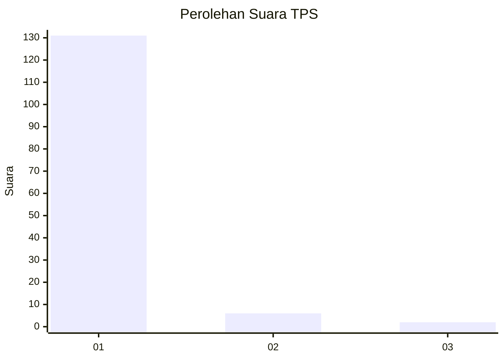
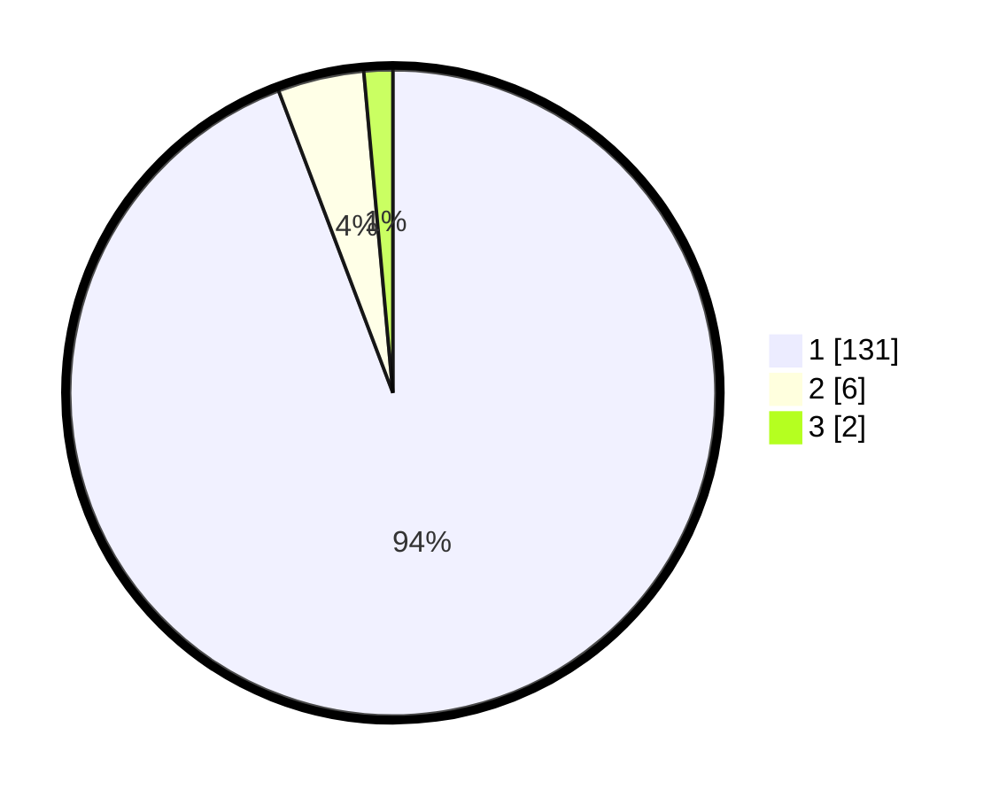

# Hasil

## Grafik

## Tabel

| No. | Nama Paslon    | Suara | Suara (raw) | Persentase |
|:--- |:-------------- | -----:| -----------:| ----------:|
| 1   | ANIES MUHAIMIN | 131   | [131][p-1]  | 94,24      |
| 2   | PRABOWO GIBRAN | 6     | [6][p-2]    | 4,32       |
| 3   | GANJAR MAHFUD  | 2     | [2][p-3]    | 1,44       |

[p-1]: https://github.com/gigit-pemilu/pemilu-2024-11-aceh/blob/main/pilpres/hitung-suara/sub/11-aceh/sub/03-aceh-timur/sub/21-darul-ihsan/sub/2011-lhok-dalam/sub/001-tps/sub/paslon-1.txt
[p-2]: https://github.com/gigit-pemilu/pemilu-2024-11-aceh/blob/main/pilpres/hitung-suara/sub/11-aceh/sub/03-aceh-timur/sub/21-darul-ihsan/sub/2011-lhok-dalam/sub/001-tps/sub/paslon-2.txt
[p-3]: https://github.com/gigit-pemilu/pemilu-2024-11-aceh/blob/main/pilpres/hitung-suara/sub/11-aceh/sub/03-aceh-timur/sub/21-darul-ihsan/sub/2011-lhok-dalam/sub/001-tps/sub/paslon-3.txt

## Foto C Plano

https://sirekap-obj-formc.kpu.go.id/6785/pemilu/ppwp/11/03/21/20/11/1103212011001-20240215-104246--2d80d86a-3e2e-499c-9a03-c5ba2945d183.jpg

https://sirekap-obj-formc.kpu.go.id/6785/pemilu/ppwp/11/03/21/20/11/1103212011001-20240214-211014--ae48b736-b2c7-4039-8e80-1852704777e6.jpg

https://sirekap-obj-formc.kpu.go.id/6785/pemilu/ppwp/11/03/21/20/11/1103212011001-20240215-104532--5d1887c9-2122-4d75-ae5a-85d92149dd1c.jpg

## Metadata

| Key        | Value               |
| ---------- | ------------------- |
| Time Stamp | 2024-02-24 22:31:28 |

