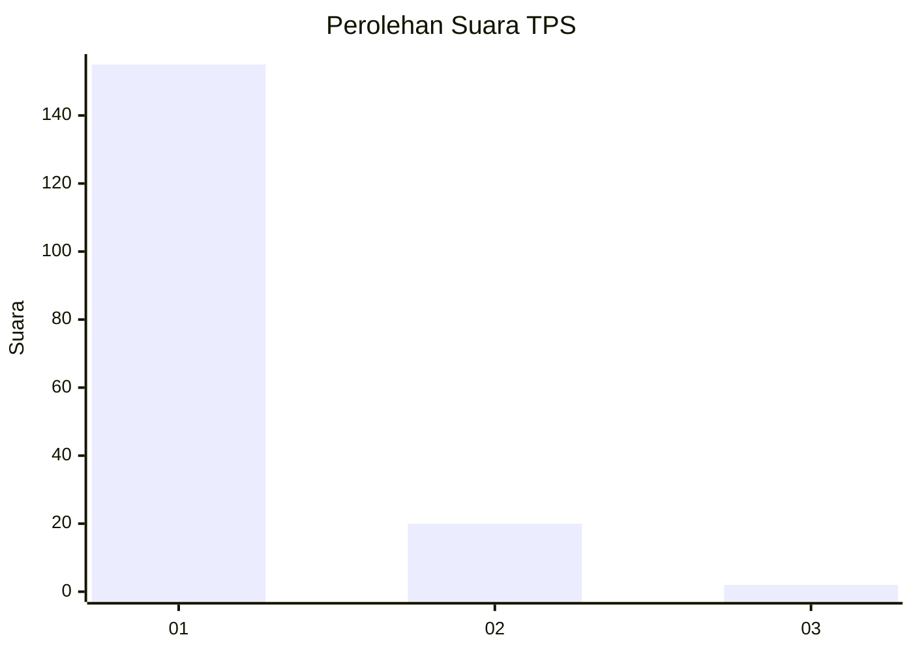
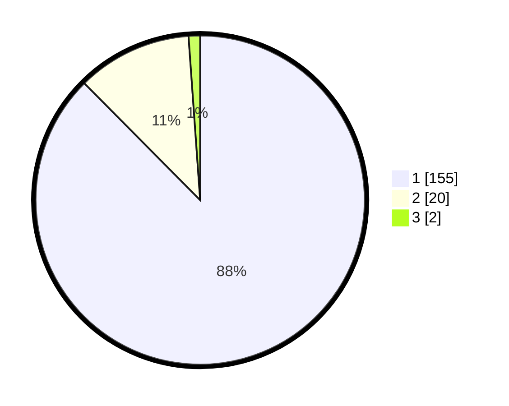

# Hasil

## Grafik

## Tabel

| No. | Nama Paslon    | Suara | Suara (raw) | Persentase |
|:--- |:-------------- | -----:| -----------:| ----------:|
| 1   | ANIES MUHAIMIN | 155   | [155][p-1]  | 87,57      |
| 2   | PRABOWO GIBRAN | 20    | [20][p-2]   | 11,30      |
| 3   | GANJAR MAHFUD  | 2     | [2][p-3]    | 1,13       |

[p-1]: https://github.com/gigit-pemilu/pemilu-2024-11-aceh/blob/main/pilpres/hitung-suara/sub/11-aceh/sub/03-aceh-timur/sub/22-darul-falah/sub/2001-tunong-bugeng/sub/002-tps/sub/paslon-1.txt
[p-2]: https://github.com/gigit-pemilu/pemilu-2024-11-aceh/blob/main/pilpres/hitung-suara/sub/11-aceh/sub/03-aceh-timur/sub/22-darul-falah/sub/2001-tunong-bugeng/sub/002-tps/sub/paslon-2.txt
[p-3]: https://github.com/gigit-pemilu/pemilu-2024-11-aceh/blob/main/pilpres/hitung-suara/sub/11-aceh/sub/03-aceh-timur/sub/22-darul-falah/sub/2001-tunong-bugeng/sub/002-tps/sub/paslon-3.txt

## Foto C Plano

https://sirekap-obj-formc.kpu.go.id/8339/pemilu/ppwp/11/03/22/20/01/1103222001002-20240218-120106--4d2ffd36-f483-4738-a8f1-62de14c893f7.jpg

https://sirekap-obj-formc.kpu.go.id/8339/pemilu/ppwp/11/03/22/20/01/1103222001002-20240218-120107--c24a7173-6575-4287-a0a3-b5427ffc7175.jpg

https://sirekap-obj-formc.kpu.go.id/8339/pemilu/ppwp/11/03/22/20/01/1103222001002-20240218-120106--8433a04e-e726-457d-abdf-84d5f3dce675.jpg

## Metadata

| Key        | Value               |
| ---------- | ------------------- |
| Time Stamp | 2024-02-19 12:00:00 |

## DATA PEMILIH TETAP

Jumlah pemilih dalam DPT: **241**.
 * L: **116**.
 * P: **125**.

## DATA PENGGUNA HAK PILIH

Jumlah pengguna hak pilih dalam DPT: **179**.
 * L: **72**.
 * P: **107**.

Jumlah pengguna hak pilih dalam DPTb: **0**.
 * L: **0**.
 * P: **0**.

Jumlah pengguna hak pilih dalam DPK: **0**.
 * L: **0**.
 * P: **0**.

Jumlah pengguna hak pilih: **179**.
 * L: **72**.
 * P: **107**.

## JUMLAH SUARA SAH DAN TIDAK SAH

JUMLAH SELURUH SUARA SAH: **177**.

JUMLAH SUARA TIDAK SAH: **2**.

JUMLAH SELURUH SUARA SAH DAN SUARA TIDAK SAH: **179**.

