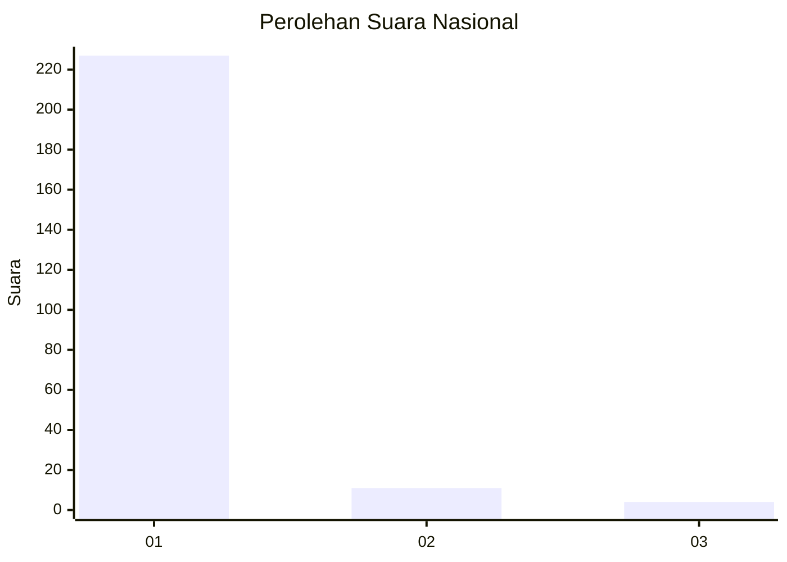
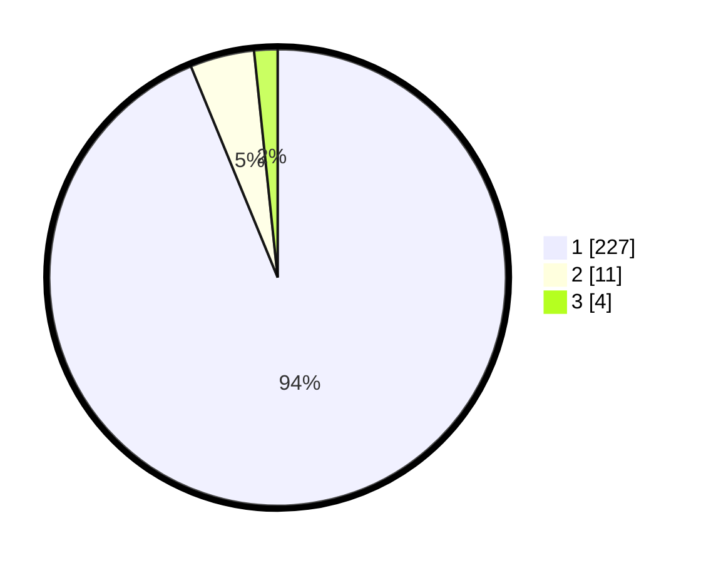

# Hasil

## Grafik

## Tabel

| No. | Nama Paslon    | Suara | Suara (raw) | Persentase |
|:--- |:-------------- | -----:| -----------:| ----------:|
| 1   | ANIES MUHAIMIN | 227   | [227][p-1]  | 93,80      |
| 2   | PRABOWO GIBRAN | 11    | [11][p-2]   | 4,55       |
| 3   | GANJAR MAHFUD  | 4     | [4][p-3]    | 1,65       |

[p-1]: https://github.com/gigit-pemilu/pemilu-2024/blob/main/pilpres/hitung-suara/sub/11-aceh/sub/03-aceh-timur/sub/22-darul-falah/sub/2002-cempeudak/sub/001-tps/sub/paslon-1.txt
[p-2]: https://github.com/gigit-pemilu/pemilu-2024/blob/main/pilpres/hitung-suara/sub/11-aceh/sub/03-aceh-timur/sub/22-darul-falah/sub/2002-cempeudak/sub/001-tps/sub/paslon-2.txt
[p-3]: https://github.com/gigit-pemilu/pemilu-2024/blob/main/pilpres/hitung-suara/sub/11-aceh/sub/03-aceh-timur/sub/22-darul-falah/sub/2002-cempeudak/sub/001-tps/sub/paslon-3.txt

## Foto C Plano

https://sirekap-obj-formc.kpu.go.id/fc0f/pemilu/ppwp/11/03/22/20/02/1103222002001-20240216-182016--0934ce45-920c-4661-b6c8-a74d3ed29965.jpg

https://sirekap-obj-formc.kpu.go.id/fc0f/pemilu/ppwp/11/03/22/20/02/1103222002001-20240216-182017--4a00b403-08ca-4e73-9eda-8deea2cd89ef.jpg

https://sirekap-obj-formc.kpu.go.id/fc0f/pemilu/ppwp/11/03/22/20/02/1103222002001-20240216-182016--d9a9299f-cc73-4fe3-9143-d571c09f37aa.jpg

## Metadata

| Key        | Value               |
| ---------- | ------------------- |
| Time Stamp | 2024-02-17 14:45:18 |

## DATA PEMILIH TETAP

Jumlah pemilih dalam DPT: **294**.
 * L: **144**.
 * P: **150**.

## DATA PENGGUNA HAK PILIH

Jumlah pengguna hak pilih dalam DPT: **243**.
 * L: **115**.
 * P: **128**.

Jumlah pengguna hak pilih dalam DPTb: **0**.
 * L: **0**.
 * P: **0**.

Jumlah pengguna hak pilih dalam DPK: **3**.
 * L: **1**.
 * P: **2**.

Jumlah pengguna hak pilih: **246**.
 * L: **116**.
 * P: **130**.

## JUMLAH SUARA SAH DAN TIDAK SAH

JUMLAH SELURUH SUARA SAH: **242**.

JUMLAH SUARA TIDAK SAH: **4**.

JUMLAH SELURUH SUARA SAH DAN SUARA TIDAK SAH: **246**.

