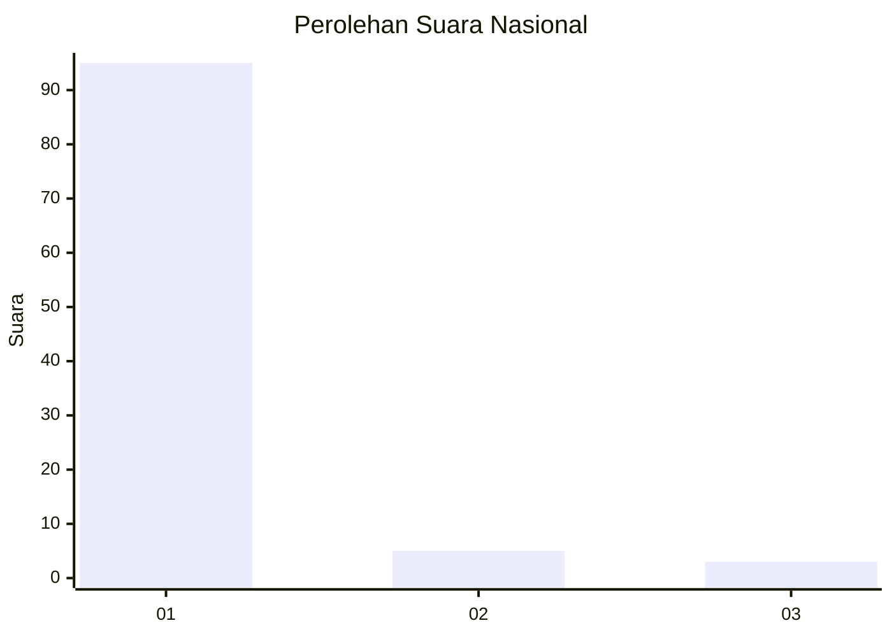
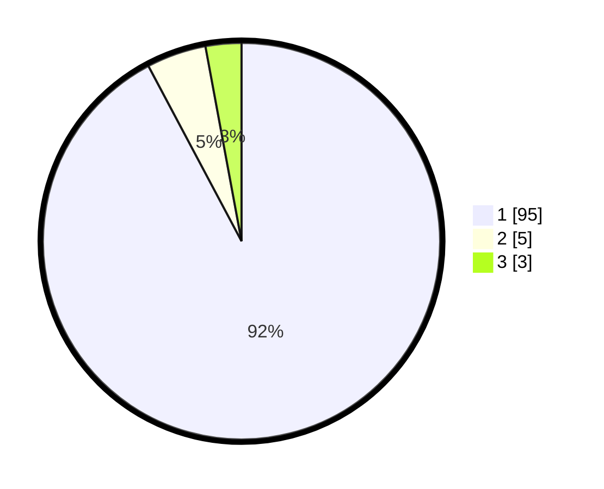

# Hasil

## Grafik

## Tabel

| No. | Nama Paslon    | Suara | Suara (raw) | Persentase |
|:--- |:-------------- | -----:| -----------:| ----------:|
| 1   | ANIES MUHAIMIN | 95    | [95][p-1]   | 92,23      |
| 2   | PRABOWO GIBRAN | 5     | [5][p-2]    | 4,85       |
| 3   | GANJAR MAHFUD  | 3     | [3][p-3]    | 2,91       |

[p-1]: https://github.com/gigit-pemilu/pemilu-2024/blob/main/pilpres/hitung-suara/sub/11-aceh/sub/03-aceh-timur/sub/22-darul-falah/sub/2003-buket-tufah/sub/001-tps/sub/paslon-1.txt
[p-2]: https://github.com/gigit-pemilu/pemilu-2024/blob/main/pilpres/hitung-suara/sub/11-aceh/sub/03-aceh-timur/sub/22-darul-falah/sub/2003-buket-tufah/sub/001-tps/sub/paslon-2.txt
[p-3]: https://github.com/gigit-pemilu/pemilu-2024/blob/main/pilpres/hitung-suara/sub/11-aceh/sub/03-aceh-timur/sub/22-darul-falah/sub/2003-buket-tufah/sub/001-tps/sub/paslon-3.txt

## Foto C Plano

https://sirekap-obj-formc.kpu.go.id/ce7e/pemilu/ppwp/11/03/22/20/03/1103222003001-20240214-155321--25cf9211-08c5-41da-9e14-1c052a264513.jpg

https://sirekap-obj-formc.kpu.go.id/ce7e/pemilu/ppwp/11/03/22/20/03/1103222003001-20240214-155255--923f72b8-52e9-4092-867b-e587bb1ca619.jpg

https://sirekap-obj-formc.kpu.go.id/ce7e/pemilu/ppwp/11/03/22/20/03/1103222003001-20240216-155735--4c99ad42-e21e-4c22-8250-12c98569f43d.jpg

## Metadata

| Key        | Value               |
| ---------- | ------------------- |
| Time Stamp | 2024-02-16 16:25:10 |

## DATA PEMILIH TETAP

Jumlah pemilih dalam DPT: **117**.
 * L: **57**.
 * P: **60**.

## DATA PENGGUNA HAK PILIH

Jumlah pengguna hak pilih dalam DPT: **101**.
 * L: **51**.
 * P: **50**.

Jumlah pengguna hak pilih dalam DPTb: **0**.
 * L: **0**.
 * P: **0**.

Jumlah pengguna hak pilih dalam DPK: **2**.
 * L: **1**.
 * P: **1**.

Jumlah pengguna hak pilih: **103**.
 * L: **52**.
 * P: **51**.

## JUMLAH SUARA SAH DAN TIDAK SAH

JUMLAH SELURUH SUARA SAH: **103**.

JUMLAH SUARA TIDAK SAH: **0**.

JUMLAH SELURUH SUARA SAH DAN SUARA TIDAK SAH: **103**.

