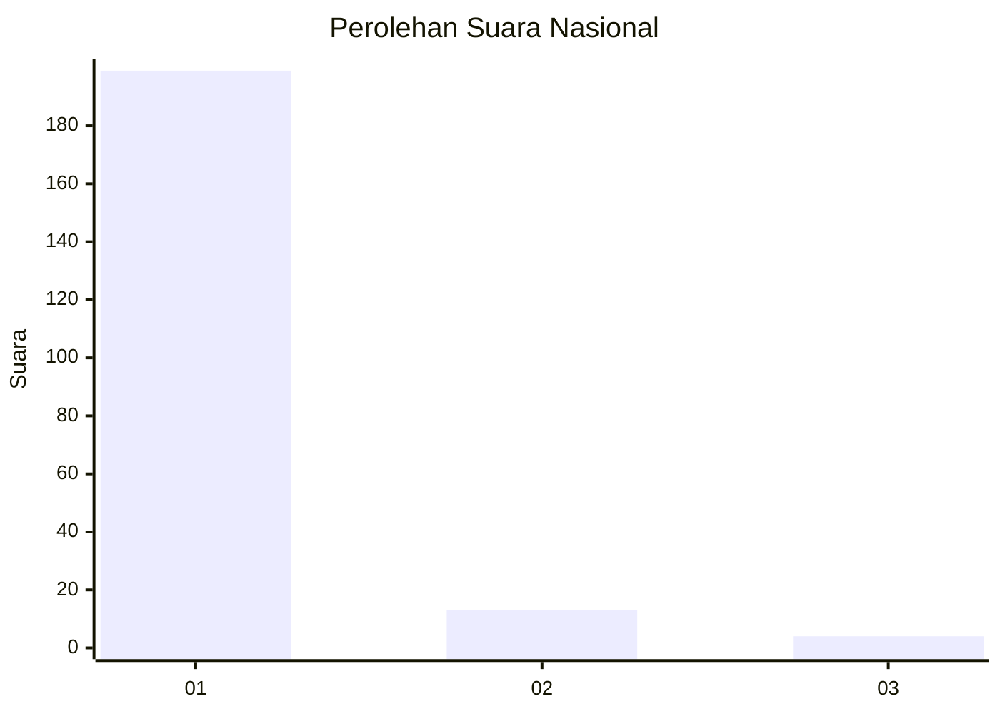
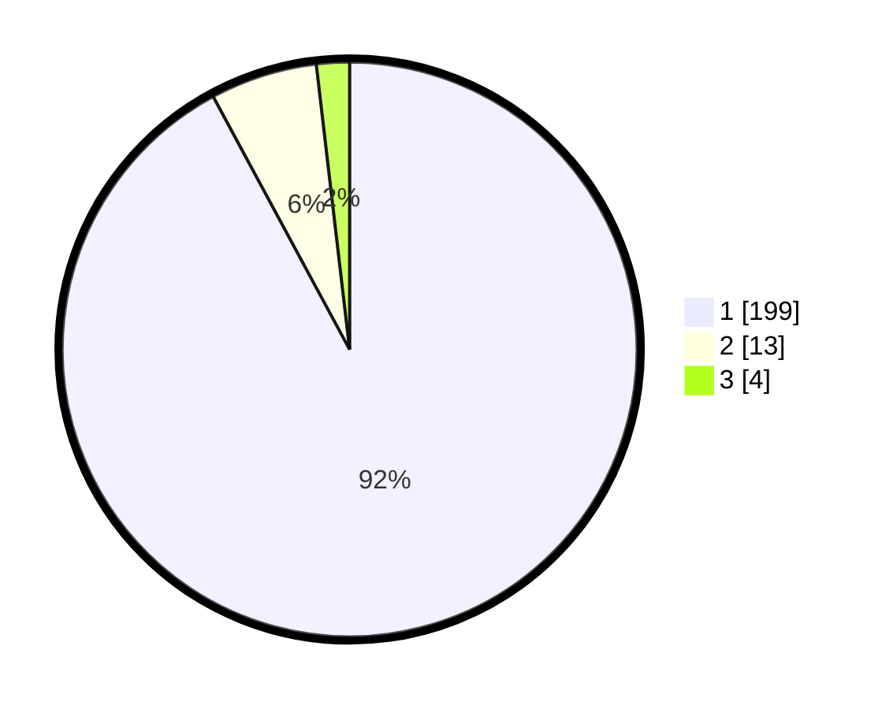

# Hasil

## Grafik

## Tabel

| No. | Nama Paslon    | Suara | Suara (raw) | Persentase |
|:--- |:-------------- | -----:| -----------:| ----------:|
| 1   | ANIES MUHAIMIN | 199   | [199][p-1]  | 92,13      |
| 2   | PRABOWO GIBRAN | 13    | [13][p-2]   | 6,02       |
| 3   | GANJAR MAHFUD  | 4     | [4][p-3]    | 1,85       |

[p-1]: https://github.com/gigit-pemilu/pemilu-2024/blob/main/pilpres/hitung-suara/sub/11-aceh/sub/03-aceh-timur/sub/22-darul-falah/sub/2004-tunong-ulee-gajah/sub/001-tps/sub/paslon-1.txt
[p-2]: https://github.com/gigit-pemilu/pemilu-2024/blob/main/pilpres/hitung-suara/sub/11-aceh/sub/03-aceh-timur/sub/22-darul-falah/sub/2004-tunong-ulee-gajah/sub/001-tps/sub/paslon-2.txt
[p-3]: https://github.com/gigit-pemilu/pemilu-2024/blob/main/pilpres/hitung-suara/sub/11-aceh/sub/03-aceh-timur/sub/22-darul-falah/sub/2004-tunong-ulee-gajah/sub/001-tps/sub/paslon-3.txt

## Foto C Plano

https://sirekap-obj-formc.kpu.go.id/54cd/pemilu/ppwp/11/03/22/20/04/1103222004001-20240217-103443--c2b4266f-2d61-4b23-8f6d-f71efe284b8e.jpg

https://sirekap-obj-formc.kpu.go.id/54cd/pemilu/ppwp/11/03/22/20/04/1103222004001-20240217-104740--3a281930-c926-419b-984f-dce670201876.jpg

https://sirekap-obj-formc.kpu.go.id/54cd/pemilu/ppwp/11/03/22/20/04/1103222004001-20240215-040335--6d15a5b2-5d89-4646-a0ad-f0e9839b3136.jpg

## Metadata

| Key        | Value               |
| ---------- | ------------------- |
| Time Stamp | 2024-02-24 22:31:28 |

## DATA PEMILIH TETAP

Jumlah pemilih dalam DPT: **267**.
 * L: **125**.
 * P: **142**.

## DATA PENGGUNA HAK PILIH

Jumlah pengguna hak pilih dalam DPT: **217**.
 * L: **93**.
 * P: **124**.

Jumlah pengguna hak pilih dalam DPTb: **0**.
 * L: **0**.
 * P: **0**.

Jumlah pengguna hak pilih dalam DPK: **2**.
 * L: **1**.
 * P: **1**.

Jumlah pengguna hak pilih: **219**.
 * L: **94**.
 * P: **125**.

## JUMLAH SUARA SAH DAN TIDAK SAH

JUMLAH SELURUH SUARA SAH: **216**.

JUMLAH SUARA TIDAK SAH: **3**.

JUMLAH SELURUH SUARA SAH DAN SUARA TIDAK SAH: **219**.

