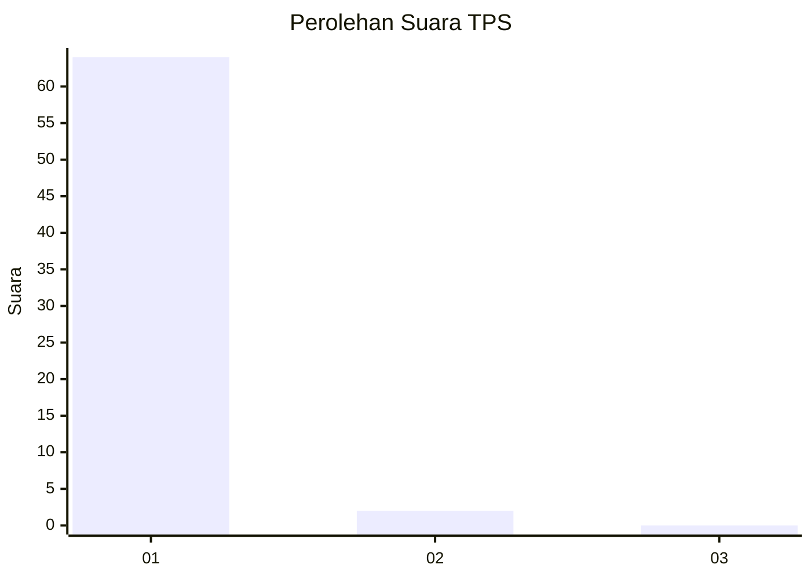
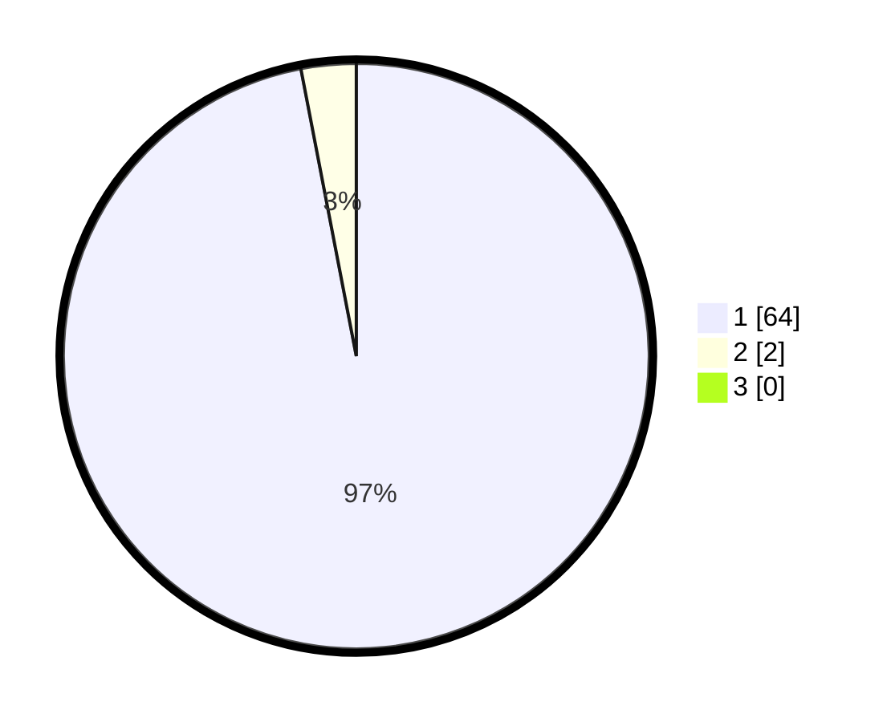

# Hasil

## Grafik

## Tabel

| No. | Nama Paslon    | Suara | Suara (raw) | Persentase |
|:--- |:-------------- | -----:| -----------:| ----------:|
| 1   | ANIES MUHAIMIN | 64    | [64][p-1]   | 96,97      |
| 2   | PRABOWO GIBRAN | 2     | [2][p-2]    | 3,03       |
| 3   | GANJAR MAHFUD  | 0     | [0][p-3]    | 0,00       |

[p-1]: https://github.com/gigit-pemilu/pemilu-2024-11-aceh/blob/main/pilpres/hitung-suara/sub/11-aceh/sub/03-aceh-timur/sub/22-darul-falah/sub/2011-alue-siwah/sub/001-tps/sub/paslon-1.txt
[p-2]: https://github.com/gigit-pemilu/pemilu-2024-11-aceh/blob/main/pilpres/hitung-suara/sub/11-aceh/sub/03-aceh-timur/sub/22-darul-falah/sub/2011-alue-siwah/sub/001-tps/sub/paslon-2.txt
[p-3]: https://github.com/gigit-pemilu/pemilu-2024-11-aceh/blob/main/pilpres/hitung-suara/sub/11-aceh/sub/03-aceh-timur/sub/22-darul-falah/sub/2011-alue-siwah/sub/001-tps/sub/paslon-3.txt

## Foto C Plano

https://sirekap-obj-formc.kpu.go.id/95e2/pemilu/ppwp/11/03/22/20/11/1103222011001-20240214-195503--4724323c-6eaa-428b-acb1-a7d15470a043.jpg

https://sirekap-obj-formc.kpu.go.id/95e2/pemilu/ppwp/11/03/22/20/11/1103222011001-20240214-162242--eb3c72f3-89ab-4a4f-b752-c5a222ef7be0.jpg

https://sirekap-obj-formc.kpu.go.id/95e2/pemilu/ppwp/11/03/22/20/11/1103222011001-20240214-195835--ba16ac92-bf46-4b21-bb90-31973fda0820.jpg

## Metadata

| Key        | Value               |
| ---------- | ------------------- |
| Time Stamp | 2024-02-14 21:46:01 |

## DATA PEMILIH TETAP

Jumlah pemilih dalam DPT: **77**.
 * L: **37**.
 * P: **40**.

## DATA PENGGUNA HAK PILIH

Jumlah pengguna hak pilih dalam DPT: **66**.
 * L: **27**.
 * P: **39**.

Jumlah pengguna hak pilih dalam DPTb: **0**.
 * L: **0**.
 * P: **0**.

Jumlah pengguna hak pilih dalam DPK: **0**.
 * L: **0**.
 * P: **0**.

Jumlah pengguna hak pilih: **66**.
 * L: **27**.
 * P: **59**.

## JUMLAH SUARA SAH DAN TIDAK SAH

JUMLAH SELURUH SUARA SAH: **66**.

JUMLAH SUARA TIDAK SAH: **0**.

JUMLAH SELURUH SUARA SAH DAN SUARA TIDAK SAH: **66**.

