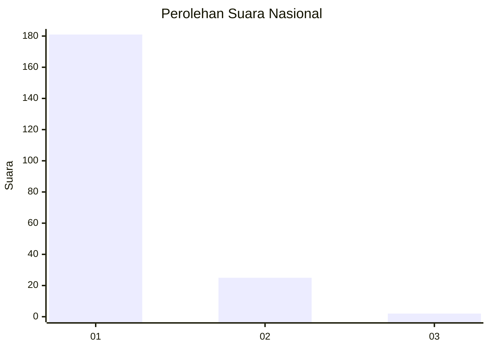
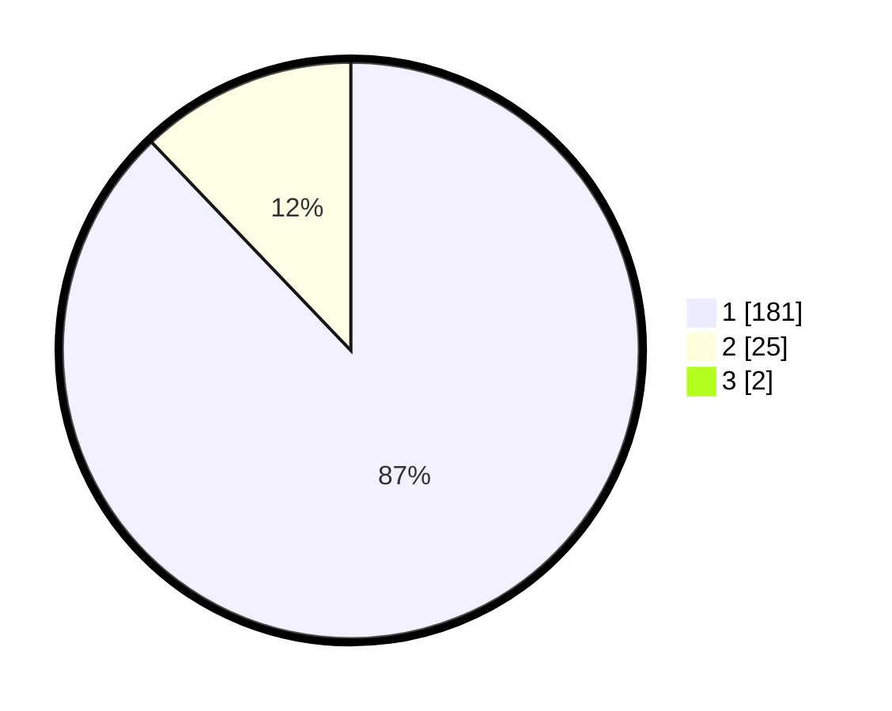

# Hasil

## Grafik

## Tabel

| No. | Nama Paslon    | Suara | Suara (raw) | Persentase |
|:--- |:-------------- | -----:| -----------:| ----------:|
| 1   | ANIES MUHAIMIN | 181   | [181][p-1]  | 87,02      |
| 2   | PRABOWO GIBRAN | 25    | [25][p-2]   | 12,02      |
| 3   | GANJAR MAHFUD  | 2     | [2][p-3]    | 0,96       |

[p-1]: https://github.com/gigit-pemilu/pemilu-2024/blob/main/pilpres/hitung-suara/sub/11-aceh/sub/03-aceh-timur/sub/23-idi-timur/sub/2001-keutapang-dua/sub/001-tps/sub/paslon-1.txt
[p-2]: https://github.com/gigit-pemilu/pemilu-2024/blob/main/pilpres/hitung-suara/sub/11-aceh/sub/03-aceh-timur/sub/23-idi-timur/sub/2001-keutapang-dua/sub/001-tps/sub/paslon-2.txt
[p-3]: https://github.com/gigit-pemilu/pemilu-2024/blob/main/pilpres/hitung-suara/sub/11-aceh/sub/03-aceh-timur/sub/23-idi-timur/sub/2001-keutapang-dua/sub/001-tps/sub/paslon-3.txt

## Foto C Plano

https://sirekap-obj-formc.kpu.go.id/7745/pemilu/ppwp/11/03/23/20/01/1103232001001-20240215-093545--8de8ee32-9053-477c-b606-9bb3c5c3314b.jpg

https://sirekap-obj-formc.kpu.go.id/7745/pemilu/ppwp/11/03/23/20/01/1103232001001-20240215-093948--424972ab-b69c-4952-a1e9-08d45854c14b.jpg

## Metadata

| Key        | Value               |
| ---------- | ------------------- |
| Time Stamp | 2024-02-24 22:31:28 |

