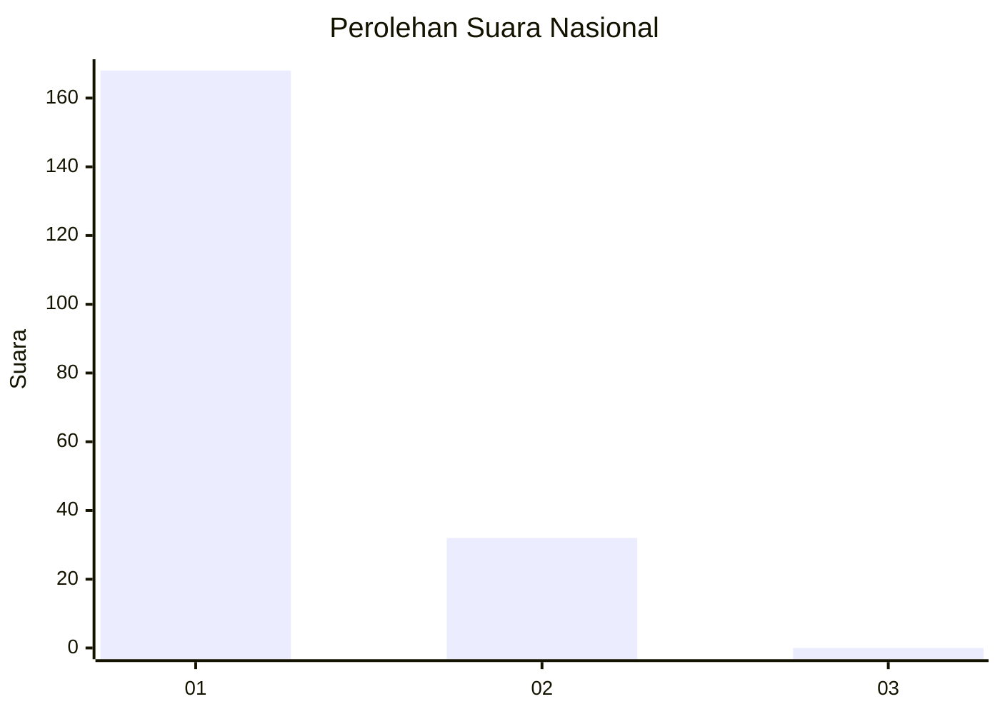
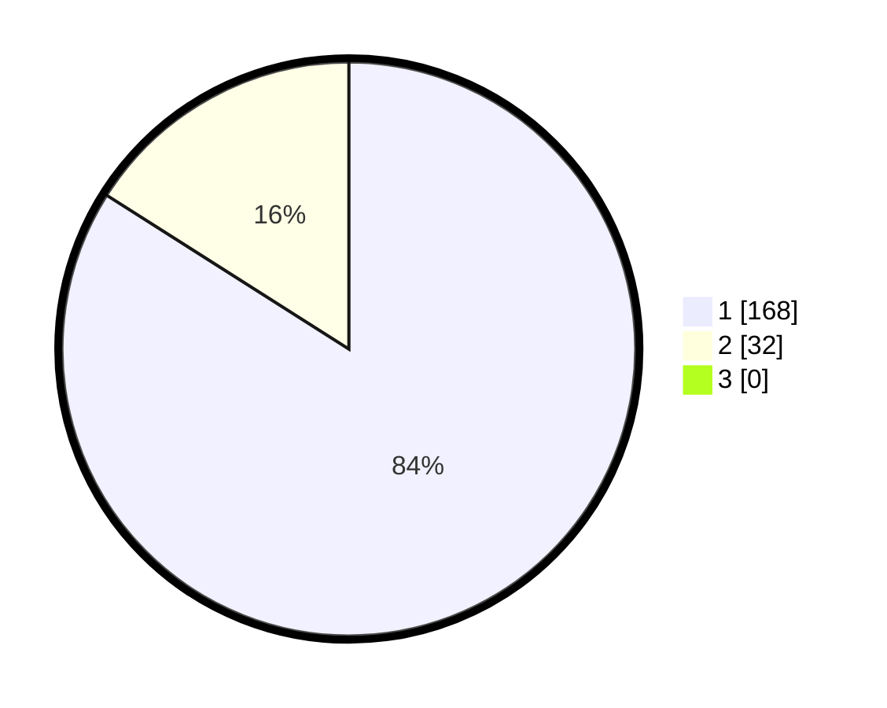

# Hasil

## Grafik

## Tabel

| No. | Nama Paslon    | Suara | Suara (raw) | Persentase |
|:--- |:-------------- | -----:| -----------:| ----------:|
| 1   | ANIES MUHAIMIN | 168   | [168][p-1]  | 84,00      |
| 2   | PRABOWO GIBRAN | 32    | [32][p-2]   | 16,00      |
| 3   | GANJAR MAHFUD  | 0     | [0][p-3]    | 0,00       |

[p-1]: https://github.com/gigit-pemilu/pemilu-2024/blob/main/pilpres/hitung-suara/sub/11-aceh/sub/03-aceh-timur/sub/23-idi-timur/sub/2001-keutapang-dua/sub/002-tps/sub/paslon-1.txt
[p-2]: https://github.com/gigit-pemilu/pemilu-2024/blob/main/pilpres/hitung-suara/sub/11-aceh/sub/03-aceh-timur/sub/23-idi-timur/sub/2001-keutapang-dua/sub/002-tps/sub/paslon-2.txt
[p-3]: https://github.com/gigit-pemilu/pemilu-2024/blob/main/pilpres/hitung-suara/sub/11-aceh/sub/03-aceh-timur/sub/23-idi-timur/sub/2001-keutapang-dua/sub/002-tps/sub/paslon-3.txt

## Foto C Plano

https://sirekap-obj-formc.kpu.go.id/2d94/pemilu/ppwp/11/03/23/20/01/1103232001002-20240215-112731--212b8d79-348e-4815-a5a4-690f652589c8.jpg

https://sirekap-obj-formc.kpu.go.id/2d94/pemilu/ppwp/11/03/23/20/01/1103232001002-20240215-132251--186b2425-2c03-4e07-9dbf-5a7595aba52f.jpg

https://sirekap-obj-formc.kpu.go.id/2d94/pemilu/ppwp/11/03/23/20/01/1103232001002-20240215-113108--cf725940-66a0-46ce-bd92-fa986378b792.jpg

## Metadata

| Key        | Value               |
| ---------- | ------------------- |
| Time Stamp | 2024-02-15 15:30:25 |

## DATA PEMILIH TETAP

Jumlah pemilih dalam DPT: **251**.
 * L: **124**.
 * P: **127**.

## DATA PENGGUNA HAK PILIH

Jumlah pengguna hak pilih dalam DPT: **192**.
 * L: **86**.
 * P: **106**.

Jumlah pengguna hak pilih dalam DPTb: **1**.
 * L: **0**.
 * P: **1**.

Jumlah pengguna hak pilih dalam DPK: **12**.
 * L: **8**.
 * P: **4**.

Jumlah pengguna hak pilih: **205**.
 * L: **94**.
 * P: **111**.

## JUMLAH SUARA SAH DAN TIDAK SAH

JUMLAH SELURUH SUARA SAH: **200**.

JUMLAH SUARA TIDAK SAH: **5**.

JUMLAH SELURUH SUARA SAH DAN SUARA TIDAK SAH: **205**.

