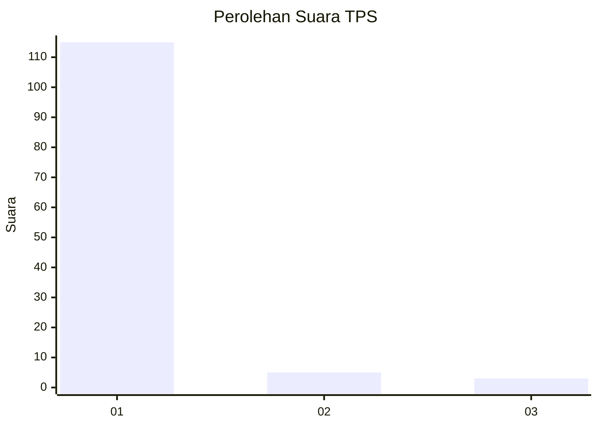
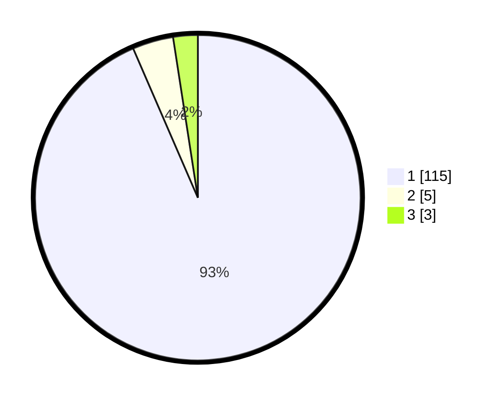

# Hasil

## Grafik

## Tabel

| No. | Nama Paslon    | Suara | Suara (raw) | Persentase |
|:--- |:-------------- | -----:| -----------:| ----------:|
| 1   | ANIES MUHAIMIN | 115   | [115][p-1]  | 93,50      |
| 2   | PRABOWO GIBRAN | 5     | [5][p-2]    | 4,07       |
| 3   | GANJAR MAHFUD  | 3     | [3][p-3]    | 2,44       |

[p-1]: https://github.com/gigit-pemilu/pemilu-2024-11-aceh/blob/main/pilpres/hitung-suara/sub/11-aceh/sub/03-aceh-timur/sub/23-idi-timur/sub/2002-matang-rayeuk-pp/sub/003-tps/sub/paslon-1.txt
[p-2]: https://github.com/gigit-pemilu/pemilu-2024-11-aceh/blob/main/pilpres/hitung-suara/sub/11-aceh/sub/03-aceh-timur/sub/23-idi-timur/sub/2002-matang-rayeuk-pp/sub/003-tps/sub/paslon-2.txt
[p-3]: https://github.com/gigit-pemilu/pemilu-2024-11-aceh/blob/main/pilpres/hitung-suara/sub/11-aceh/sub/03-aceh-timur/sub/23-idi-timur/sub/2002-matang-rayeuk-pp/sub/003-tps/sub/paslon-3.txt

## Foto C Plano

https://sirekap-obj-formc.kpu.go.id/896c/pemilu/ppwp/11/03/23/20/02/1103232002003-20240214-200534--4e9cbf40-1ad9-43da-b646-2824734acdc6.jpg

https://sirekap-obj-formc.kpu.go.id/896c/pemilu/ppwp/11/03/23/20/02/1103232002003-20240214-200626--09fc4dd2-3083-47e2-98b6-b766f0e966cc.jpg

https://sirekap-obj-formc.kpu.go.id/896c/pemilu/ppwp/11/03/23/20/02/1103232002003-20240214-200715--a834f41e-a937-4bac-972f-bfb0e8644a7f.jpg

## Metadata

| Key        | Value               |
| ---------- | ------------------- |
| Time Stamp | 2024-02-14 21:46:01 |

## DATA PEMILIH TETAP

Jumlah pemilih dalam DPT: **137**.
 * L: **75**.
 * P: **62**.

## DATA PENGGUNA HAK PILIH

Jumlah pengguna hak pilih dalam DPT: **108**.
 * L: **52**.
 * P: **56**.

Jumlah pengguna hak pilih dalam DPTb: **5**.
 * L: **3**.
 * P: **2**.

Jumlah pengguna hak pilih dalam DPK: **12**.
 * L: **8**.
 * P: **4**.

Jumlah pengguna hak pilih: **125**.
 * L: **63**.
 * P: **62**.

## JUMLAH SUARA SAH DAN TIDAK SAH

JUMLAH SELURUH SUARA SAH: **123**.

JUMLAH SUARA TIDAK SAH: **2**.

JUMLAH SELURUH SUARA SAH DAN SUARA TIDAK SAH: **125**.

