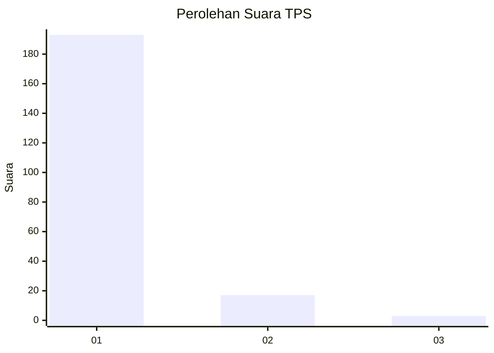
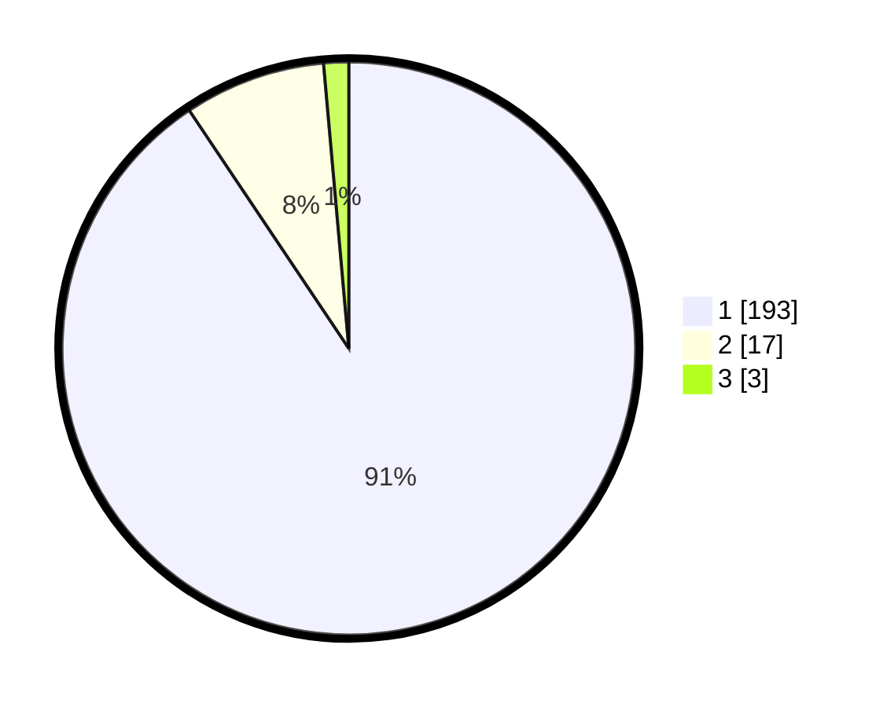

# Hasil

## Grafik

## Tabel

| No. | Nama Paslon    | Suara | Suara (raw) | Persentase |
|:--- |:-------------- | -----:| -----------:| ----------:|
| 1   | ANIES MUHAIMIN | 193   | [193][p-1]  | 90,61      |
| 2   | PRABOWO GIBRAN | 17    | [17][p-2]   | 7,98       |
| 3   | GANJAR MAHFUD  | 3     | [3][p-3]    | 1,41       |

[p-1]: https://github.com/gigit-pemilu/pemilu-2024-11-aceh/blob/main/pilpres/hitung-suara/sub/11-aceh/sub/03-aceh-timur/sub/23-idi-timur/sub/2010-seuneubok-timu/sub/001-tps/sub/paslon-1.txt
[p-2]: https://github.com/gigit-pemilu/pemilu-2024-11-aceh/blob/main/pilpres/hitung-suara/sub/11-aceh/sub/03-aceh-timur/sub/23-idi-timur/sub/2010-seuneubok-timu/sub/001-tps/sub/paslon-2.txt
[p-3]: https://github.com/gigit-pemilu/pemilu-2024-11-aceh/blob/main/pilpres/hitung-suara/sub/11-aceh/sub/03-aceh-timur/sub/23-idi-timur/sub/2010-seuneubok-timu/sub/001-tps/sub/paslon-3.txt

## Foto C Plano

https://sirekap-obj-formc.kpu.go.id/4fc3/pemilu/ppwp/11/03/23/20/10/1103232010001-20240215-112422--b246126f-cbde-4a64-8863-014bbd629fba.jpg

https://sirekap-obj-formc.kpu.go.id/4fc3/pemilu/ppwp/11/03/23/20/10/1103232010001-20240215-112601--0fabc0db-ab69-422a-8400-10e322538cb0.jpg

https://sirekap-obj-formc.kpu.go.id/4fc3/pemilu/ppwp/11/03/23/20/10/1103232010001-20240215-112838--8bdbdacf-ce0f-43fa-8a9e-ad56624c3250.jpg

## Metadata

| Key        | Value               |
| ---------- | ------------------- |
| Time Stamp | 2024-02-25 18:00:00 |

