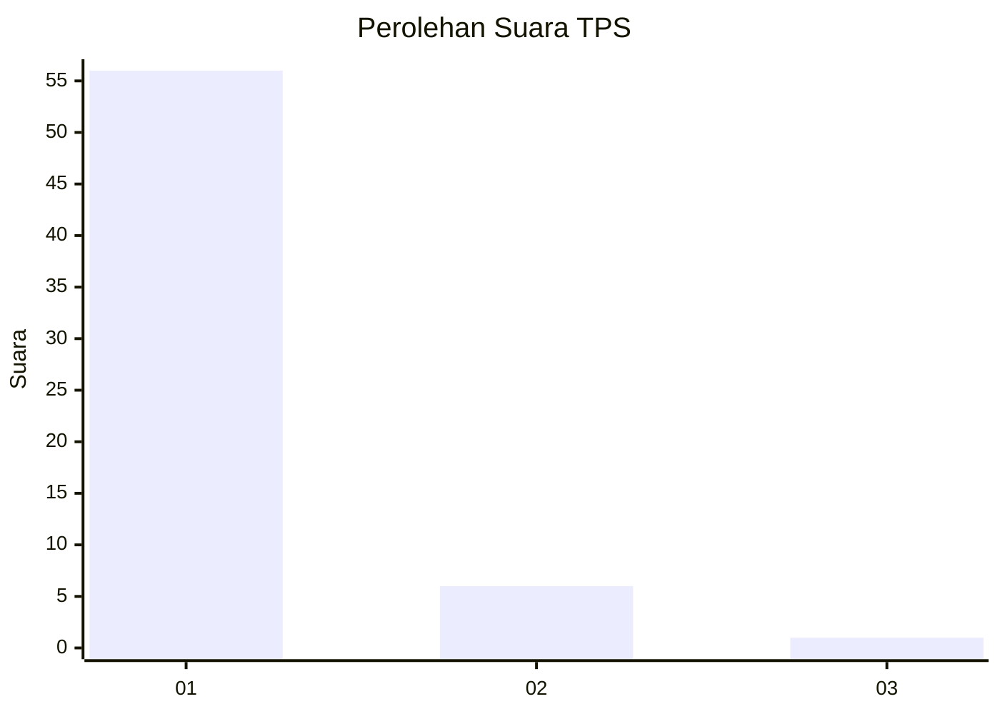
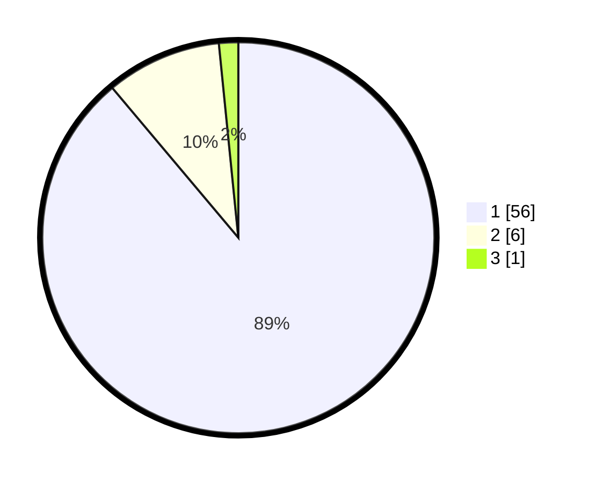

# Hasil

## Grafik

## Tabel

| No. | Nama Paslon    | Suara | Suara (raw) | Persentase |
|:--- |:-------------- | -----:| -----------:| ----------:|
| 1   | ANIES MUHAIMIN | 56    | [56][p-1]   | 88,89      |
| 2   | PRABOWO GIBRAN | 6     | [6][p-2]    | 9,52       |
| 3   | GANJAR MAHFUD  | 1     | [1][p-3]    | 1,59       |

[p-1]: https://github.com/gigit-pemilu/pemilu-2024-11-aceh/blob/main/pilpres/hitung-suara/sub/11-aceh/sub/03-aceh-timur/sub/23-idi-timur/sub/2011-matang-bungong/sub/003-tps/sub/paslon-1.txt
[p-2]: https://github.com/gigit-pemilu/pemilu-2024-11-aceh/blob/main/pilpres/hitung-suara/sub/11-aceh/sub/03-aceh-timur/sub/23-idi-timur/sub/2011-matang-bungong/sub/003-tps/sub/paslon-2.txt
[p-3]: https://github.com/gigit-pemilu/pemilu-2024-11-aceh/blob/main/pilpres/hitung-suara/sub/11-aceh/sub/03-aceh-timur/sub/23-idi-timur/sub/2011-matang-bungong/sub/003-tps/sub/paslon-3.txt

## Foto C Plano

https://sirekap-obj-formc.kpu.go.id/002f/pemilu/ppwp/11/03/23/20/11/1103232011003-20240216-154623--7974a678-5f3d-47b4-8a95-cff198639c15.jpg

https://sirekap-obj-formc.kpu.go.id/002f/pemilu/ppwp/11/03/23/20/11/1103232011003-20240216-154624--dec56fcc-010d-4e70-b8bf-5c2d6d18e188.jpg

https://sirekap-obj-formc.kpu.go.id/002f/pemilu/ppwp/11/03/23/20/11/1103232011003-20240216-154624--6c439947-a84d-4693-a6d7-99e81d8e2ddc.jpg

## Metadata

| Key        | Value               |
| ---------- | ------------------- |
| Time Stamp | 2024-02-17 14:45:18 |

## DATA PEMILIH TETAP

Jumlah pemilih dalam DPT: **71**.
 * L: **38**.
 * P: **33**.

## DATA PENGGUNA HAK PILIH

Jumlah pengguna hak pilih dalam DPT: **59**.
 * L: **29**.
 * P: **30**.

Jumlah pengguna hak pilih dalam DPTb: **0**.
 * L: **0**.
 * P: **0**.

Jumlah pengguna hak pilih dalam DPK: **4**.
 * L: **1**.
 * P: **3**.

Jumlah pengguna hak pilih: **63**.
 * L: **30**.
 * P: **33**.

## JUMLAH SUARA SAH DAN TIDAK SAH

JUMLAH SELURUH SUARA SAH: **63**.

JUMLAH SUARA TIDAK SAH: **0**.

JUMLAH SELURUH SUARA SAH DAN SUARA TIDAK SAH: **63**.

