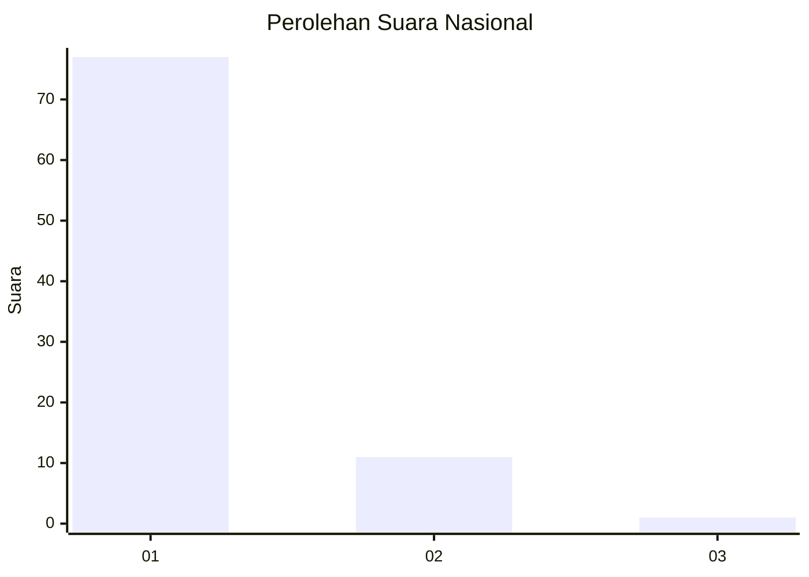
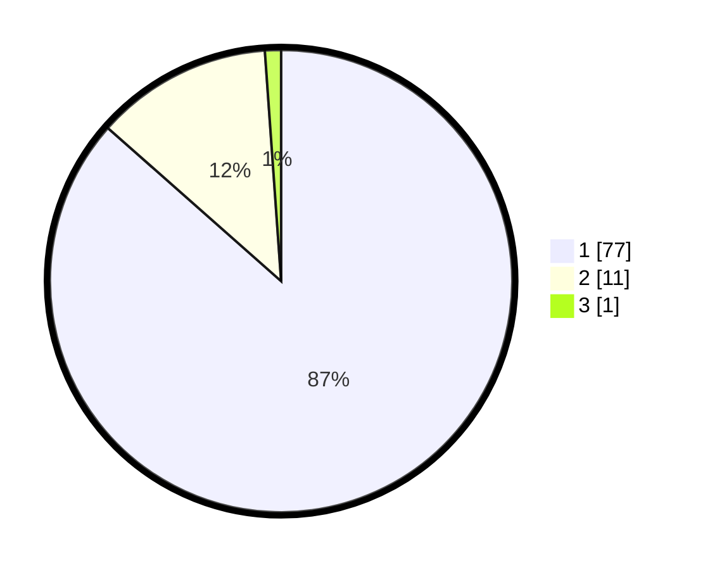

# Hasil

## Grafik

## Tabel

| No. | Nama Paslon    | Suara | Suara (raw) | Persentase |
|:--- |:-------------- | -----:| -----------:| ----------:|
| 1   | ANIES MUHAIMIN | 77    | [77][p-1]   | 86,52      |
| 2   | PRABOWO GIBRAN | 11    | [11][p-2]   | 12,36      |
| 3   | GANJAR MAHFUD  | 1     | [1][p-3]    | 1,12       |

[p-1]: https://github.com/gigit-pemilu/pemilu-2024/blob/main/pilpres/hitung-suara/sub/11-aceh/sub/03-aceh-timur/sub/23-idi-timur/sub/2013-seuneubok-dalam/sub/001-tps/sub/paslon-1.txt
[p-2]: https://github.com/gigit-pemilu/pemilu-2024/blob/main/pilpres/hitung-suara/sub/11-aceh/sub/03-aceh-timur/sub/23-idi-timur/sub/2013-seuneubok-dalam/sub/001-tps/sub/paslon-2.txt
[p-3]: https://github.com/gigit-pemilu/pemilu-2024/blob/main/pilpres/hitung-suara/sub/11-aceh/sub/03-aceh-timur/sub/23-idi-timur/sub/2013-seuneubok-dalam/sub/001-tps/sub/paslon-3.txt

## Foto C Plano

https://sirekap-obj-formc.kpu.go.id/5f38/pemilu/ppwp/11/03/23/20/13/1103232013001-20240216-150740--8c9aa99a-f871-43db-a446-b1481c23f5e6.jpg

https://sirekap-obj-formc.kpu.go.id/5f38/pemilu/ppwp/11/03/23/20/13/1103232013001-20240216-150741--e90bbc43-ccb2-44e2-b87b-d72b5d476a29.jpg

https://sirekap-obj-formc.kpu.go.id/5f38/pemilu/ppwp/11/03/23/20/13/1103232013001-20240216-150740--eae9fcd4-d0d5-49c6-a47e-97ddeecd522e.jpg

## Metadata

| Key        | Value               |
| ---------- | ------------------- |
| Time Stamp | 2024-02-17 14:45:18 |

## DATA PEMILIH TETAP

Jumlah pemilih dalam DPT: **114**.
 * L: **61**.
 * P: **53**.

## DATA PENGGUNA HAK PILIH

Jumlah pengguna hak pilih dalam DPT: **91**.
 * L: **47**.
 * P: **44**.

Jumlah pengguna hak pilih dalam DPTb: **0**.
 * L: **0**.
 * P: **0**.

Jumlah pengguna hak pilih dalam DPK: **0**.
 * L: **0**.
 * P: **0**.

Jumlah pengguna hak pilih: **91**.
 * L: **47**.
 * P: **44**.

## JUMLAH SUARA SAH DAN TIDAK SAH

JUMLAH SELURUH SUARA SAH: **89**.

JUMLAH SUARA TIDAK SAH: **2**.

JUMLAH SELURUH SUARA SAH DAN SUARA TIDAK SAH: **91**.

