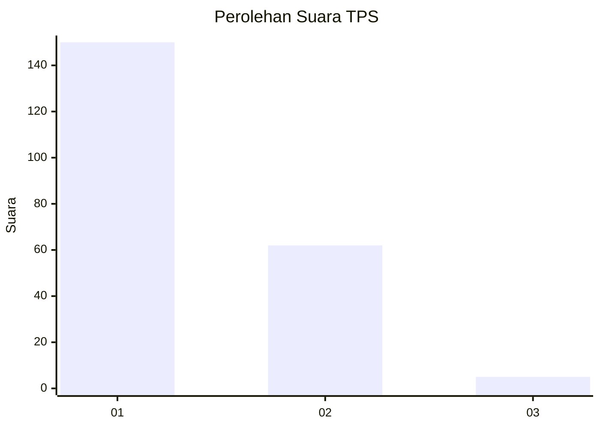
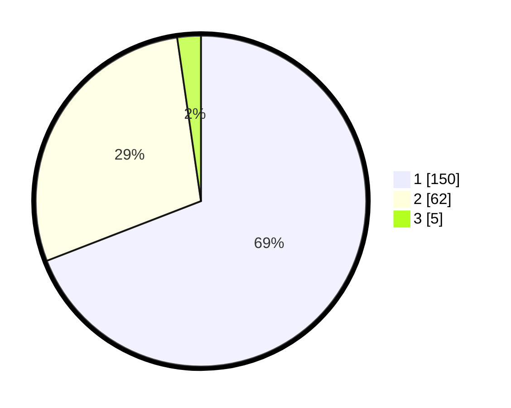

# Hasil

## Grafik

## Tabel

| No. | Nama Paslon    | Suara | Suara (raw) | Persentase |
|:--- |:-------------- | -----:| -----------:| ----------:|
| 1   | ANIES MUHAIMIN | 150   | [150][p-1]  | 69,12      |
| 2   | PRABOWO GIBRAN | 62    | [62][p-2]   | 28,57      |
| 3   | GANJAR MAHFUD  | 5     | [5][p-3]    | 2,30       |

[p-1]: https://github.com/gigit-pemilu/pemilu-2024-11-aceh/blob/main/pilpres/hitung-suara/sub/11-aceh/sub/03-aceh-timur/sub/24-peunaron/sub/2001-arul-pinang/sub/002-tps/sub/paslon-1.txt
[p-2]: https://github.com/gigit-pemilu/pemilu-2024-11-aceh/blob/main/pilpres/hitung-suara/sub/11-aceh/sub/03-aceh-timur/sub/24-peunaron/sub/2001-arul-pinang/sub/002-tps/sub/paslon-2.txt
[p-3]: https://github.com/gigit-pemilu/pemilu-2024-11-aceh/blob/main/pilpres/hitung-suara/sub/11-aceh/sub/03-aceh-timur/sub/24-peunaron/sub/2001-arul-pinang/sub/002-tps/sub/paslon-3.txt

## Foto C Plano

https://sirekap-obj-formc.kpu.go.id/70a9/pemilu/ppwp/11/03/24/20/01/1103242001002-20240214-203808--c65c186a-daf3-4db2-ac18-104cfb693bef.jpg

https://sirekap-obj-formc.kpu.go.id/70a9/pemilu/ppwp/11/03/24/20/01/1103242001002-20240214-204047--ba7cfe2e-7267-4d94-a7a7-354c97497d61.jpg

https://sirekap-obj-formc.kpu.go.id/70a9/pemilu/ppwp/11/03/24/20/01/1103242001002-20240214-204614--a736bab5-a067-4d57-8ccb-2148dd50f75f.jpg

## Metadata

| Key        | Value               |
| ---------- | ------------------- |
| Time Stamp | 2024-02-15 00:41:44 |

