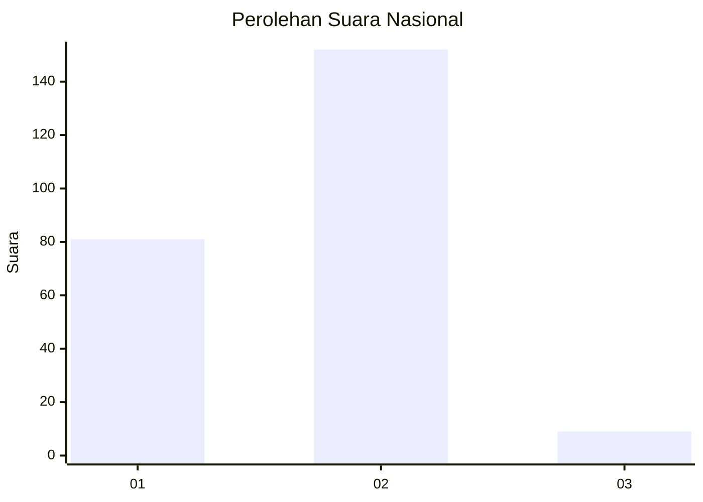
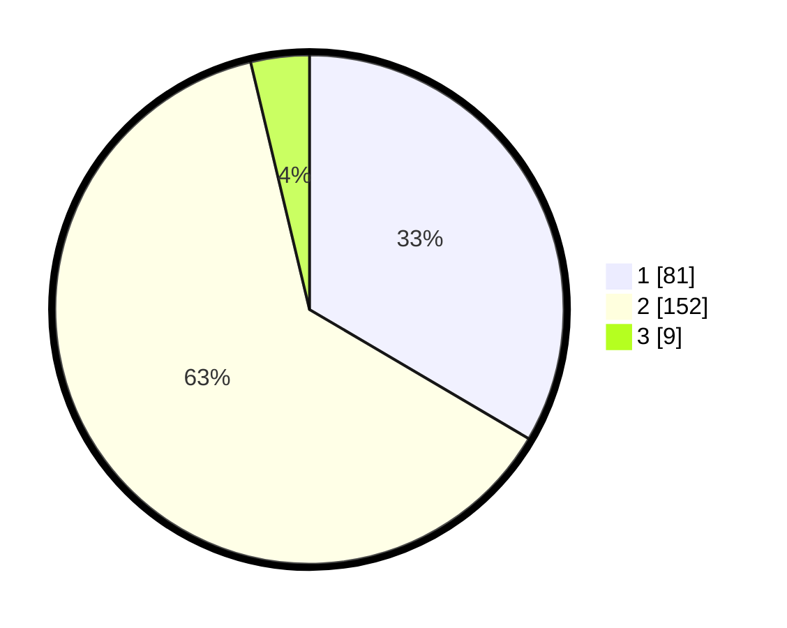

# Hasil

## Grafik

## Tabel

| No. | Nama Paslon    | Suara | Suara (raw) | Persentase |
|:--- |:-------------- | -----:| -----------:| ----------:|
| 1   | ANIES MUHAIMIN | 81    | [81][p-1]   | 33,47      |
| 2   | PRABOWO GIBRAN | 152   | [152][p-2]  | 62,81      |
| 3   | GANJAR MAHFUD  | 9     | [9][p-3]    | 3,72       |

[p-1]: https://github.com/gigit-pemilu/pemilu-2024/blob/main/pilpres/hitung-suara/sub/11-aceh/sub/03-aceh-timur/sub/24-peunaron/sub/2001-arul-pinang/sub/003-tps/sub/paslon-1.txt
[p-2]: https://github.com/gigit-pemilu/pemilu-2024/blob/main/pilpres/hitung-suara/sub/11-aceh/sub/03-aceh-timur/sub/24-peunaron/sub/2001-arul-pinang/sub/003-tps/sub/paslon-2.txt
[p-3]: https://github.com/gigit-pemilu/pemilu-2024/blob/main/pilpres/hitung-suara/sub/11-aceh/sub/03-aceh-timur/sub/24-peunaron/sub/2001-arul-pinang/sub/003-tps/sub/paslon-3.txt

## Foto C Plano

https://sirekap-obj-formc.kpu.go.id/8bcb/pemilu/ppwp/11/03/24/20/01/1103242001003-20240215-211725--07c1966c-2c2c-475c-8d22-dec095016456.jpg

https://sirekap-obj-formc.kpu.go.id/8bcb/pemilu/ppwp/11/03/24/20/01/1103242001003-20240215-211727--9c946f8f-30ca-43e8-8891-5a5e08f7381f.jpg

https://sirekap-obj-formc.kpu.go.id/8bcb/pemilu/ppwp/11/03/24/20/01/1103242001003-20240215-211726--6097850c-4dad-4676-a472-bd442c207f5f.jpg

## Metadata

| Key        | Value               |
| ---------- | ------------------- |
| Time Stamp | 2024-02-17 13:37:34 |

## DATA PEMILIH TETAP

Jumlah pemilih dalam DPT: **290**.
 * L: **140**.
 * P: **150**.

## DATA PENGGUNA HAK PILIH

Jumlah pengguna hak pilih dalam DPT: **246**.
 * L: **115**.
 * P: **131**.

Jumlah pengguna hak pilih dalam DPTb: **0**.
 * L: **0**.
 * P: **0**.

Jumlah pengguna hak pilih dalam DPK: **0**.
 * L: **0**.
 * P: **0**.

Jumlah pengguna hak pilih: **246**.
 * L: **115**.
 * P: **131**.

## JUMLAH SUARA SAH DAN TIDAK SAH

JUMLAH SELURUH SUARA SAH: **242**.

JUMLAH SUARA TIDAK SAH: **4**.

JUMLAH SELURUH SUARA SAH DAN SUARA TIDAK SAH: **246**.

