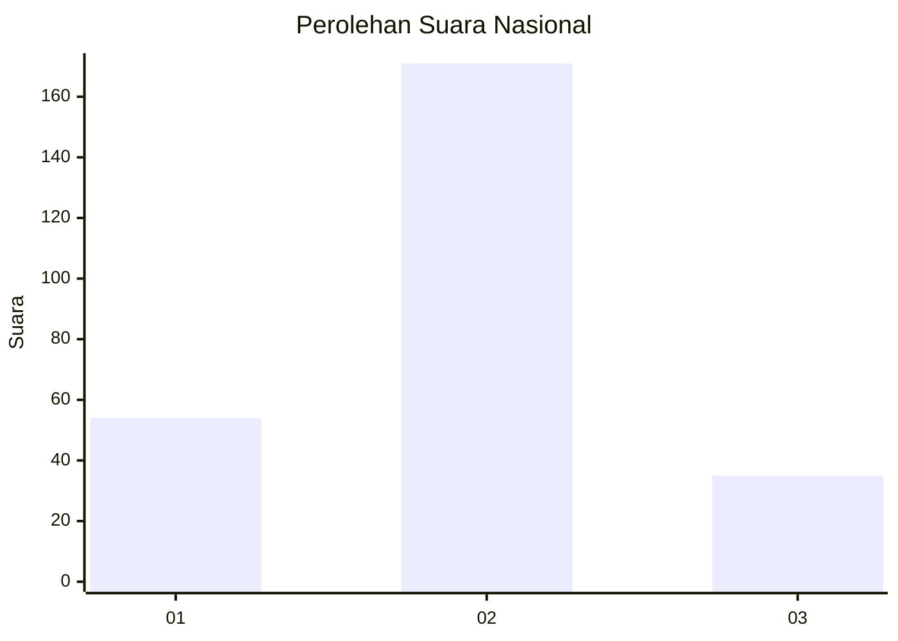
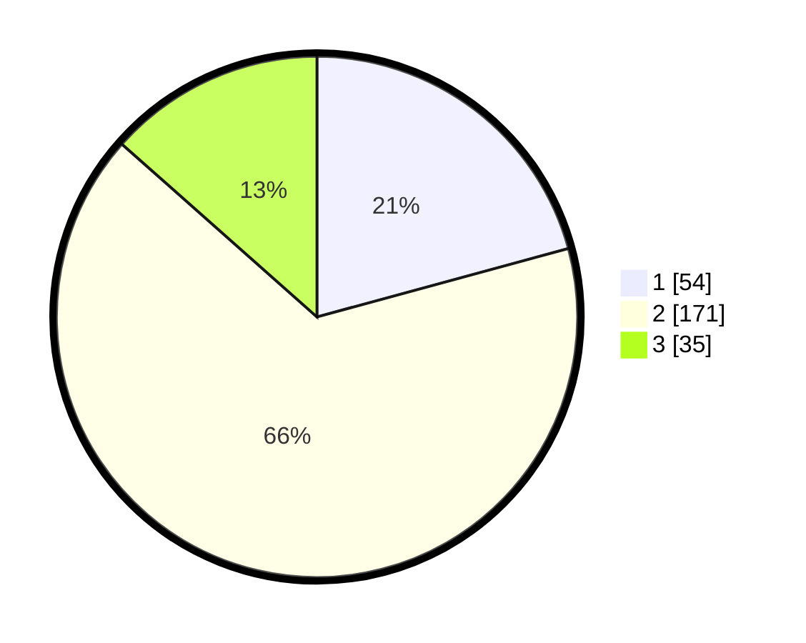

# Hasil

## Grafik

## Tabel

| No. | Nama Paslon    | Suara | Suara (raw) | Persentase |
|:--- |:-------------- | -----:| -----------:| ----------:|
| 1   | ANIES MUHAIMIN | 54    | [54][p-1]   | 20,77      |
| 2   | PRABOWO GIBRAN | 171   | [171][p-2]  | 65,77      |
| 3   | GANJAR MAHFUD  | 35    | [35][p-3]   | 13,46      |

[p-1]: https://github.com/gigit-pemilu/pemilu-2024/blob/main/pilpres/hitung-suara/sub/11-aceh/sub/03-aceh-timur/sub/24-peunaron/sub/2001-arul-pinang/sub/004-tps/sub/paslon-1.txt
[p-2]: https://github.com/gigit-pemilu/pemilu-2024/blob/main/pilpres/hitung-suara/sub/11-aceh/sub/03-aceh-timur/sub/24-peunaron/sub/2001-arul-pinang/sub/004-tps/sub/paslon-2.txt
[p-3]: https://github.com/gigit-pemilu/pemilu-2024/blob/main/pilpres/hitung-suara/sub/11-aceh/sub/03-aceh-timur/sub/24-peunaron/sub/2001-arul-pinang/sub/004-tps/sub/paslon-3.txt

## Foto C Plano

https://sirekap-obj-formc.kpu.go.id/c576/pemilu/ppwp/11/03/24/20/01/1103242001004-20240215-194624--5cc84983-25c8-43f6-a89d-ded24afe33ba.jpg

https://sirekap-obj-formc.kpu.go.id/c576/pemilu/ppwp/11/03/24/20/01/1103242001004-20240215-194647--b00ed290-a0f3-4617-9f02-3bb1cd7e7ed0.jpg

https://sirekap-obj-formc.kpu.go.id/c576/pemilu/ppwp/11/03/24/20/01/1103242001004-20240215-194635--eeccba4d-2b0b-4bbb-b4d5-4dda87d3ea3a.jpg

## Metadata

| Key        | Value               |
| ---------- | ------------------- |
| Time Stamp | 2024-02-17 13:37:34 |

## DATA PEMILIH TETAP

Jumlah pemilih dalam DPT: **300**.
 * L: **158**.
 * P: **142**.

## DATA PENGGUNA HAK PILIH

Jumlah pengguna hak pilih dalam DPT: **257**.
 * L: **136**.
 * P: **121**.

Jumlah pengguna hak pilih dalam DPTb: **2**.
 * L: **0**.
 * P: **2**.

Jumlah pengguna hak pilih dalam DPK: **2**.
 * L: **1**.
 * P: **1**.

Jumlah pengguna hak pilih: **261**.
 * L: **137**.
 * P: **124**.

## JUMLAH SUARA SAH DAN TIDAK SAH

JUMLAH SELURUH SUARA SAH: **260**.

JUMLAH SUARA TIDAK SAH: **1**.

JUMLAH SELURUH SUARA SAH DAN SUARA TIDAK SAH: **261**.

