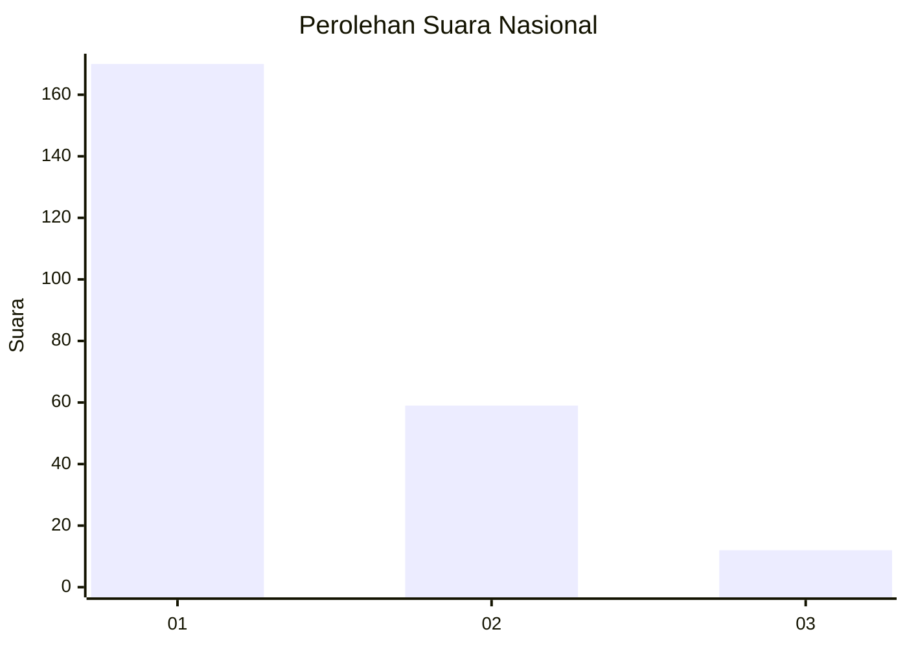
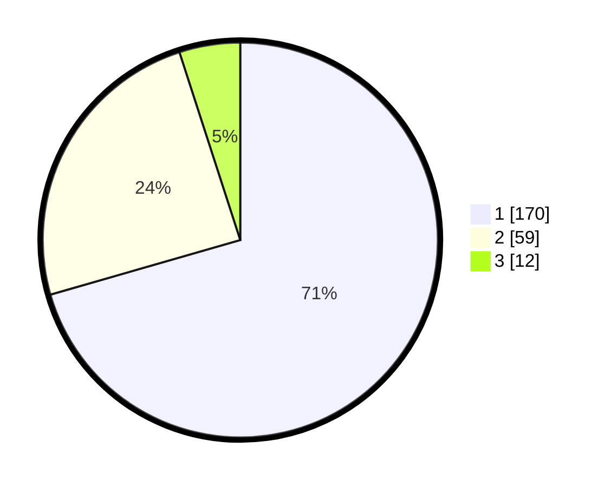

# Hasil

## Grafik

## Tabel

| No. | Nama Paslon    | Suara | Suara (raw) | Persentase |
|:--- |:-------------- | -----:| -----------:| ----------:|
| 1   | ANIES MUHAIMIN | 170   | [170][p-1]  | 70,54      |
| 2   | PRABOWO GIBRAN | 59    | [59][p-2]   | 24,48      |
| 3   | GANJAR MAHFUD  | 12    | [12][p-3]   | 4,98       |

[p-1]: https://github.com/gigit-pemilu/pemilu-2024/blob/main/pilpres/hitung-suara/sub/11-aceh/sub/03-aceh-timur/sub/24-peunaron/sub/2001-arul-pinang/sub/006-tps/sub/paslon-1.txt
[p-2]: https://github.com/gigit-pemilu/pemilu-2024/blob/main/pilpres/hitung-suara/sub/11-aceh/sub/03-aceh-timur/sub/24-peunaron/sub/2001-arul-pinang/sub/006-tps/sub/paslon-2.txt
[p-3]: https://github.com/gigit-pemilu/pemilu-2024/blob/main/pilpres/hitung-suara/sub/11-aceh/sub/03-aceh-timur/sub/24-peunaron/sub/2001-arul-pinang/sub/006-tps/sub/paslon-3.txt

## Foto C Plano

https://sirekap-obj-formc.kpu.go.id/efdc/pemilu/ppwp/11/03/24/20/01/1103242001006-20240216-143535--4d66ef7e-c801-4d85-9f5e-7de41b4d835b.jpg

https://sirekap-obj-formc.kpu.go.id/efdc/pemilu/ppwp/11/03/24/20/01/1103242001006-20240216-143547--c83f0de3-6e6f-4f6f-9597-83ed6f687f79.jpg

https://sirekap-obj-formc.kpu.go.id/efdc/pemilu/ppwp/11/03/24/20/01/1103242001006-20240216-143556--3e97d5f3-c060-42ef-82ef-cd91080f7560.jpg

## Metadata

| Key        | Value               |
| ---------- | ------------------- |
| Time Stamp | 2024-02-17 13:37:34 |

## DATA PEMILIH TETAP

Jumlah pemilih dalam DPT: **294**.
 * L: **154**.
 * P: **140**.

## DATA PENGGUNA HAK PILIH

Jumlah pengguna hak pilih dalam DPT: **229**.
 * L: **113**.
 * P: **116**.

Jumlah pengguna hak pilih dalam DPTb: **0**.
 * L: **0**.
 * P: **0**.

Jumlah pengguna hak pilih dalam DPK: **16**.
 * L: **11**.
 * P: **5**.

Jumlah pengguna hak pilih: **245**.
 * L: **124**.
 * P: **121**.

## JUMLAH SUARA SAH DAN TIDAK SAH

JUMLAH SELURUH SUARA SAH: **241**.

JUMLAH SUARA TIDAK SAH: **4**.

JUMLAH SELURUH SUARA SAH DAN SUARA TIDAK SAH: **245**.

