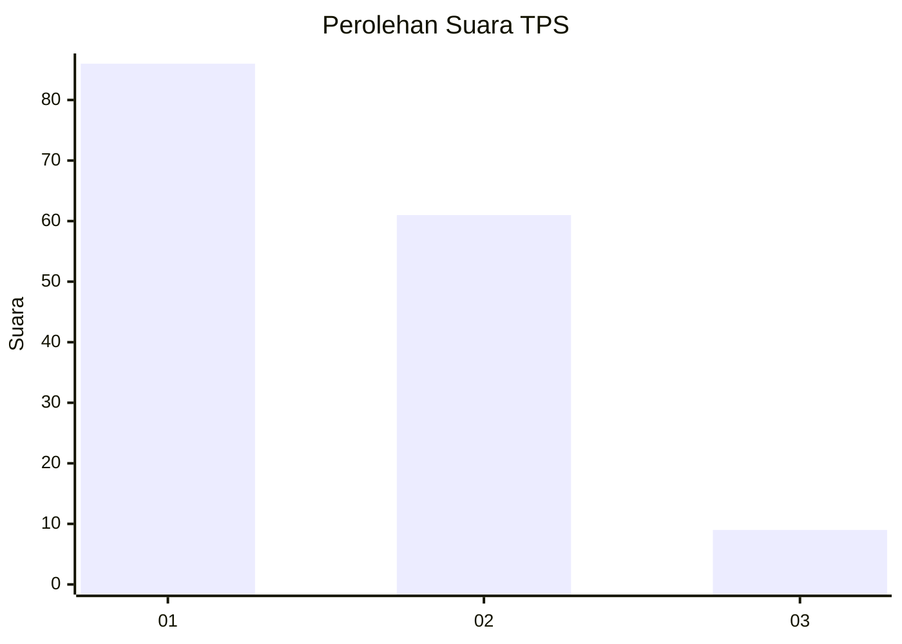
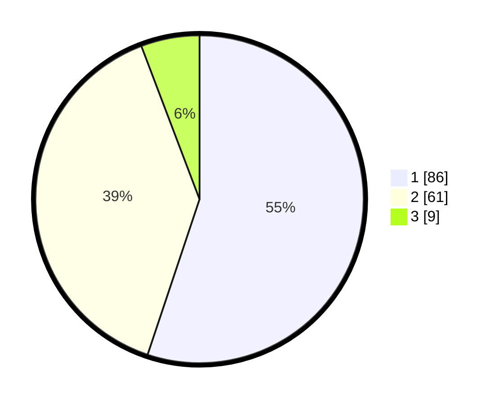

# Hasil

## Grafik

## Tabel

| No. | Nama Paslon    | Suara | Suara (raw) | Persentase |
|:--- |:-------------- | -----:| -----------:| ----------:|
| 1   | ANIES MUHAIMIN | 86    | [86][p-1]   | 55,13      |
| 2   | PRABOWO GIBRAN | 61    | [61][p-2]   | 39,10      |
| 3   | GANJAR MAHFUD  | 9     | [9][p-3]    | 5,77       |

[p-1]: https://github.com/gigit-pemilu/pemilu-2024-11-aceh/blob/main/pilpres/hitung-suara/sub/11-aceh/sub/03-aceh-timur/sub/24-peunaron/sub/2001-arul-pinang/sub/007-tps/sub/paslon-1.txt
[p-2]: https://github.com/gigit-pemilu/pemilu-2024-11-aceh/blob/main/pilpres/hitung-suara/sub/11-aceh/sub/03-aceh-timur/sub/24-peunaron/sub/2001-arul-pinang/sub/007-tps/sub/paslon-2.txt
[p-3]: https://github.com/gigit-pemilu/pemilu-2024-11-aceh/blob/main/pilpres/hitung-suara/sub/11-aceh/sub/03-aceh-timur/sub/24-peunaron/sub/2001-arul-pinang/sub/007-tps/sub/paslon-3.txt

## Foto C Plano

https://sirekap-obj-formc.kpu.go.id/35c5/pemilu/ppwp/11/03/24/20/01/1103242001007-20240216-101213--441d50f4-7c70-4da3-8ad1-2a3f59bbf6b6.jpg

https://sirekap-obj-formc.kpu.go.id/35c5/pemilu/ppwp/11/03/24/20/01/1103242001007-20240216-095739--8b5a6614-d7bc-48bb-b3c7-6ed09319b7f0.jpg

https://sirekap-obj-formc.kpu.go.id/35c5/pemilu/ppwp/11/03/24/20/01/1103242001007-20240216-095733--21265b51-2717-4839-b76f-14af0e83834a.jpg

## Metadata

| Key        | Value               |
| ---------- | ------------------- |
| Time Stamp | 2024-02-17 13:37:34 |

## DATA PEMILIH TETAP

Jumlah pemilih dalam DPT: **0**.
 * L: **0**.
 * P: **0**.

## DATA PENGGUNA HAK PILIH

Jumlah pengguna hak pilih dalam DPT: **0**.
 * L: **0**.
 * P: **0**.

Jumlah pengguna hak pilih dalam DPTb: **0**.
 * L: **0**.
 * P: **0**.

Jumlah pengguna hak pilih dalam DPK: **0**.
 * L: **0**.
 * P: **0**.

Jumlah pengguna hak pilih: **0**.
 * L: **0**.
 * P: **0**.

## JUMLAH SUARA SAH DAN TIDAK SAH

JUMLAH SELURUH SUARA SAH: **156**.

JUMLAH SUARA TIDAK SAH: **2**.

JUMLAH SELURUH SUARA SAH DAN SUARA TIDAK SAH: **158**.

