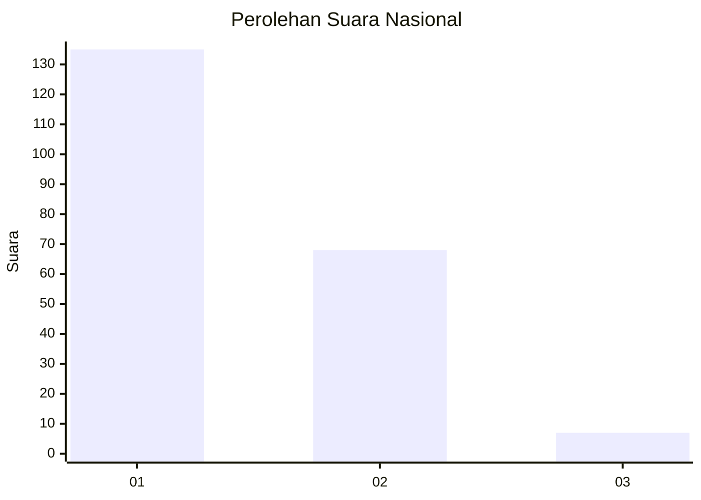
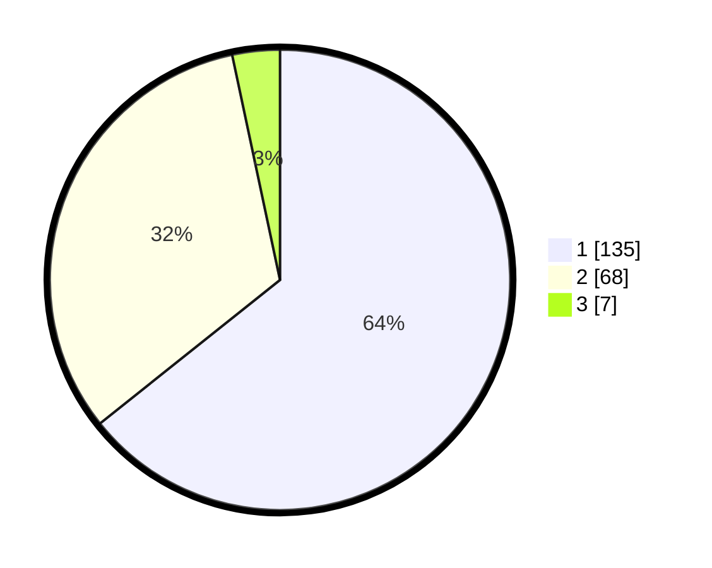

# Hasil

## Grafik

## Tabel

| No. | Nama Paslon    | Suara | Suara (raw) | Persentase |
|:--- |:-------------- | -----:| -----------:| ----------:|
| 1   | ANIES MUHAIMIN | 135   | [135][p-1]  | 64,29      |
| 2   | PRABOWO GIBRAN | 68    | [68][p-2]   | 32,38      |
| 3   | GANJAR MAHFUD  | 7     | [7][p-3]    | 3,33       |

[p-1]: https://github.com/gigit-pemilu/pemilu-2024/blob/main/pilpres/hitung-suara/sub/11-aceh/sub/04-aceh-tengah/sub/01-linge/sub/2003-delung-sekinel/sub/001-tps/sub/paslon-1.txt
[p-2]: https://github.com/gigit-pemilu/pemilu-2024/blob/main/pilpres/hitung-suara/sub/11-aceh/sub/04-aceh-tengah/sub/01-linge/sub/2003-delung-sekinel/sub/001-tps/sub/paslon-2.txt
[p-3]: https://github.com/gigit-pemilu/pemilu-2024/blob/main/pilpres/hitung-suara/sub/11-aceh/sub/04-aceh-tengah/sub/01-linge/sub/2003-delung-sekinel/sub/001-tps/sub/paslon-3.txt

## Foto C Plano

https://sirekap-obj-formc.kpu.go.id/c8be/pemilu/ppwp/11/04/01/20/03/1104012003001-20240216-211306--14b6b09d-a2fa-41cd-8f5b-4304a1b69c9f.jpg

https://sirekap-obj-formc.kpu.go.id/c8be/pemilu/ppwp/11/04/01/20/03/1104012003001-20240216-211307--7d8a0981-7fb3-4a54-a91b-713190717b09.jpg

https://sirekap-obj-formc.kpu.go.id/c8be/pemilu/ppwp/11/04/01/20/03/1104012003001-20240216-211306--7b528c7d-cb38-4ec2-a94a-667792e1a407.jpg

## Metadata

| Key        | Value               |
| ---------- | ------------------- |
| Time Stamp | 2024-02-16 23:30:00 |

## DATA PEMILIH TETAP

Jumlah pemilih dalam DPT: **236**.
 * L: **126**.
 * P: **110**.

## DATA PENGGUNA HAK PILIH

Jumlah pengguna hak pilih dalam DPT: **206**.
 * L: **115**.
 * P: **91**.

Jumlah pengguna hak pilih dalam DPTb: **3**.
 * L: **1**.
 * P: **2**.

Jumlah pengguna hak pilih dalam DPK: **2**.
 * L: **1**.
 * P: **1**.

Jumlah pengguna hak pilih: **211**.
 * L: **117**.
 * P: **94**.

## JUMLAH SUARA SAH DAN TIDAK SAH

JUMLAH SELURUH SUARA SAH: **210**.

JUMLAH SUARA TIDAK SAH: **1**.

JUMLAH SELURUH SUARA SAH DAN SUARA TIDAK SAH: **211**.

