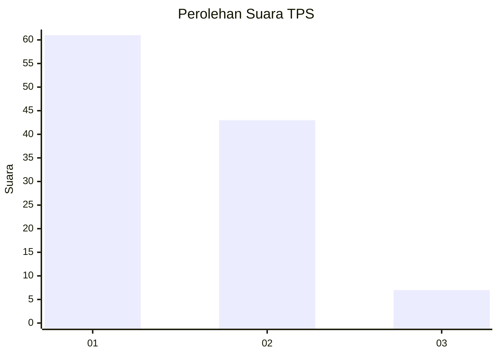
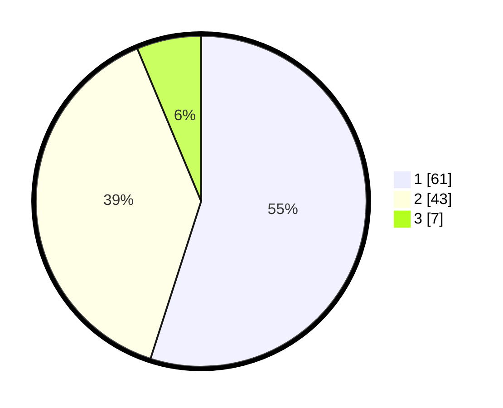

# Hasil

## Grafik

## Tabel

| No. | Nama Paslon    | Suara | Suara (raw) | Persentase |
|:--- |:-------------- | -----:| -----------:| ----------:|
| 1   | ANIES MUHAIMIN | 61    | [61][p-1]   | 54,95      |
| 2   | PRABOWO GIBRAN | 43    | [43][p-2]   | 38,74      |
| 3   | GANJAR MAHFUD  | 7     | [7][p-3]    | 6,31       |

[p-1]: https://github.com/gigit-pemilu/pemilu-2024-11-aceh/blob/main/pilpres/hitung-suara/sub/11-aceh/sub/04-aceh-tengah/sub/01-linge/sub/2006-gewat/sub/001-tps/sub/paslon-1.txt
[p-2]: https://github.com/gigit-pemilu/pemilu-2024-11-aceh/blob/main/pilpres/hitung-suara/sub/11-aceh/sub/04-aceh-tengah/sub/01-linge/sub/2006-gewat/sub/001-tps/sub/paslon-2.txt
[p-3]: https://github.com/gigit-pemilu/pemilu-2024-11-aceh/blob/main/pilpres/hitung-suara/sub/11-aceh/sub/04-aceh-tengah/sub/01-linge/sub/2006-gewat/sub/001-tps/sub/paslon-3.txt

## Foto C Plano

https://sirekap-obj-formc.kpu.go.id/e969/pemilu/ppwp/11/04/01/20/06/1104012006001-20240220-140756--e7ed80bb-81f5-48c0-888c-bd2beafda6a6.jpg

https://sirekap-obj-formc.kpu.go.id/e969/pemilu/ppwp/11/04/01/20/06/1104012006001-20240220-140757--60a7c06e-5e4e-4bc7-8a8c-1d8032bb7d9d.jpg

https://sirekap-obj-formc.kpu.go.id/e969/pemilu/ppwp/11/04/01/20/06/1104012006001-20240220-140757--fe1e0f8c-fc1d-4d2e-adb9-dfb78889a7b7.jpg

## Metadata

| Key        | Value               |
| ---------- | ------------------- |
| Time Stamp | 2024-02-20 20:00:00 |

## DATA PEMILIH TETAP

Jumlah pemilih dalam DPT: **0**.
 * L: **0**.
 * P: **0**.

## DATA PENGGUNA HAK PILIH

Jumlah pengguna hak pilih dalam DPT: **0**.
 * L: **0**.
 * P: **0**.

Jumlah pengguna hak pilih dalam DPTb: **0**.
 * L: **0**.
 * P: **0**.

Jumlah pengguna hak pilih dalam DPK: **0**.
 * L: **0**.
 * P: **0**.

Jumlah pengguna hak pilih: **0**.
 * L: **0**.
 * P: **0**.

## JUMLAH SUARA SAH DAN TIDAK SAH

JUMLAH SELURUH SUARA SAH: **111**.

JUMLAH SUARA TIDAK SAH: **6**.

JUMLAH SELURUH SUARA SAH DAN SUARA TIDAK SAH: **117**.

