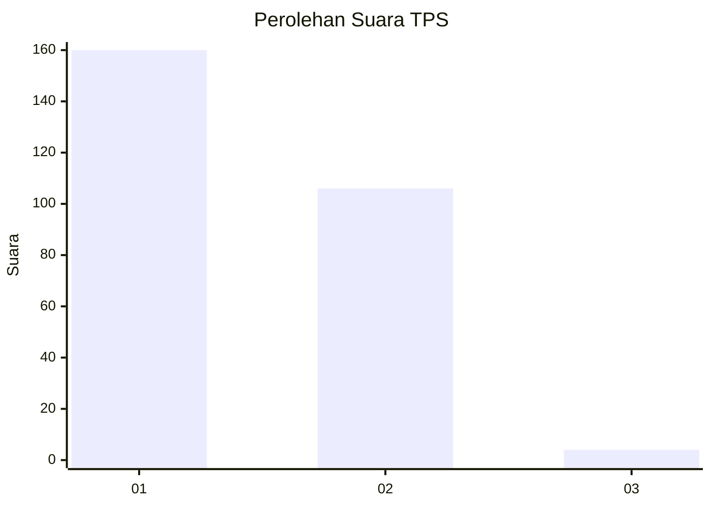
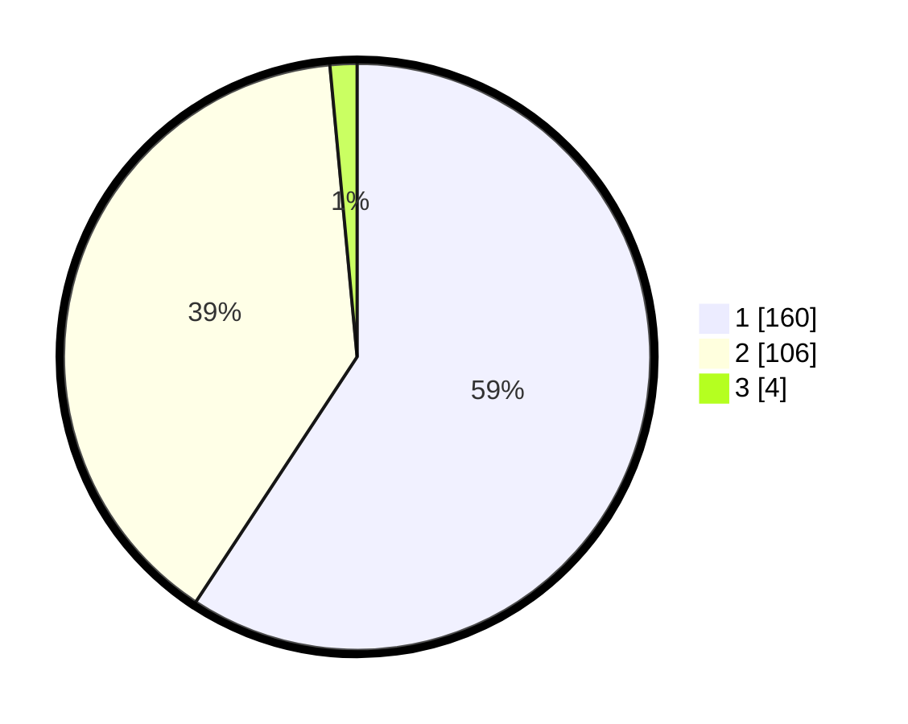

# Hasil

## Grafik

## Tabel

| No. | Nama Paslon    | Suara | Suara (raw) | Persentase |
|:--- |:-------------- | -----:| -----------:| ----------:|
| 1   | ANIES MUHAIMIN | 160   | [160][p-1]  | 59,26      |
| 2   | PRABOWO GIBRAN | 106   | [106][p-2]  | 39,26      |
| 3   | GANJAR MAHFUD  | 4     | [4][p-3]    | 1,48       |

[p-1]: https://github.com/gigit-pemilu/pemilu-2024-11-aceh/blob/main/pilpres/hitung-suara/sub/11-aceh/sub/04-aceh-tengah/sub/01-linge/sub/2008-jamat/sub/001-tps/sub/paslon-1.txt
[p-2]: https://github.com/gigit-pemilu/pemilu-2024-11-aceh/blob/main/pilpres/hitung-suara/sub/11-aceh/sub/04-aceh-tengah/sub/01-linge/sub/2008-jamat/sub/001-tps/sub/paslon-2.txt
[p-3]: https://github.com/gigit-pemilu/pemilu-2024-11-aceh/blob/main/pilpres/hitung-suara/sub/11-aceh/sub/04-aceh-tengah/sub/01-linge/sub/2008-jamat/sub/001-tps/sub/paslon-3.txt

## Foto C Plano

https://sirekap-obj-formc.kpu.go.id/5221/pemilu/ppwp/11/04/01/20/08/1104012008001-20240218-122746--1d0021e3-7a3b-4bfa-ab8a-835c42af7255.jpg

https://sirekap-obj-formc.kpu.go.id/5221/pemilu/ppwp/11/04/01/20/08/1104012008001-20240218-122747--436e1196-77ff-49c7-9d09-4181e1d84c20.jpg

https://sirekap-obj-formc.kpu.go.id/5221/pemilu/ppwp/11/04/01/20/08/1104012008001-20240218-122747--a2e5696b-0277-41ee-a27f-e14c7bdf579d.jpg

## Metadata

| Key        | Value               |
| ---------- | ------------------- |
| Time Stamp | 2024-02-19 06:16:00 |

## DATA PEMILIH TETAP

Jumlah pemilih dalam DPT: **292**.
 * L: **148**.
 * P: **144**.

## DATA PENGGUNA HAK PILIH

Jumlah pengguna hak pilih dalam DPT: **265**.
 * L: **135**.
 * P: **130**.

Jumlah pengguna hak pilih dalam DPTb: **3**.
 * L: **1**.
 * P: **2**.

Jumlah pengguna hak pilih dalam DPK: **4**.
 * L: **2**.
 * P: **2**.

Jumlah pengguna hak pilih: **272**.
 * L: **138**.
 * P: **134**.

## JUMLAH SUARA SAH DAN TIDAK SAH

JUMLAH SELURUH SUARA SAH: **270**.

JUMLAH SUARA TIDAK SAH: **2**.

JUMLAH SELURUH SUARA SAH DAN SUARA TIDAK SAH: **272**.

