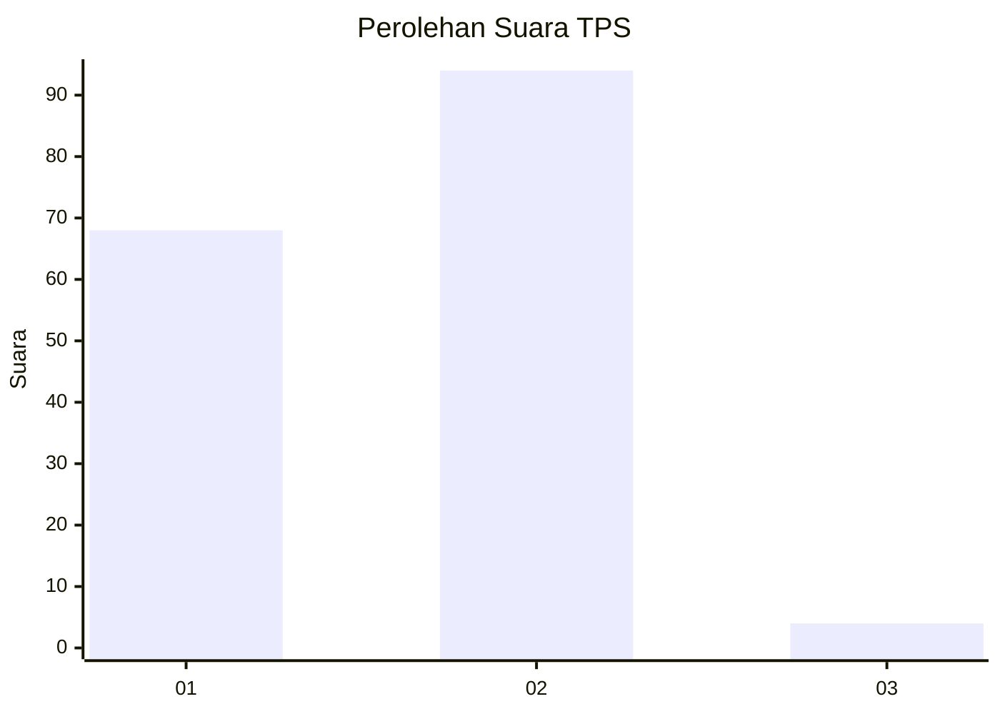
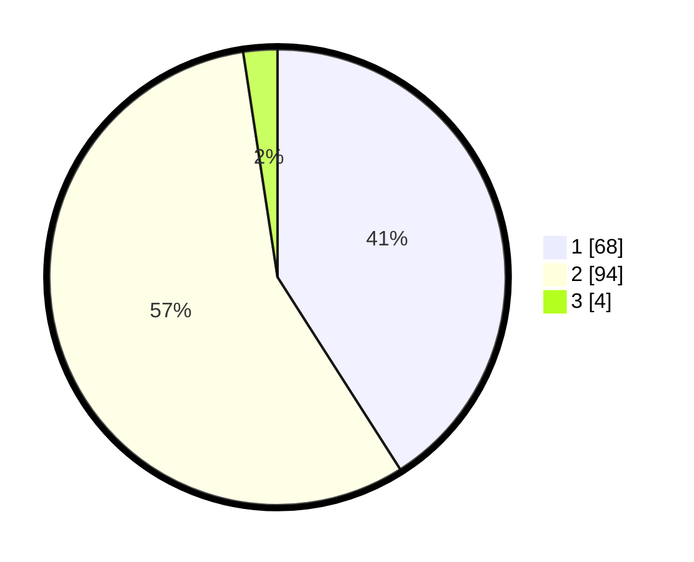

# Hasil

## Grafik

## Tabel

| No. | Nama Paslon    | Suara | Suara (raw) | Persentase |
|:--- |:-------------- | -----:| -----------:| ----------:|
| 1   | ANIES MUHAIMIN | 68    | [68][p-1]   | 40,96      |
| 2   | PRABOWO GIBRAN | 94    | [94][p-2]   | 56,63      |
| 3   | GANJAR MAHFUD  | 4     | [4][p-3]    | 2,41       |

[p-1]: https://github.com/gigit-pemilu/pemilu-2024-11-aceh/blob/main/pilpres/hitung-suara/sub/11-aceh/sub/04-aceh-tengah/sub/01-linge/sub/2010-kute-baru/sub/001-tps/sub/paslon-1.txt
[p-2]: https://github.com/gigit-pemilu/pemilu-2024-11-aceh/blob/main/pilpres/hitung-suara/sub/11-aceh/sub/04-aceh-tengah/sub/01-linge/sub/2010-kute-baru/sub/001-tps/sub/paslon-2.txt
[p-3]: https://github.com/gigit-pemilu/pemilu-2024-11-aceh/blob/main/pilpres/hitung-suara/sub/11-aceh/sub/04-aceh-tengah/sub/01-linge/sub/2010-kute-baru/sub/001-tps/sub/paslon-3.txt

## Foto C Plano

https://sirekap-obj-formc.kpu.go.id/d9d2/pemilu/ppwp/11/04/01/20/10/1104012010001-20240216-144348--5ba9fa7a-3573-4bba-9703-2ec55f330019.jpg

https://sirekap-obj-formc.kpu.go.id/d9d2/pemilu/ppwp/11/04/01/20/10/1104012010001-20240216-144349--327d36d5-92b7-4e92-a7ce-743da75af248.jpg

https://sirekap-obj-formc.kpu.go.id/d9d2/pemilu/ppwp/11/04/01/20/10/1104012010001-20240216-144349--bcb1d8c3-cbc3-436d-aba0-e0790b61ea9d.jpg

## Metadata

| Key        | Value               |
| ---------- | ------------------- |
| Time Stamp | 2024-02-16 16:25:10 |

## DATA PEMILIH TETAP

Jumlah pemilih dalam DPT: **178**.
 * L: **86**.
 * P: **92**.

## DATA PENGGUNA HAK PILIH

Jumlah pengguna hak pilih dalam DPT: **166**.
 * L: **77**.
 * P: **89**.

Jumlah pengguna hak pilih dalam DPTb: **3**.
 * L: **1**.
 * P: **2**.

Jumlah pengguna hak pilih dalam DPK: **1**.
 * L: **1**.
 * P: **0**.

Jumlah pengguna hak pilih: **170**.
 * L: **79**.
 * P: **91**.

## JUMLAH SUARA SAH DAN TIDAK SAH

JUMLAH SELURUH SUARA SAH: **166**.

JUMLAH SUARA TIDAK SAH: **4**.

JUMLAH SELURUH SUARA SAH DAN SUARA TIDAK SAH: **170**.

