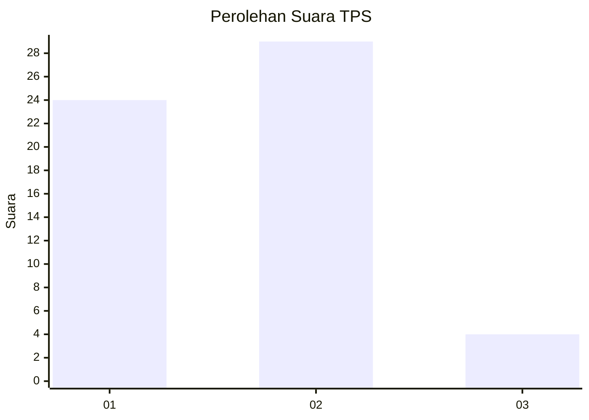
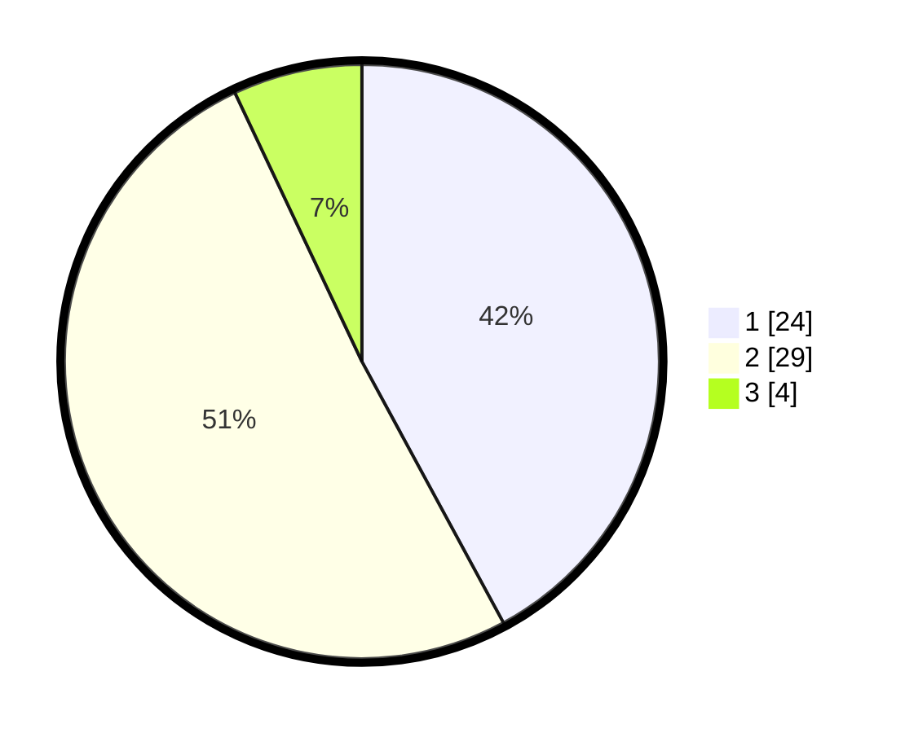

# Hasil

## Grafik

## Tabel

| No. | Nama Paslon    | Suara | Suara (raw) | Persentase |
|:--- |:-------------- | -----:| -----------:| ----------:|
| 1   | ANIES MUHAIMIN | 24    | [24][p-1]   | 42,11      |
| 2   | PRABOWO GIBRAN | 29    | [29][p-2]   | 50,88      |
| 3   | GANJAR MAHFUD  | 4     | [4][p-3]    | 7,02       |

[p-1]: https://github.com/gigit-pemilu/pemilu-2024-11-aceh/blob/main/pilpres/hitung-suara/sub/11-aceh/sub/04-aceh-tengah/sub/01-linge/sub/2011-kute-keramil/sub/002-tps/sub/paslon-1.txt
[p-2]: https://github.com/gigit-pemilu/pemilu-2024-11-aceh/blob/main/pilpres/hitung-suara/sub/11-aceh/sub/04-aceh-tengah/sub/01-linge/sub/2011-kute-keramil/sub/002-tps/sub/paslon-2.txt
[p-3]: https://github.com/gigit-pemilu/pemilu-2024-11-aceh/blob/main/pilpres/hitung-suara/sub/11-aceh/sub/04-aceh-tengah/sub/01-linge/sub/2011-kute-keramil/sub/002-tps/sub/paslon-3.txt

## Foto C Plano

https://sirekap-obj-formc.kpu.go.id/5c0f/pemilu/ppwp/11/04/01/20/11/1104012011002-20240216-193929--bb36bc21-e90b-44f4-94f8-5b2a319066d4.jpg

https://sirekap-obj-formc.kpu.go.id/5c0f/pemilu/ppwp/11/04/01/20/11/1104012011002-20240216-193930--6db7ee63-5ea6-43bf-8846-5ef006a540cc.jpg

https://sirekap-obj-formc.kpu.go.id/5c0f/pemilu/ppwp/11/04/01/20/11/1104012011002-20240216-193930--d10f4377-8fcb-4141-9e9e-6a4d821e2652.jpg

## Metadata

| Key        | Value               |
| ---------- | ------------------- |
| Time Stamp | 2024-02-16 23:30:00 |

## DATA PEMILIH TETAP

Jumlah pemilih dalam DPT: **73**.
 * L: **32**.
 * P: **41**.

## DATA PENGGUNA HAK PILIH

Jumlah pengguna hak pilih dalam DPT: **54**.
 * L: **26**.
 * P: **28**.

Jumlah pengguna hak pilih dalam DPTb: **0**.
 * L: **0**.
 * P: **0**.

Jumlah pengguna hak pilih dalam DPK: **3**.
 * L: **1**.
 * P: **2**.

Jumlah pengguna hak pilih: **57**.
 * L: **27**.
 * P: **30**.

## JUMLAH SUARA SAH DAN TIDAK SAH

JUMLAH SELURUH SUARA SAH: **57**.

JUMLAH SUARA TIDAK SAH: **0**.

JUMLAH SELURUH SUARA SAH DAN SUARA TIDAK SAH: **57**.

