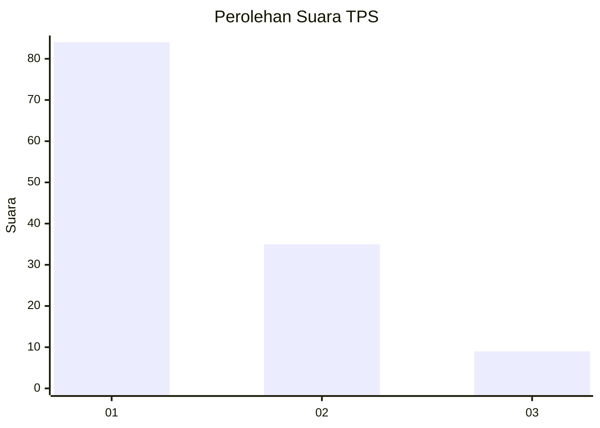
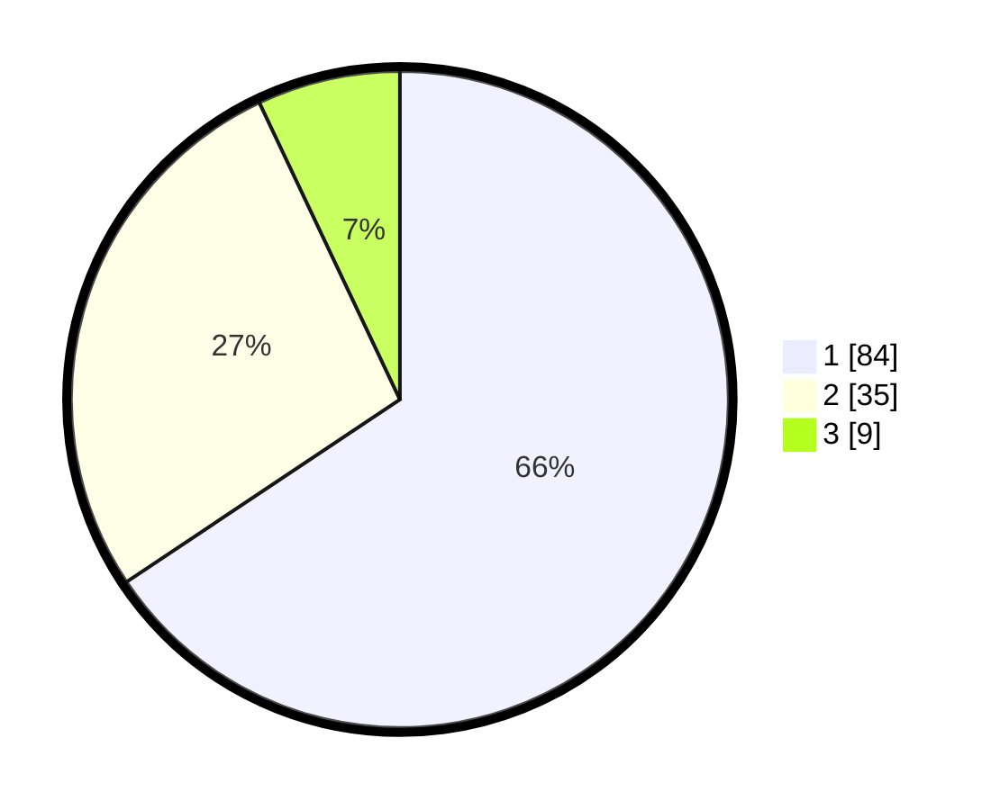

# Hasil

## Grafik

## Tabel

| No. | Nama Paslon    | Suara | Suara (raw) | Persentase |
|:--- |:-------------- | -----:| -----------:| ----------:|
| 1   | ANIES MUHAIMIN | 84    | [84][p-1]   | 65,63      |
| 2   | PRABOWO GIBRAN | 35    | [35][p-2]   | 27,34      |
| 3   | GANJAR MAHFUD  | 9     | [9][p-3]    | 7,03       |

[p-1]: https://github.com/gigit-pemilu/pemilu-2024-11-aceh/blob/main/pilpres/hitung-suara/sub/11-aceh/sub/04-aceh-tengah/sub/01-linge/sub/2016-lumut/sub/002-tps/sub/paslon-1.txt
[p-2]: https://github.com/gigit-pemilu/pemilu-2024-11-aceh/blob/main/pilpres/hitung-suara/sub/11-aceh/sub/04-aceh-tengah/sub/01-linge/sub/2016-lumut/sub/002-tps/sub/paslon-2.txt
[p-3]: https://github.com/gigit-pemilu/pemilu-2024-11-aceh/blob/main/pilpres/hitung-suara/sub/11-aceh/sub/04-aceh-tengah/sub/01-linge/sub/2016-lumut/sub/002-tps/sub/paslon-3.txt

## Foto C Plano

https://sirekap-obj-formc.kpu.go.id/7f1e/pemilu/ppwp/11/04/01/20/16/1104012016002-20240216-142759--60113ec4-fda6-4704-bc1c-29b401096b07.jpg

https://sirekap-obj-formc.kpu.go.id/7f1e/pemilu/ppwp/11/04/01/20/16/1104012016002-20240216-142800--db15173c-7d76-4193-9399-86924e7e38c4.jpg

https://sirekap-obj-formc.kpu.go.id/7f1e/pemilu/ppwp/11/04/01/20/16/1104012016002-20240216-142759--3031d833-cbc2-4e65-a217-4fb0f15ac731.jpg

## Metadata

| Key        | Value               |
| ---------- | ------------------- |
| Time Stamp | 2024-02-17 06:00:03 |

## DATA PEMILIH TETAP

Jumlah pemilih dalam DPT: **147**.
 * L: **79**.
 * P: **68**.

## DATA PENGGUNA HAK PILIH

Jumlah pengguna hak pilih dalam DPT: **128**.
 * L: **70**.
 * P: **58**.

Jumlah pengguna hak pilih dalam DPTb: **0**.
 * L: **0**.
 * P: **0**.

Jumlah pengguna hak pilih dalam DPK: **5**.
 * L: **2**.
 * P: **3**.

Jumlah pengguna hak pilih: **133**.
 * L: **72**.
 * P: **61**.

## JUMLAH SUARA SAH DAN TIDAK SAH

JUMLAH SELURUH SUARA SAH: **128**.

JUMLAH SUARA TIDAK SAH: **5**.

JUMLAH SELURUH SUARA SAH DAN SUARA TIDAK SAH: **133**.

