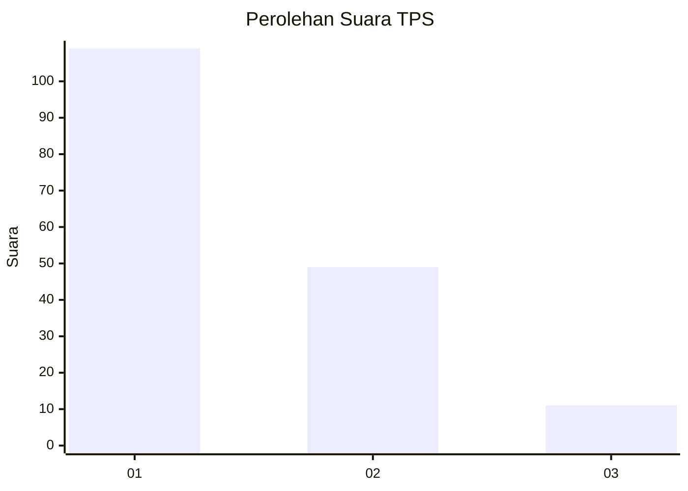
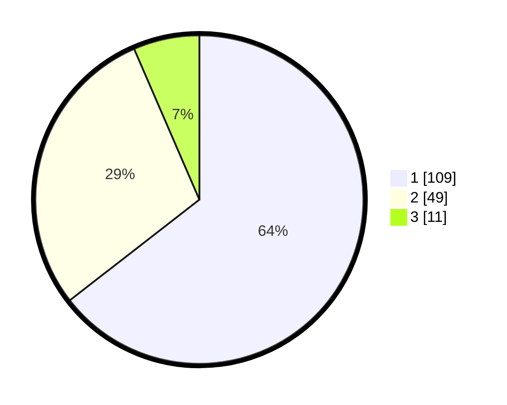

# Hasil

## Grafik

## Tabel

| No. | Nama Paslon    | Suara | Suara (raw) | Persentase |
|:--- |:-------------- | -----:| -----------:| ----------:|
| 1   | ANIES MUHAIMIN | 109   | [109][p-1]  | 64,50      |
| 2   | PRABOWO GIBRAN | 49    | [49][p-2]   | 28,99      |
| 3   | GANJAR MAHFUD  | 11    | [11][p-3]   | 6,51       |

[p-1]: https://github.com/gigit-pemilu/pemilu-2024-11-aceh/blob/main/pilpres/hitung-suara/sub/11-aceh/sub/04-aceh-tengah/sub/01-linge/sub/2016-lumut/sub/003-tps/sub/paslon-1.txt
[p-2]: https://github.com/gigit-pemilu/pemilu-2024-11-aceh/blob/main/pilpres/hitung-suara/sub/11-aceh/sub/04-aceh-tengah/sub/01-linge/sub/2016-lumut/sub/003-tps/sub/paslon-2.txt
[p-3]: https://github.com/gigit-pemilu/pemilu-2024-11-aceh/blob/main/pilpres/hitung-suara/sub/11-aceh/sub/04-aceh-tengah/sub/01-linge/sub/2016-lumut/sub/003-tps/sub/paslon-3.txt

## Foto C Plano

https://sirekap-obj-formc.kpu.go.id/a754/pemilu/ppwp/11/04/01/20/16/1104012016003-20240216-143244--d6a7aa31-1ccd-4638-9510-6e0f0c095dcf.jpg

https://sirekap-obj-formc.kpu.go.id/a754/pemilu/ppwp/11/04/01/20/16/1104012016003-20240216-143246--384b5294-1735-4b5a-b6cd-d8bc3cb63151.jpg

https://sirekap-obj-formc.kpu.go.id/a754/pemilu/ppwp/11/04/01/20/16/1104012016003-20240216-143245--1da1d7d6-aca4-4a0d-b799-fc03c7e5a9a5.jpg

## Metadata

| Key        | Value               |
| ---------- | ------------------- |
| Time Stamp | 2024-02-17 06:00:03 |

## DATA PEMILIH TETAP

Jumlah pemilih dalam DPT: **178**.
 * L: **93**.
 * P: **85**.

## DATA PENGGUNA HAK PILIH

Jumlah pengguna hak pilih dalam DPT: **162**.
 * L: **88**.
 * P: **74**.

Jumlah pengguna hak pilih dalam DPTb: **0**.
 * L: **0**.
 * P: **0**.

Jumlah pengguna hak pilih dalam DPK: **9**.
 * L: **3**.
 * P: **6**.

Jumlah pengguna hak pilih: **171**.
 * L: **91**.
 * P: **80**.

## JUMLAH SUARA SAH DAN TIDAK SAH

JUMLAH SELURUH SUARA SAH: **169**.

JUMLAH SUARA TIDAK SAH: **2**.

JUMLAH SELURUH SUARA SAH DAN SUARA TIDAK SAH: **171**.

