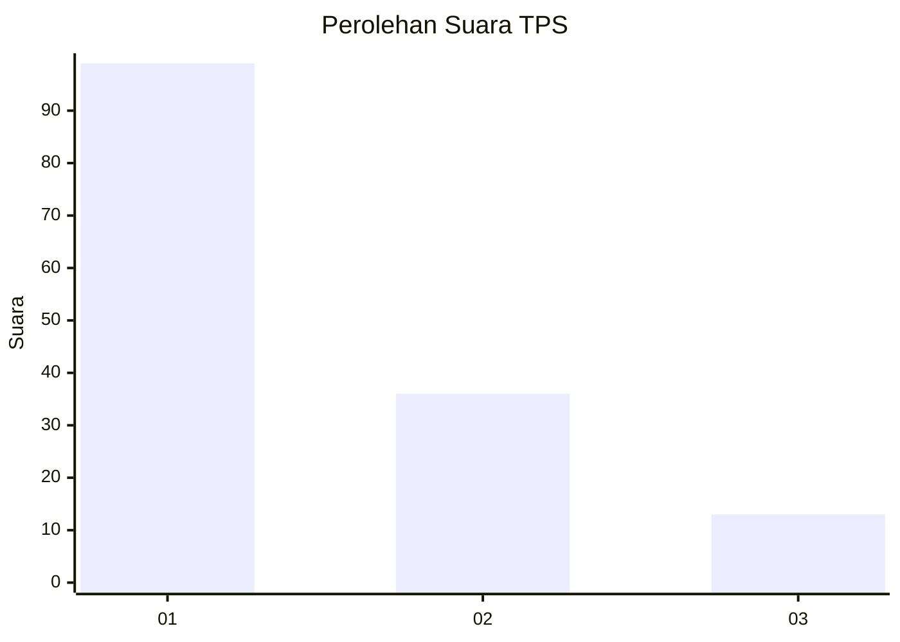
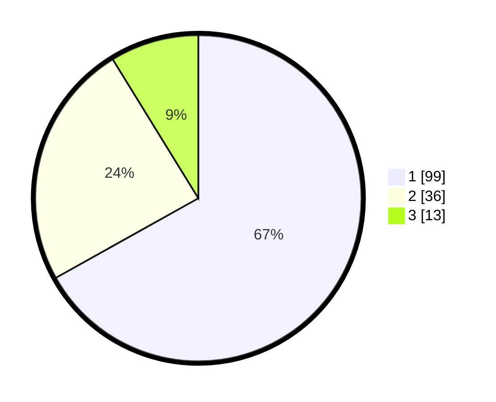

# Hasil

## Grafik

## Tabel

| No. | Nama Paslon    | Suara | Suara (raw) | Persentase |
|:--- |:-------------- | -----:| -----------:| ----------:|
| 1   | ANIES MUHAIMIN | 99    | [99][p-1]   | 66,89      |
| 2   | PRABOWO GIBRAN | 36    | [36][p-2]   | 24,32      |
| 3   | GANJAR MAHFUD  | 13    | [13][p-3]   | 8,78       |

[p-1]: https://github.com/gigit-pemilu/pemilu-2024-11-aceh/blob/main/pilpres/hitung-suara/sub/11-aceh/sub/04-aceh-tengah/sub/01-linge/sub/2032-ise-ise/sub/001-tps/sub/paslon-1.txt
[p-2]: https://github.com/gigit-pemilu/pemilu-2024-11-aceh/blob/main/pilpres/hitung-suara/sub/11-aceh/sub/04-aceh-tengah/sub/01-linge/sub/2032-ise-ise/sub/001-tps/sub/paslon-2.txt
[p-3]: https://github.com/gigit-pemilu/pemilu-2024-11-aceh/blob/main/pilpres/hitung-suara/sub/11-aceh/sub/04-aceh-tengah/sub/01-linge/sub/2032-ise-ise/sub/001-tps/sub/paslon-3.txt

## Foto C Plano

https://sirekap-obj-formc.kpu.go.id/7d20/pemilu/ppwp/11/04/01/20/32/1104012032001-20240215-000925--807dfe36-9432-48b3-9d81-1b9b47e136ea.jpg

https://sirekap-obj-formc.kpu.go.id/7d20/pemilu/ppwp/11/04/01/20/32/1104012032001-20240215-001029--6909fc42-bf08-4bf5-84f3-8e23e1c91575.jpg

https://sirekap-obj-formc.kpu.go.id/7d20/pemilu/ppwp/11/04/01/20/32/1104012032001-20240215-001120--71b49a37-3084-4a33-ad17-72a33f11682e.jpg

## Metadata

| Key        | Value               |
| ---------- | ------------------- |
| Time Stamp | 2024-02-15 16:00:26 |

