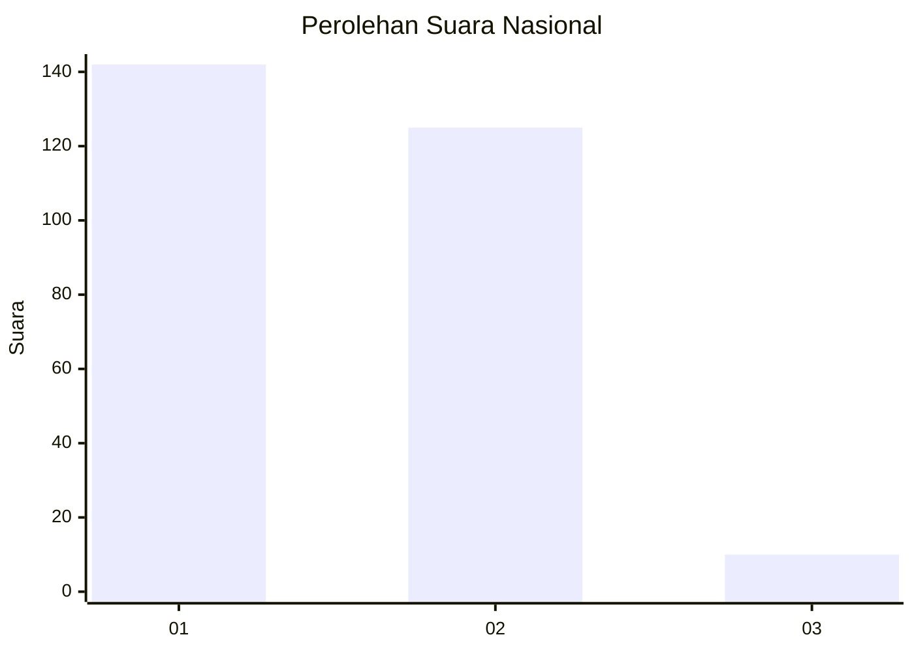
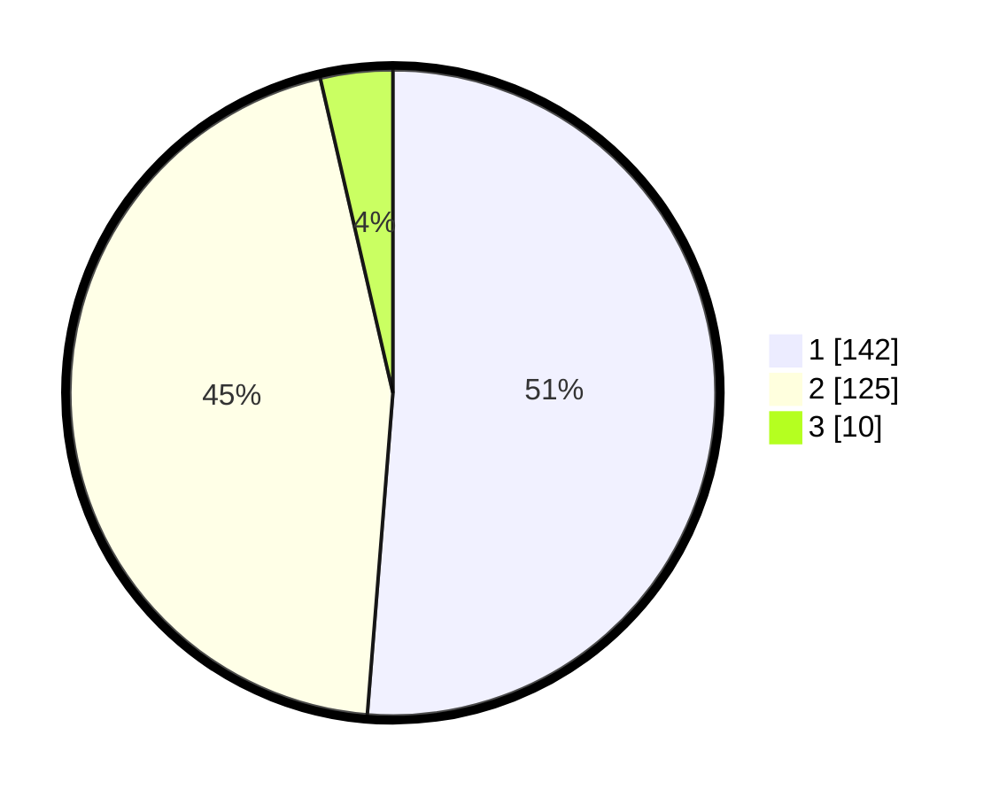

# Hasil

## Grafik

## Tabel

| No. | Nama Paslon    | Suara | Suara (raw) | Persentase |
|:--- |:-------------- | -----:| -----------:| ----------:|
| 1   | ANIES MUHAIMIN | 142   | [142][p-1]  | 51,26      |
| 2   | PRABOWO GIBRAN | 125   | [125][p-2]  | 45,13      |
| 3   | GANJAR MAHFUD  | 10    | [10][p-3]   | 3,61       |

[p-1]: https://github.com/gigit-pemilu/pemilu-2024/blob/main/pilpres/hitung-suara/sub/11-aceh/sub/04-aceh-tengah/sub/02-silih-nara/sub/2001-arul-gele/sub/001-tps/sub/paslon-1.txt
[p-2]: https://github.com/gigit-pemilu/pemilu-2024/blob/main/pilpres/hitung-suara/sub/11-aceh/sub/04-aceh-tengah/sub/02-silih-nara/sub/2001-arul-gele/sub/001-tps/sub/paslon-2.txt
[p-3]: https://github.com/gigit-pemilu/pemilu-2024/blob/main/pilpres/hitung-suara/sub/11-aceh/sub/04-aceh-tengah/sub/02-silih-nara/sub/2001-arul-gele/sub/001-tps/sub/paslon-3.txt

## Foto C Plano

https://sirekap-obj-formc.kpu.go.id/3e60/pemilu/ppwp/11/04/02/20/01/1104022001001-20240214-185307--408ae315-4dd3-457b-8c30-8c10005c020c.jpg

https://sirekap-obj-formc.kpu.go.id/3e60/pemilu/ppwp/11/04/02/20/01/1104022001001-20240214-190937--569dd6b3-2937-4b41-a7fa-3d391918733e.jpg

https://sirekap-obj-formc.kpu.go.id/3e60/pemilu/ppwp/11/04/02/20/01/1104022001001-20240214-185631--3c733546-e9b8-4834-ad77-0ba5fdd053dd.jpg

## Metadata

| Key        | Value               |
| ---------- | ------------------- |
| Time Stamp | 2024-02-14 21:46:01 |

## DATA PEMILIH TETAP

Jumlah pemilih dalam DPT: **292**.
 * L: **151**.
 * P: **141**.

## DATA PENGGUNA HAK PILIH

Jumlah pengguna hak pilih dalam DPT: **276**.
 * L: **145**.
 * P: **131**.

Jumlah pengguna hak pilih dalam DPTb: **7**.
 * L: **3**.
 * P: **4**.

Jumlah pengguna hak pilih dalam DPK: **0**.
 * L: **0**.
 * P: **0**.

Jumlah pengguna hak pilih: **283**.
 * L: **148**.
 * P: **135**.

## JUMLAH SUARA SAH DAN TIDAK SAH

JUMLAH SELURUH SUARA SAH: **277**.

JUMLAH SUARA TIDAK SAH: **6**.

JUMLAH SELURUH SUARA SAH DAN SUARA TIDAK SAH: **283**.

