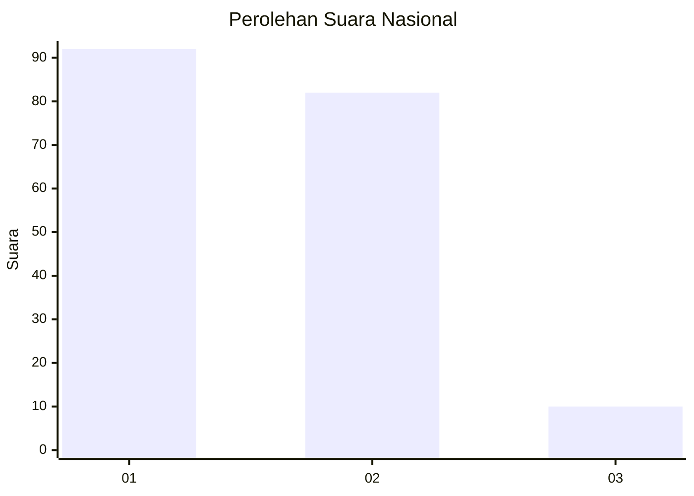
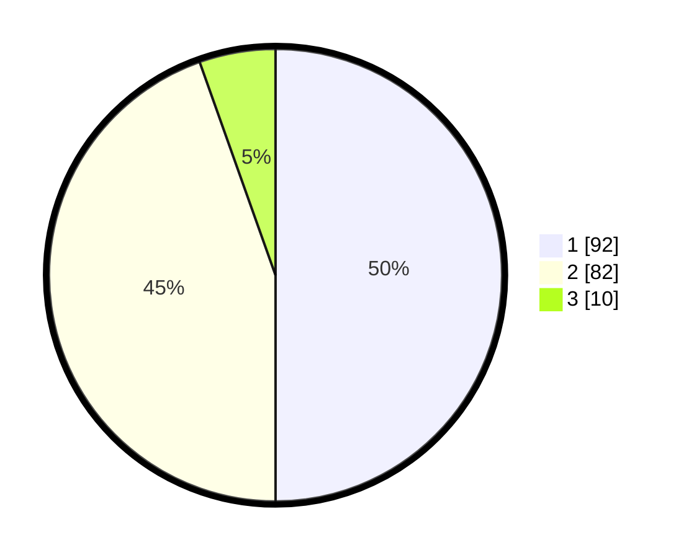

# Hasil

## Grafik

## Tabel

| No. | Nama Paslon    | Suara | Suara (raw) | Persentase |
|:--- |:-------------- | -----:| -----------:| ----------:|
| 1   | ANIES MUHAIMIN | 92    | [92][p-1]   | 50,00      |
| 2   | PRABOWO GIBRAN | 82    | [82][p-2]   | 44,57      |
| 3   | GANJAR MAHFUD  | 10    | [10][p-3]   | 5,43       |

[p-1]: https://github.com/gigit-pemilu/pemilu-2024/blob/main/pilpres/hitung-suara/sub/11-aceh/sub/04-aceh-tengah/sub/02-silih-nara/sub/2001-arul-gele/sub/002-tps/sub/paslon-1.txt
[p-2]: https://github.com/gigit-pemilu/pemilu-2024/blob/main/pilpres/hitung-suara/sub/11-aceh/sub/04-aceh-tengah/sub/02-silih-nara/sub/2001-arul-gele/sub/002-tps/sub/paslon-2.txt
[p-3]: https://github.com/gigit-pemilu/pemilu-2024/blob/main/pilpres/hitung-suara/sub/11-aceh/sub/04-aceh-tengah/sub/02-silih-nara/sub/2001-arul-gele/sub/002-tps/sub/paslon-3.txt

## Foto C Plano

https://sirekap-obj-formc.kpu.go.id/eba5/pemilu/ppwp/11/04/02/20/01/1104022001002-20240216-132544--da7cecbc-06df-4be7-a3b5-ab3f6dee9381.jpg

https://sirekap-obj-formc.kpu.go.id/eba5/pemilu/ppwp/11/04/02/20/01/1104022001002-20240214-205040--4c39997a-1ba6-40cc-882a-6658455f8755.jpg

https://sirekap-obj-formc.kpu.go.id/eba5/pemilu/ppwp/11/04/02/20/01/1104022001002-20240214-205231--889e35a3-86e5-4454-a7a8-3c288764d4b2.jpg

## Metadata

| Key        | Value               |
| ---------- | ------------------- |
| Time Stamp | 2024-02-16 13:30:32 |

## DATA PEMILIH TETAP

Jumlah pemilih dalam DPT: **202**.
 * L: **87**.
 * P: **115**.

## DATA PENGGUNA HAK PILIH

Jumlah pengguna hak pilih dalam DPT: **193**.
 * L: **87**.
 * P: **106**.

Jumlah pengguna hak pilih dalam DPTb: **0**.
 * L: **0**.
 * P: **0**.

Jumlah pengguna hak pilih dalam DPK: **0**.
 * L: **0**.
 * P: **0**.

Jumlah pengguna hak pilih: **193**.
 * L: **87**.
 * P: **106**.

## JUMLAH SUARA SAH DAN TIDAK SAH

JUMLAH SELURUH SUARA SAH: **184**.

JUMLAH SUARA TIDAK SAH: **9**.

JUMLAH SELURUH SUARA SAH DAN SUARA TIDAK SAH: **193**.

