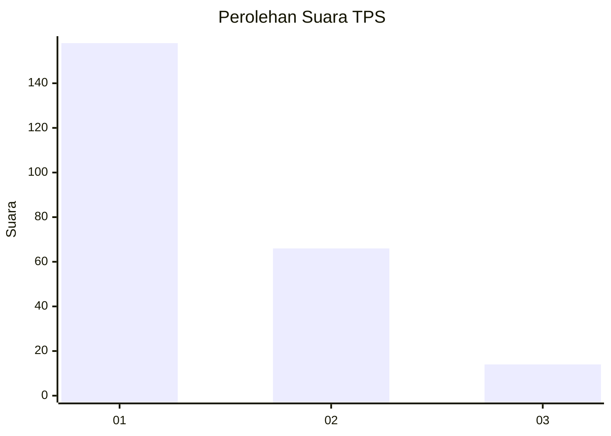
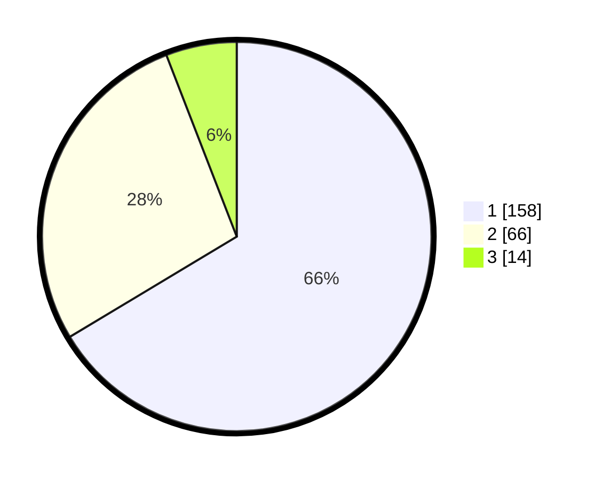

# Hasil

## Grafik

## Tabel

| No. | Nama Paslon    | Suara | Suara (raw) | Persentase |
|:--- |:-------------- | -----:| -----------:| ----------:|
| 1   | ANIES MUHAIMIN | 158   | [158][p-1]  | 66,39      |
| 2   | PRABOWO GIBRAN | 66    | [66][p-2]   | 27,73      |
| 3   | GANJAR MAHFUD  | 14    | [14][p-3]   | 5,88       |

[p-1]: https://github.com/gigit-pemilu/pemilu-2024-11-aceh/blob/main/pilpres/hitung-suara/sub/11-aceh/sub/04-aceh-tengah/sub/02-silih-nara/sub/2001-arul-gele/sub/003-tps/sub/paslon-1.txt
[p-2]: https://github.com/gigit-pemilu/pemilu-2024-11-aceh/blob/main/pilpres/hitung-suara/sub/11-aceh/sub/04-aceh-tengah/sub/02-silih-nara/sub/2001-arul-gele/sub/003-tps/sub/paslon-2.txt
[p-3]: https://github.com/gigit-pemilu/pemilu-2024-11-aceh/blob/main/pilpres/hitung-suara/sub/11-aceh/sub/04-aceh-tengah/sub/02-silih-nara/sub/2001-arul-gele/sub/003-tps/sub/paslon-3.txt

## Foto C Plano

https://sirekap-obj-formc.kpu.go.id/804d/pemilu/ppwp/11/04/02/20/01/1104022001003-20240216-181010--6e1fd1da-7ed2-4f03-a0cd-46a671731e01.jpg

https://sirekap-obj-formc.kpu.go.id/804d/pemilu/ppwp/11/04/02/20/01/1104022001003-20240216-181011--7f258ea6-440a-4300-a4b5-fdeadddb0856.jpg

https://sirekap-obj-formc.kpu.go.id/804d/pemilu/ppwp/11/04/02/20/01/1104022001003-20240216-181010--7a33c2f5-15fe-4311-ab2b-3257ff5e33ff.jpg

## Metadata

| Key        | Value               |
| ---------- | ------------------- |
| Time Stamp | 2024-02-16 23:30:00 |

## DATA PEMILIH TETAP

Jumlah pemilih dalam DPT: **251**.
 * L: **124**.
 * P: **127**.

## DATA PENGGUNA HAK PILIH

Jumlah pengguna hak pilih dalam DPT: **234**.
 * L: **97**.
 * P: **137**.

Jumlah pengguna hak pilih dalam DPTb: **0**.
 * L: **0**.
 * P: **0**.

Jumlah pengguna hak pilih dalam DPK: **11**.
 * L: **4**.
 * P: **7**.

Jumlah pengguna hak pilih: **245**.
 * L: **101**.
 * P: **144**.

## JUMLAH SUARA SAH DAN TIDAK SAH

JUMLAH SELURUH SUARA SAH: **238**.

JUMLAH SUARA TIDAK SAH: **7**.

JUMLAH SELURUH SUARA SAH DAN SUARA TIDAK SAH: **245**.

