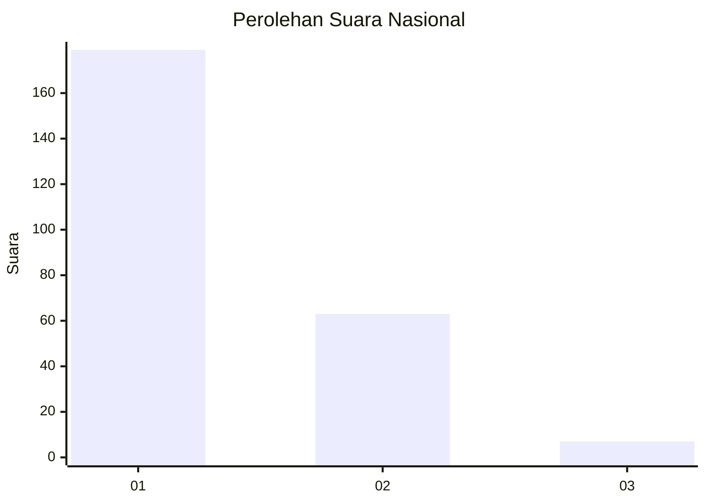
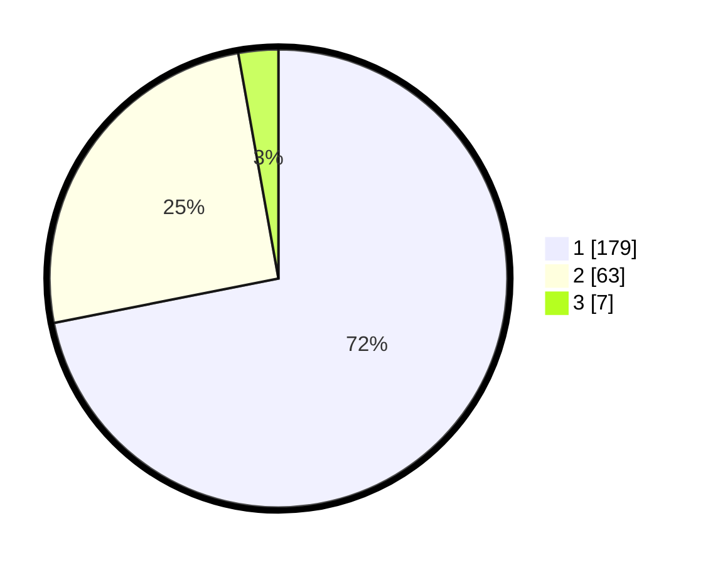

# Hasil

## Grafik

## Tabel

| No. | Nama Paslon    | Suara | Suara (raw) | Persentase |
|:--- |:-------------- | -----:| -----------:| ----------:|
| 1   | ANIES MUHAIMIN | 179   | [179][p-1]  | 71,89      |
| 2   | PRABOWO GIBRAN | 63    | [63][p-2]   | 25,30      |
| 3   | GANJAR MAHFUD  | 7     | [7][p-3]    | 2,81       |

[p-1]: https://github.com/gigit-pemilu/pemilu-2024/blob/main/pilpres/hitung-suara/sub/11-aceh/sub/04-aceh-tengah/sub/02-silih-nara/sub/2002-arul-kumer/sub/001-tps/sub/paslon-1.txt
[p-2]: https://github.com/gigit-pemilu/pemilu-2024/blob/main/pilpres/hitung-suara/sub/11-aceh/sub/04-aceh-tengah/sub/02-silih-nara/sub/2002-arul-kumer/sub/001-tps/sub/paslon-2.txt
[p-3]: https://github.com/gigit-pemilu/pemilu-2024/blob/main/pilpres/hitung-suara/sub/11-aceh/sub/04-aceh-tengah/sub/02-silih-nara/sub/2002-arul-kumer/sub/001-tps/sub/paslon-3.txt

## Foto C Plano

https://sirekap-obj-formc.kpu.go.id/62a6/pemilu/ppwp/11/04/02/20/02/1104022002001-20240216-073553--4bb1632b-9a9a-44b2-8067-d24661f3fc47.jpg

https://sirekap-obj-formc.kpu.go.id/62a6/pemilu/ppwp/11/04/02/20/02/1104022002001-20240216-073554--d3a29cbc-4af4-42e2-9f97-afeaf89cbd20.jpg

https://sirekap-obj-formc.kpu.go.id/62a6/pemilu/ppwp/11/04/02/20/02/1104022002001-20240216-073554--fa18dfca-e8be-4eef-9f6a-2b98fa3d24a6.jpg

## Metadata

| Key        | Value               |
| ---------- | ------------------- |
| Time Stamp | 2024-02-16 12:51:22 |

## DATA PEMILIH TETAP

Jumlah pemilih dalam DPT: **272**.
 * L: **131**.
 * P: **141**.

## DATA PENGGUNA HAK PILIH

Jumlah pengguna hak pilih dalam DPT: **243**.
 * L: **122**.
 * P: **121**.

Jumlah pengguna hak pilih dalam DPTb: **1**.
 * L: **1**.
 * P: **0**.

Jumlah pengguna hak pilih dalam DPK: **10**.
 * L: **2**.
 * P: **8**.

Jumlah pengguna hak pilih: **254**.
 * L: **125**.
 * P: **129**.

## JUMLAH SUARA SAH DAN TIDAK SAH

JUMLAH SELURUH SUARA SAH: **249**.

JUMLAH SUARA TIDAK SAH: **5**.

JUMLAH SELURUH SUARA SAH DAN SUARA TIDAK SAH: **254**.

