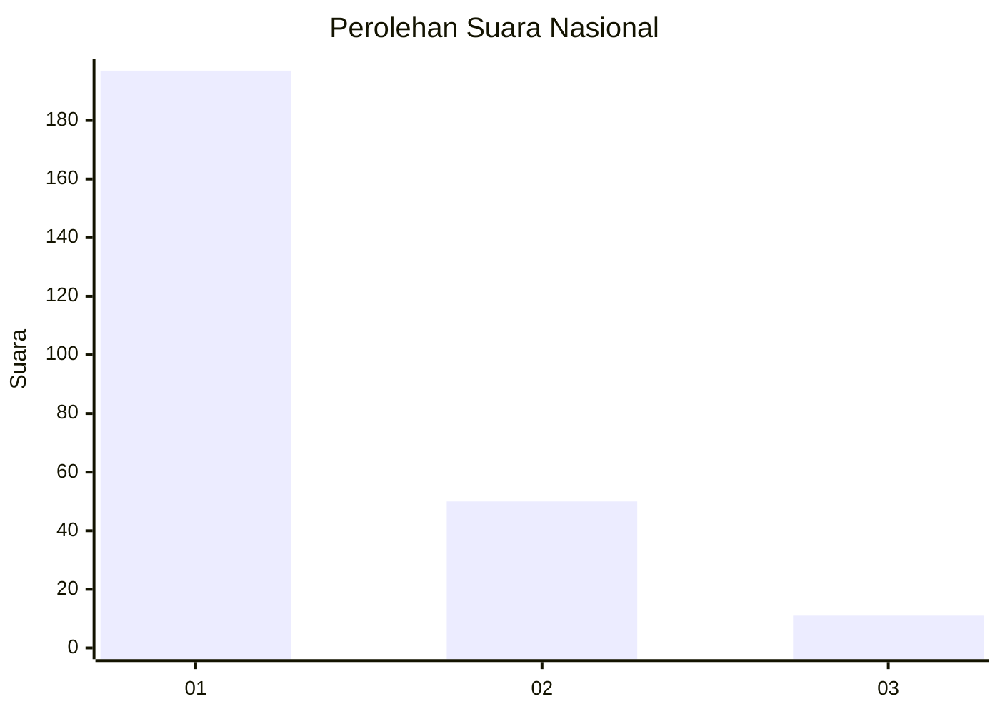
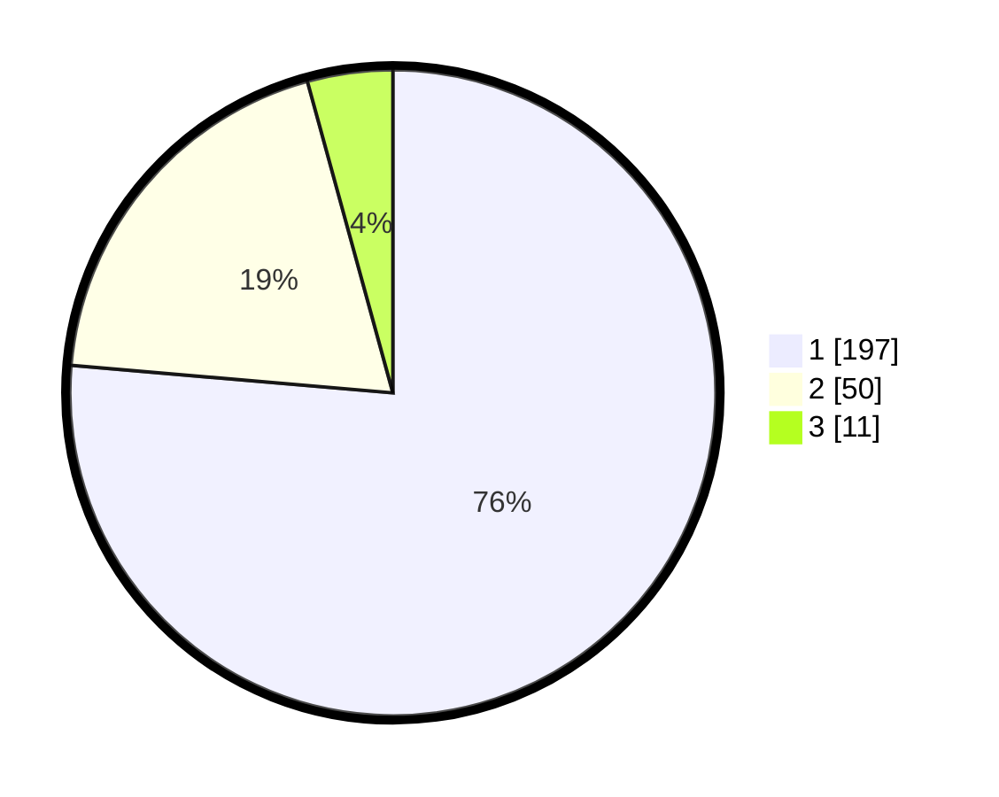

# Hasil

## Grafik

## Tabel

| No. | Nama Paslon    | Suara | Suara (raw) | Persentase |
|:--- |:-------------- | -----:| -----------:| ----------:|
| 1   | ANIES MUHAIMIN | 197   | [197][p-1]  | 76,36      |
| 2   | PRABOWO GIBRAN | 50    | [50][p-2]   | 19,38      |
| 3   | GANJAR MAHFUD  | 11    | [11][p-3]   | 4,26       |

[p-1]: https://github.com/gigit-pemilu/pemilu-2024/blob/main/pilpres/hitung-suara/sub/11-aceh/sub/04-aceh-tengah/sub/02-silih-nara/sub/2002-arul-kumer/sub/002-tps/sub/paslon-1.txt
[p-2]: https://github.com/gigit-pemilu/pemilu-2024/blob/main/pilpres/hitung-suara/sub/11-aceh/sub/04-aceh-tengah/sub/02-silih-nara/sub/2002-arul-kumer/sub/002-tps/sub/paslon-2.txt
[p-3]: https://github.com/gigit-pemilu/pemilu-2024/blob/main/pilpres/hitung-suara/sub/11-aceh/sub/04-aceh-tengah/sub/02-silih-nara/sub/2002-arul-kumer/sub/002-tps/sub/paslon-3.txt

## Foto C Plano

https://sirekap-obj-formc.kpu.go.id/0d98/pemilu/ppwp/11/04/02/20/02/1104022002002-20240217-170923--0618c7ae-cfc2-4b3b-ab51-7ab2eb392075.jpg

https://sirekap-obj-formc.kpu.go.id/0d98/pemilu/ppwp/11/04/02/20/02/1104022002002-20240217-170924--de2d3b5c-aeac-46a4-8b60-8665db191b14.jpg

https://sirekap-obj-formc.kpu.go.id/0d98/pemilu/ppwp/11/04/02/20/02/1104022002002-20240217-170923--2635318a-e6c9-4752-bb91-65fa3b32b127.jpg

## Metadata

| Key        | Value               |
| ---------- | ------------------- |
| Time Stamp | 2024-02-24 22:31:28 |

## DATA PEMILIH TETAP

Jumlah pemilih dalam DPT: **286**.
 * L: **144**.
 * P: **142**.

## DATA PENGGUNA HAK PILIH

Jumlah pengguna hak pilih dalam DPT: **264**.
 * L: **132**.
 * P: **132**.

Jumlah pengguna hak pilih dalam DPTb: **0**.
 * L: **0**.
 * P: **0**.

Jumlah pengguna hak pilih dalam DPK: **2**.
 * L: **1**.
 * P: **1**.

Jumlah pengguna hak pilih: **266**.
 * L: **133**.
 * P: **133**.

## JUMLAH SUARA SAH DAN TIDAK SAH

JUMLAH SELURUH SUARA SAH: **197**.

JUMLAH SUARA TIDAK SAH: **50**.

JUMLAH SELURUH SUARA SAH DAN SUARA TIDAK SAH: **11**.

