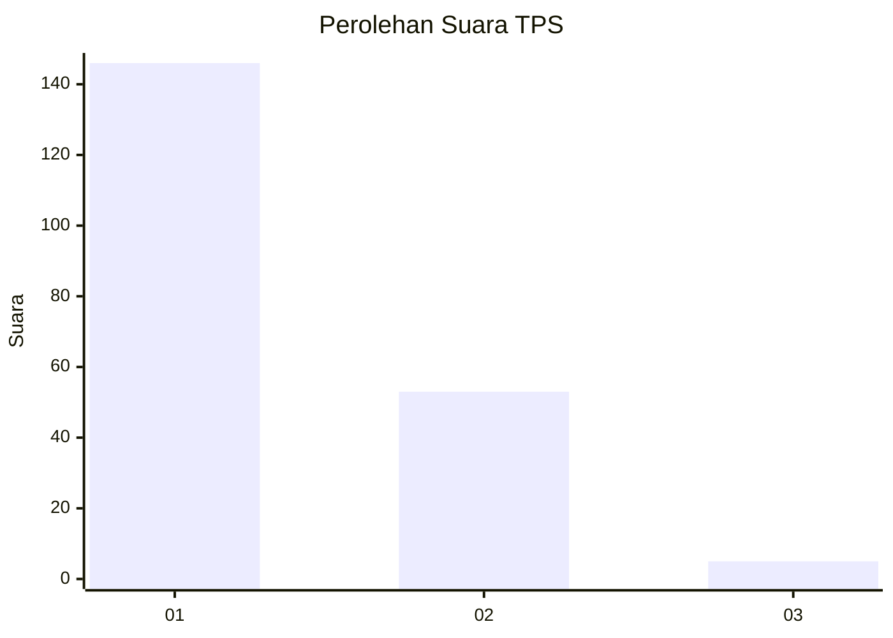
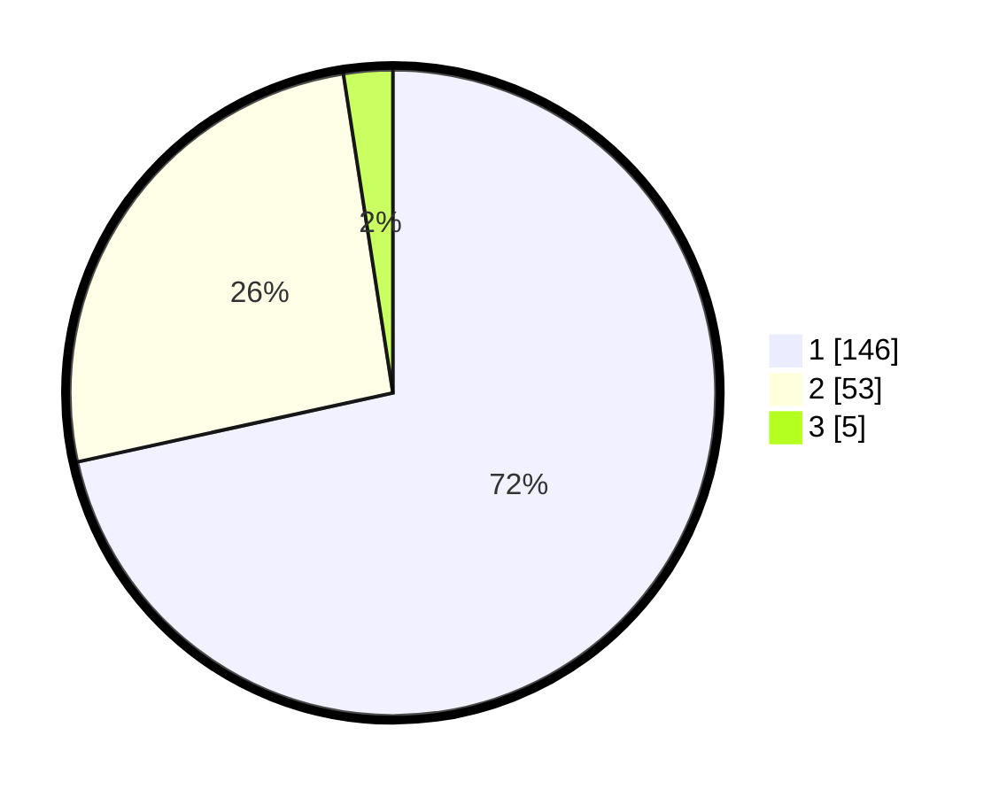

# Hasil

## Grafik

## Tabel

| No. | Nama Paslon    | Suara | Suara (raw) | Persentase |
|:--- |:-------------- | -----:| -----------:| ----------:|
| 1   | ANIES MUHAIMIN | 146   | [146][p-1]  | 71,57      |
| 2   | PRABOWO GIBRAN | 53    | [53][p-2]   | 25,98      |
| 3   | GANJAR MAHFUD  | 5     | [5][p-3]    | 2,45       |

[p-1]: https://github.com/gigit-pemilu/pemilu-2024-11-aceh/blob/main/pilpres/hitung-suara/sub/11-aceh/sub/04-aceh-tengah/sub/02-silih-nara/sub/2007-pepayungen-angkup/sub/006-tps/sub/paslon-1.txt
[p-2]: https://github.com/gigit-pemilu/pemilu-2024-11-aceh/blob/main/pilpres/hitung-suara/sub/11-aceh/sub/04-aceh-tengah/sub/02-silih-nara/sub/2007-pepayungen-angkup/sub/006-tps/sub/paslon-2.txt
[p-3]: https://github.com/gigit-pemilu/pemilu-2024-11-aceh/blob/main/pilpres/hitung-suara/sub/11-aceh/sub/04-aceh-tengah/sub/02-silih-nara/sub/2007-pepayungen-angkup/sub/006-tps/sub/paslon-3.txt

## Foto C Plano

https://sirekap-obj-formc.kpu.go.id/6dbb/pemilu/ppwp/11/04/02/20/07/1104022007006-20240214-185139--9c326907-fe9f-47cc-8272-7162ce804876.jpg

https://sirekap-obj-formc.kpu.go.id/6dbb/pemilu/ppwp/11/04/02/20/07/1104022007006-20240214-184909--fa41e83f-b678-481c-84a8-f44ce28d30c7.jpg

## Metadata

| Key        | Value               |
| ---------- | ------------------- |
| Time Stamp | 2024-02-24 22:31:28 |

