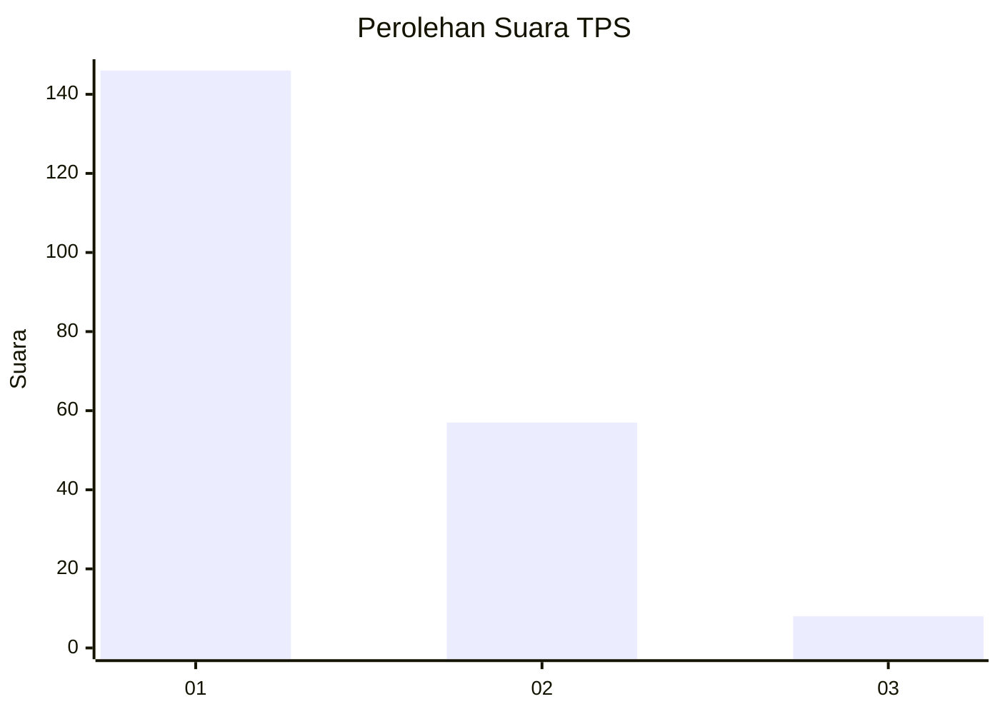
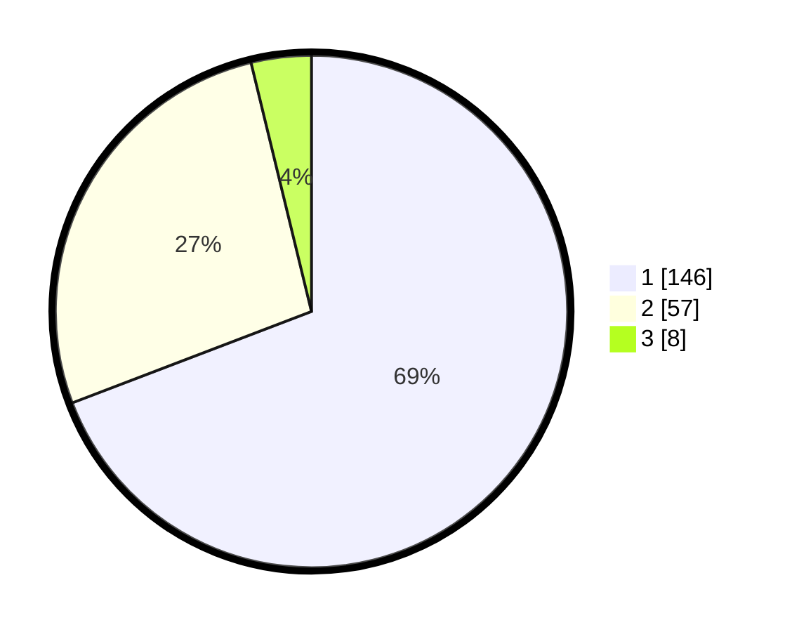

# Hasil

## Grafik

## Tabel

| No. | Nama Paslon    | Suara | Suara (raw) | Persentase |
|:--- |:-------------- | -----:| -----------:| ----------:|
| 1   | ANIES MUHAIMIN | 146   | [146][p-1]  | 69,19      |
| 2   | PRABOWO GIBRAN | 57    | [57][p-2]   | 27,01      |
| 3   | GANJAR MAHFUD  | 8     | [8][p-3]    | 3,79       |

[p-1]: https://github.com/gigit-pemilu/pemilu-2024-11-aceh/blob/main/pilpres/hitung-suara/sub/11-aceh/sub/04-aceh-tengah/sub/02-silih-nara/sub/2009-rutih/sub/002-tps/sub/paslon-1.txt
[p-2]: https://github.com/gigit-pemilu/pemilu-2024-11-aceh/blob/main/pilpres/hitung-suara/sub/11-aceh/sub/04-aceh-tengah/sub/02-silih-nara/sub/2009-rutih/sub/002-tps/sub/paslon-2.txt
[p-3]: https://github.com/gigit-pemilu/pemilu-2024-11-aceh/blob/main/pilpres/hitung-suara/sub/11-aceh/sub/04-aceh-tengah/sub/02-silih-nara/sub/2009-rutih/sub/002-tps/sub/paslon-3.txt

## Foto C Plano

https://sirekap-obj-formc.kpu.go.id/5807/pemilu/ppwp/11/04/02/20/09/1104022009002-20240216-100724--ce14a6e2-f1fe-4dc4-a6cb-ba623584b722.jpg

https://sirekap-obj-formc.kpu.go.id/5807/pemilu/ppwp/11/04/02/20/09/1104022009002-20240215-071520--864c2b52-d43d-43ea-be0a-f42f793ee8e1.jpg

https://sirekap-obj-formc.kpu.go.id/5807/pemilu/ppwp/11/04/02/20/09/1104022009002-20240215-071626--1ffec8c9-440b-4215-b2d3-1ad90c9144be.jpg

## Metadata

| Key        | Value               |
| ---------- | ------------------- |
| Time Stamp | 2024-02-16 16:25:10 |

## DATA PEMILIH TETAP

Jumlah pemilih dalam DPT: **214**.
 * L: **111**.
 * P: **103**.

## DATA PENGGUNA HAK PILIH

Jumlah pengguna hak pilih dalam DPT: **207**.
 * L: **110**.
 * P: **97**.

Jumlah pengguna hak pilih dalam DPTb: **0**.
 * L: **0**.
 * P: **0**.

Jumlah pengguna hak pilih dalam DPK: **8**.
 * L: **8**.
 * P: **0**.

Jumlah pengguna hak pilih: **215**.
 * L: **118**.
 * P: **97**.

## JUMLAH SUARA SAH DAN TIDAK SAH

JUMLAH SELURUH SUARA SAH: **211**.

JUMLAH SUARA TIDAK SAH: **5**.

JUMLAH SELURUH SUARA SAH DAN SUARA TIDAK SAH: **216**.

