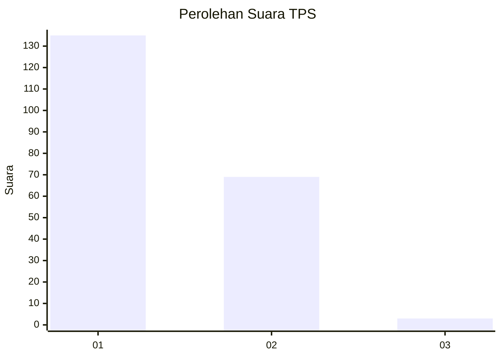
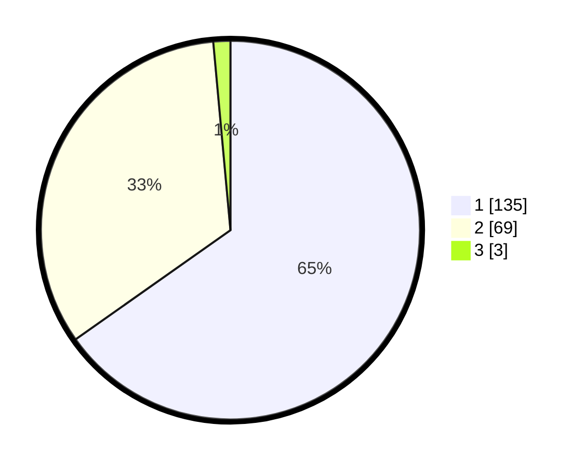

# Hasil

## Grafik

## Tabel

| No. | Nama Paslon    | Suara | Suara (raw) | Persentase |
|:--- |:-------------- | -----:| -----------:| ----------:|
| 1   | ANIES MUHAIMIN | 135   | [135][p-1]  | 65,22      |
| 2   | PRABOWO GIBRAN | 69    | [69][p-2]   | 33,33      |
| 3   | GANJAR MAHFUD  | 3     | [3][p-3]    | 1,45       |

[p-1]: https://github.com/gigit-pemilu/pemilu-2024-11-aceh/blob/main/pilpres/hitung-suara/sub/11-aceh/sub/04-aceh-tengah/sub/02-silih-nara/sub/2013-wihni-bakong/sub/002-tps/sub/paslon-1.txt
[p-2]: https://github.com/gigit-pemilu/pemilu-2024-11-aceh/blob/main/pilpres/hitung-suara/sub/11-aceh/sub/04-aceh-tengah/sub/02-silih-nara/sub/2013-wihni-bakong/sub/002-tps/sub/paslon-2.txt
[p-3]: https://github.com/gigit-pemilu/pemilu-2024-11-aceh/blob/main/pilpres/hitung-suara/sub/11-aceh/sub/04-aceh-tengah/sub/02-silih-nara/sub/2013-wihni-bakong/sub/002-tps/sub/paslon-3.txt

## Foto C Plano

https://sirekap-obj-formc.kpu.go.id/f0f7/pemilu/ppwp/11/04/02/20/13/1104022013002-20240214-175316--038cc87f-801c-4db8-a581-dc0d7695e169.jpg

https://sirekap-obj-formc.kpu.go.id/f0f7/pemilu/ppwp/11/04/02/20/13/1104022013002-20240214-175447--691ab0f8-758a-4fa0-a1cf-60b2a11edf65.jpg

https://sirekap-obj-formc.kpu.go.id/f0f7/pemilu/ppwp/11/04/02/20/13/1104022013002-20240214-200711--15571464-19d7-4b8d-82fd-89a263168869.jpg

## Metadata

| Key        | Value               |
| ---------- | ------------------- |
| Time Stamp | 2024-02-15 12:00:28 |

