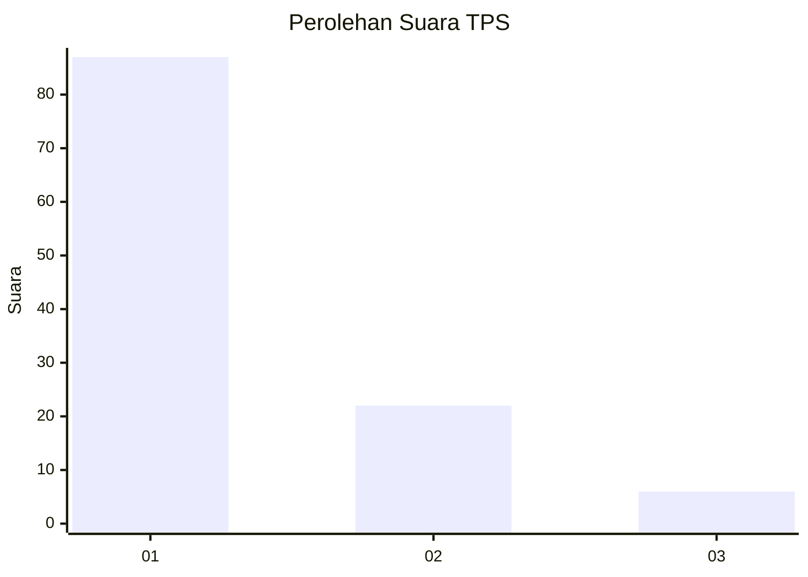
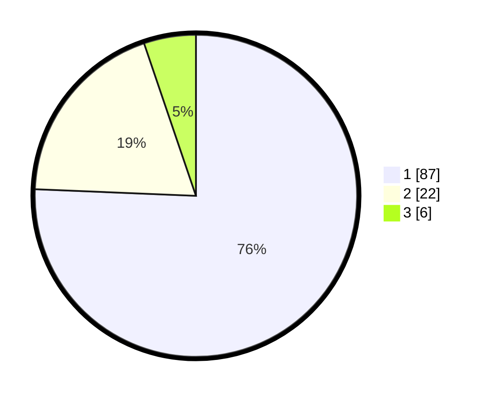

# Hasil

## Grafik

## Tabel

| No. | Nama Paslon    | Suara | Suara (raw) | Persentase |
|:--- |:-------------- | -----:| -----------:| ----------:|
| 1   | ANIES MUHAIMIN | 87    | [87][p-1]   | 75,65      |
| 2   | PRABOWO GIBRAN | 22    | [22][p-2]   | 19,13      |
| 3   | GANJAR MAHFUD  | 6     | [6][p-3]    | 5,22       |

[p-1]: https://github.com/gigit-pemilu/pemilu-2024-11-aceh/blob/main/pilpres/hitung-suara/sub/11-aceh/sub/04-aceh-tengah/sub/02-silih-nara/sub/2022-paya-beke/sub/003-tps/sub/paslon-1.txt
[p-2]: https://github.com/gigit-pemilu/pemilu-2024-11-aceh/blob/main/pilpres/hitung-suara/sub/11-aceh/sub/04-aceh-tengah/sub/02-silih-nara/sub/2022-paya-beke/sub/003-tps/sub/paslon-2.txt
[p-3]: https://github.com/gigit-pemilu/pemilu-2024-11-aceh/blob/main/pilpres/hitung-suara/sub/11-aceh/sub/04-aceh-tengah/sub/02-silih-nara/sub/2022-paya-beke/sub/003-tps/sub/paslon-3.txt

## Foto C Plano

https://sirekap-obj-formc.kpu.go.id/46ca/pemilu/ppwp/11/04/02/20/22/1104022022003-20240214-155122--384dbff8-9549-42ae-8143-a9663055317a.jpg

https://sirekap-obj-formc.kpu.go.id/46ca/pemilu/ppwp/11/04/02/20/22/1104022022003-20240214-155230--c413dc6d-8f88-474b-b5e0-51e777c5429f.jpg

https://sirekap-obj-formc.kpu.go.id/46ca/pemilu/ppwp/11/04/02/20/22/1104022022003-20240214-155317--ce322b60-fd44-46b7-8243-9e07aeedab08.jpg

## Metadata

| Key        | Value               |
| ---------- | ------------------- |
| Time Stamp | 2024-02-16 03:30:26 |

## DATA PEMILIH TETAP

Jumlah pemilih dalam DPT: **126**.
 * L: **72**.
 * P: **54**.

## DATA PENGGUNA HAK PILIH

Jumlah pengguna hak pilih dalam DPT: **120**.
 * L: **70**.
 * P: **50**.

Jumlah pengguna hak pilih dalam DPTb: **0**.
 * L: **0**.
 * P: **0**.

Jumlah pengguna hak pilih dalam DPK: **3**.
 * L: **2**.
 * P: **1**.

Jumlah pengguna hak pilih: **123**.
 * L: **72**.
 * P: **51**.

## JUMLAH SUARA SAH DAN TIDAK SAH

JUMLAH SELURUH SUARA SAH: **115**.

JUMLAH SUARA TIDAK SAH: **8**.

JUMLAH SELURUH SUARA SAH DAN SUARA TIDAK SAH: **123**.

