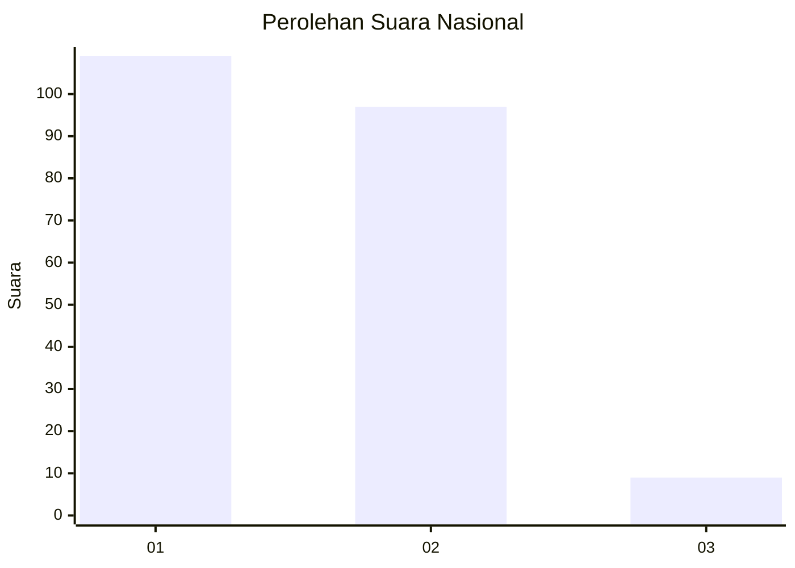
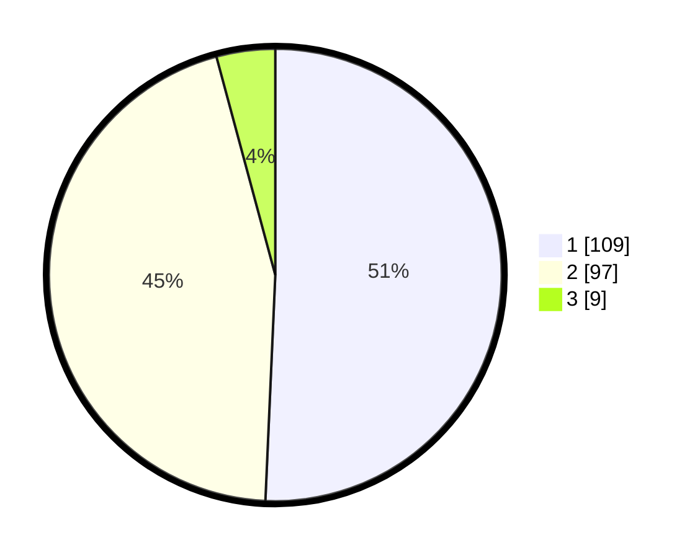

# Hasil

## Grafik

## Tabel

| No. | Nama Paslon    | Suara | Suara (raw) | Persentase |
|:--- |:-------------- | -----:| -----------:| ----------:|
| 1   | ANIES MUHAIMIN | 109   | [109][p-1]  | 50,70      |
| 2   | PRABOWO GIBRAN | 97    | [97][p-2]   | 45,12      |
| 3   | GANJAR MAHFUD  | 9     | [9][p-3]    | 4,19       |

[p-1]: https://github.com/gigit-pemilu/pemilu-2024/blob/main/pilpres/hitung-suara/sub/11-aceh/sub/04-aceh-tengah/sub/02-silih-nara/sub/2033-wih-pesam/sub/001-tps/sub/paslon-1.txt
[p-2]: https://github.com/gigit-pemilu/pemilu-2024/blob/main/pilpres/hitung-suara/sub/11-aceh/sub/04-aceh-tengah/sub/02-silih-nara/sub/2033-wih-pesam/sub/001-tps/sub/paslon-2.txt
[p-3]: https://github.com/gigit-pemilu/pemilu-2024/blob/main/pilpres/hitung-suara/sub/11-aceh/sub/04-aceh-tengah/sub/02-silih-nara/sub/2033-wih-pesam/sub/001-tps/sub/paslon-3.txt

## Foto C Plano

https://sirekap-obj-formc.kpu.go.id/3ab0/pemilu/ppwp/11/04/02/20/33/1104022033001-20240216-150204--a55370bc-c8bc-48be-8fc5-fdc1ce353ffb.jpg

https://sirekap-obj-formc.kpu.go.id/3ab0/pemilu/ppwp/11/04/02/20/33/1104022033001-20240216-150205--ce2aa51b-2dfe-43da-b972-64ecebdf2111.jpg

https://sirekap-obj-formc.kpu.go.id/3ab0/pemilu/ppwp/11/04/02/20/33/1104022033001-20240216-150205--23c2a5bf-6d2e-47fa-a6bb-aeb48eb1795a.jpg

## Metadata

| Key        | Value               |
| ---------- | ------------------- |
| Time Stamp | 2024-02-17 00:00:00 |

## DATA PEMILIH TETAP

Jumlah pemilih dalam DPT: **228**.
 * L: **106**.
 * P: **722**.

## DATA PENGGUNA HAK PILIH

Jumlah pengguna hak pilih dalam DPT: **213**.
 * L: **98**.
 * P: **115**.

Jumlah pengguna hak pilih dalam DPTb: **5**.
 * L: **3**.
 * P: **2**.

Jumlah pengguna hak pilih dalam DPK: **0**.
 * L: **0**.
 * P: **0**.

Jumlah pengguna hak pilih: **218**.
 * L: **101**.
 * P: **117**.

## JUMLAH SUARA SAH DAN TIDAK SAH

JUMLAH SELURUH SUARA SAH: **215**.

JUMLAH SUARA TIDAK SAH: **3**.

JUMLAH SELURUH SUARA SAH DAN SUARA TIDAK SAH: **218**.

