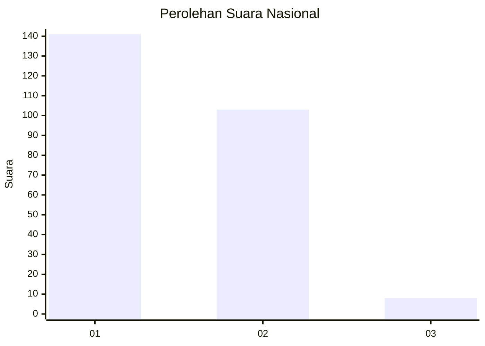
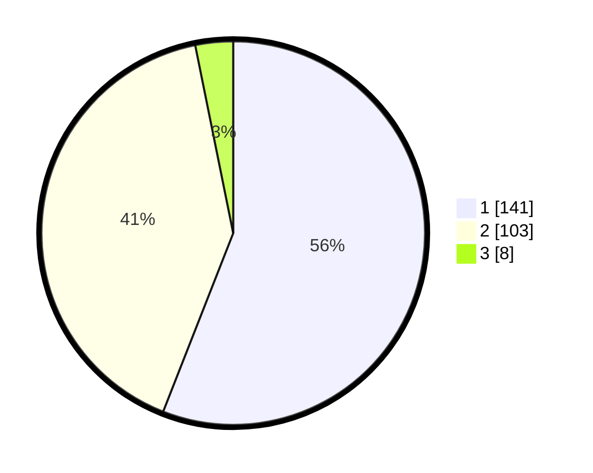

# Hasil

## Grafik

## Tabel

| No. | Nama Paslon    | Suara | Suara (raw) | Persentase |
|:--- |:-------------- | -----:| -----------:| ----------:|
| 1   | ANIES MUHAIMIN | 141   | [141][p-1]  | 55,95      |
| 2   | PRABOWO GIBRAN | 103   | [103][p-2]  | 40,87      |
| 3   | GANJAR MAHFUD  | 8     | [8][p-3]    | 3,17       |

[p-1]: https://github.com/gigit-pemilu/pemilu-2024/blob/main/pilpres/hitung-suara/sub/11-aceh/sub/04-aceh-tengah/sub/03-bebesen/sub/2001-blang-kolak-i/sub/001-tps/sub/paslon-1.txt
[p-2]: https://github.com/gigit-pemilu/pemilu-2024/blob/main/pilpres/hitung-suara/sub/11-aceh/sub/04-aceh-tengah/sub/03-bebesen/sub/2001-blang-kolak-i/sub/001-tps/sub/paslon-2.txt
[p-3]: https://github.com/gigit-pemilu/pemilu-2024/blob/main/pilpres/hitung-suara/sub/11-aceh/sub/04-aceh-tengah/sub/03-bebesen/sub/2001-blang-kolak-i/sub/001-tps/sub/paslon-3.txt

## Foto C Plano

https://sirekap-obj-formc.kpu.go.id/c4d0/pemilu/ppwp/11/04/03/20/01/1104032001001-20240216-144933--cd9ea68c-67e0-4734-8027-2aa5a7d584dd.jpg

https://sirekap-obj-formc.kpu.go.id/c4d0/pemilu/ppwp/11/04/03/20/01/1104032001001-20240216-144934--a75dc6af-2f95-402b-8c12-b05dbf75fcb7.jpg

https://sirekap-obj-formc.kpu.go.id/c4d0/pemilu/ppwp/11/04/03/20/01/1104032001001-20240216-144933--428aa8fe-8cc4-4000-9c80-d414a76332b0.jpg

## Metadata

| Key        | Value               |
| ---------- | ------------------- |
| Time Stamp | 2024-02-17 00:28:35 |

## DATA PEMILIH TETAP

Jumlah pemilih dalam DPT: **298**.
 * L: **135**.
 * P: **163**.

## DATA PENGGUNA HAK PILIH

Jumlah pengguna hak pilih dalam DPT: **242**.
 * L: **117**.
 * P: **125**.

Jumlah pengguna hak pilih dalam DPTb: **6**.
 * L: **4**.
 * P: **2**.

Jumlah pengguna hak pilih dalam DPK: **8**.
 * L: **2**.
 * P: **6**.

Jumlah pengguna hak pilih: **256**.
 * L: **123**.
 * P: **133**.

## JUMLAH SUARA SAH DAN TIDAK SAH

JUMLAH SELURUH SUARA SAH: **252**.

JUMLAH SUARA TIDAK SAH: **4**.

JUMLAH SELURUH SUARA SAH DAN SUARA TIDAK SAH: **256**.

