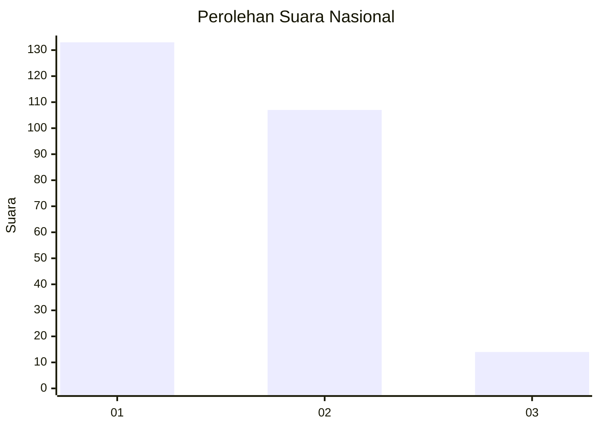
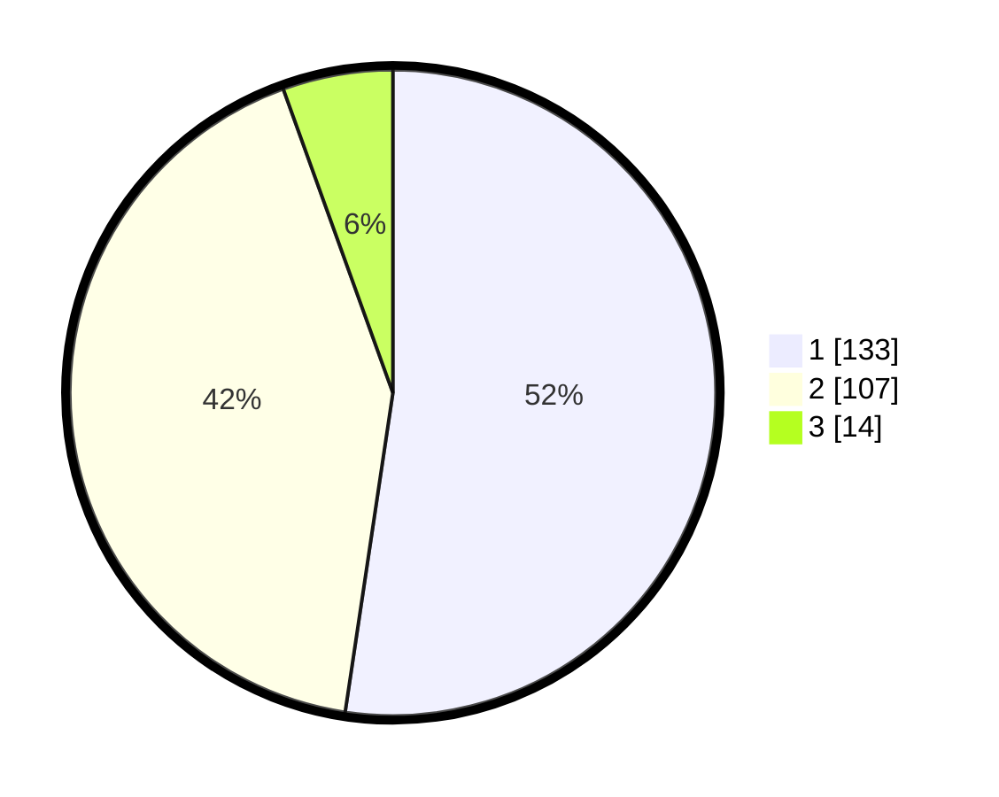

# Hasil

## Grafik

## Tabel

| No. | Nama Paslon    | Suara | Suara (raw) | Persentase |
|:--- |:-------------- | -----:| -----------:| ----------:|
| 1   | ANIES MUHAIMIN | 133   | [133][p-1]  | 52,36      |
| 2   | PRABOWO GIBRAN | 107   | [107][p-2]  | 42,13      |
| 3   | GANJAR MAHFUD  | 14    | [14][p-3]   | 5,51       |

[p-1]: https://github.com/gigit-pemilu/pemilu-2024/blob/main/pilpres/hitung-suara/sub/11-aceh/sub/04-aceh-tengah/sub/03-bebesen/sub/2001-blang-kolak-i/sub/002-tps/sub/paslon-1.txt
[p-2]: https://github.com/gigit-pemilu/pemilu-2024/blob/main/pilpres/hitung-suara/sub/11-aceh/sub/04-aceh-tengah/sub/03-bebesen/sub/2001-blang-kolak-i/sub/002-tps/sub/paslon-2.txt
[p-3]: https://github.com/gigit-pemilu/pemilu-2024/blob/main/pilpres/hitung-suara/sub/11-aceh/sub/04-aceh-tengah/sub/03-bebesen/sub/2001-blang-kolak-i/sub/002-tps/sub/paslon-3.txt

## Foto C Plano

https://sirekap-obj-formc.kpu.go.id/b983/pemilu/ppwp/11/04/03/20/01/1104032001002-20240215-015225--a1ad41dc-128e-430e-aaf9-fd2e24cce74d.jpg

https://sirekap-obj-formc.kpu.go.id/b983/pemilu/ppwp/11/04/03/20/01/1104032001002-20240214-195638--b50e179a-2eb9-42e5-8ff9-aad7b229a93e.jpg

https://sirekap-obj-formc.kpu.go.id/b983/pemilu/ppwp/11/04/03/20/01/1104032001002-20240214-195722--8d0ff467-be30-4c27-ad5f-3a2d7322bed6.jpg

## Metadata

| Key        | Value               |
| ---------- | ------------------- |
| Time Stamp | 2024-02-16 03:30:26 |

## DATA PEMILIH TETAP

Jumlah pemilih dalam DPT: **300**.
 * L: **149**.
 * P: **151**.

## DATA PENGGUNA HAK PILIH

Jumlah pengguna hak pilih dalam DPT: **249**.
 * L: **126**.
 * P: **123**.

Jumlah pengguna hak pilih dalam DPTb: **6**.
 * L: **2**.
 * P: **4**.

Jumlah pengguna hak pilih dalam DPK: **3**.
 * L: **0**.
 * P: **3**.

Jumlah pengguna hak pilih: **258**.
 * L: **128**.
 * P: **130**.

## JUMLAH SUARA SAH DAN TIDAK SAH

JUMLAH SELURUH SUARA SAH: **254**.

JUMLAH SUARA TIDAK SAH: **4**.

JUMLAH SELURUH SUARA SAH DAN SUARA TIDAK SAH: **258**.

