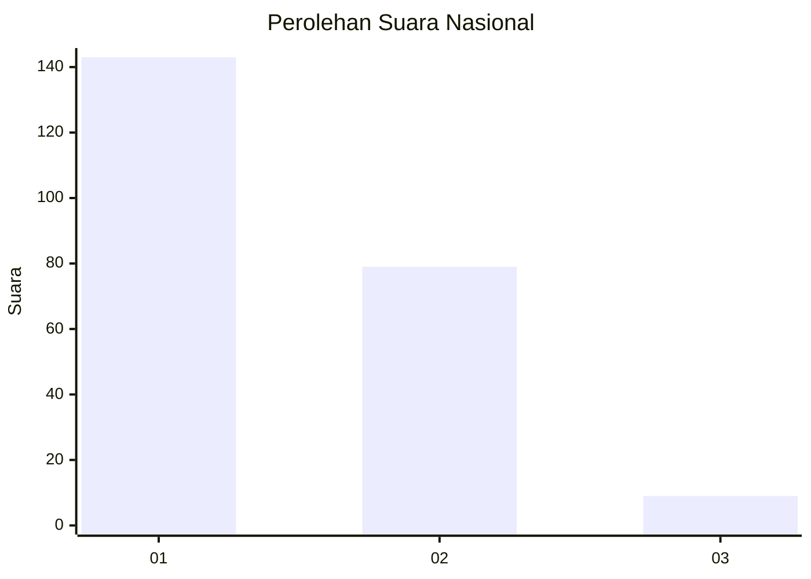
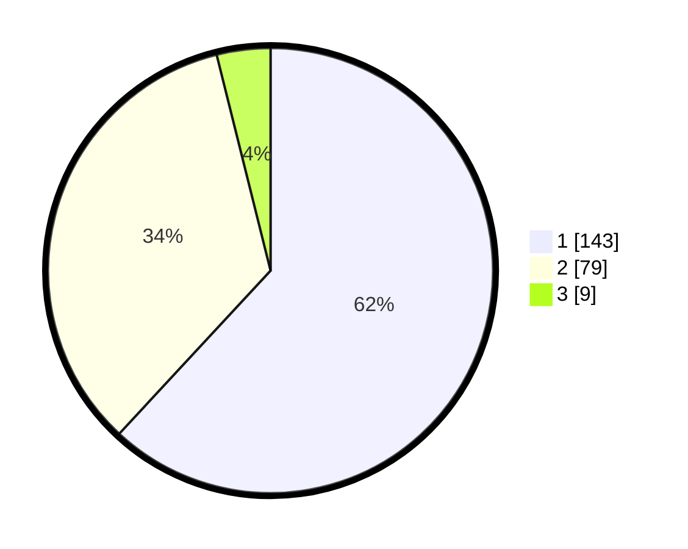

# Hasil

## Grafik

## Tabel

| No. | Nama Paslon    | Suara | Suara (raw) | Persentase |
|:--- |:-------------- | -----:| -----------:| ----------:|
| 1   | ANIES MUHAIMIN | 143   | [143][p-1]  | 61,90      |
| 2   | PRABOWO GIBRAN | 79    | [79][p-2]   | 34,20      |
| 3   | GANJAR MAHFUD  | 9     | [9][p-3]    | 3,90       |

[p-1]: https://github.com/gigit-pemilu/pemilu-2024/blob/main/pilpres/hitung-suara/sub/11-aceh/sub/04-aceh-tengah/sub/03-bebesen/sub/2001-blang-kolak-i/sub/003-tps/sub/paslon-1.txt
[p-2]: https://github.com/gigit-pemilu/pemilu-2024/blob/main/pilpres/hitung-suara/sub/11-aceh/sub/04-aceh-tengah/sub/03-bebesen/sub/2001-blang-kolak-i/sub/003-tps/sub/paslon-2.txt
[p-3]: https://github.com/gigit-pemilu/pemilu-2024/blob/main/pilpres/hitung-suara/sub/11-aceh/sub/04-aceh-tengah/sub/03-bebesen/sub/2001-blang-kolak-i/sub/003-tps/sub/paslon-3.txt

## Foto C Plano

https://sirekap-obj-formc.kpu.go.id/56ec/pemilu/ppwp/11/04/03/20/01/1104032001003-20240216-132325--a43a607e-35bc-4831-ae05-98fdd29d9070.jpg

https://sirekap-obj-formc.kpu.go.id/56ec/pemilu/ppwp/11/04/03/20/01/1104032001003-20240216-132327--57a4376d-0d39-4063-b63e-772b983e67e6.jpg

https://sirekap-obj-formc.kpu.go.id/56ec/pemilu/ppwp/11/04/03/20/01/1104032001003-20240216-132326--d9d0f5f0-0d93-478c-9ef2-d047e9beffde.jpg

## Metadata

| Key        | Value               |
| ---------- | ------------------- |
| Time Stamp | 2024-02-17 00:28:35 |

## DATA PEMILIH TETAP

Jumlah pemilih dalam DPT: **270**.
 * L: **129**.
 * P: **141**.

## DATA PENGGUNA HAK PILIH

Jumlah pengguna hak pilih dalam DPT: **220**.
 * L: **109**.
 * P: **111**.

Jumlah pengguna hak pilih dalam DPTb: **11**.
 * L: **6**.
 * P: **5**.

Jumlah pengguna hak pilih dalam DPK: **2**.
 * L: **1**.
 * P: **1**.

Jumlah pengguna hak pilih: **233**.
 * L: **116**.
 * P: **117**.

## JUMLAH SUARA SAH DAN TIDAK SAH

JUMLAH SELURUH SUARA SAH: **231**.

JUMLAH SUARA TIDAK SAH: **2**.

JUMLAH SELURUH SUARA SAH DAN SUARA TIDAK SAH: **233**.

